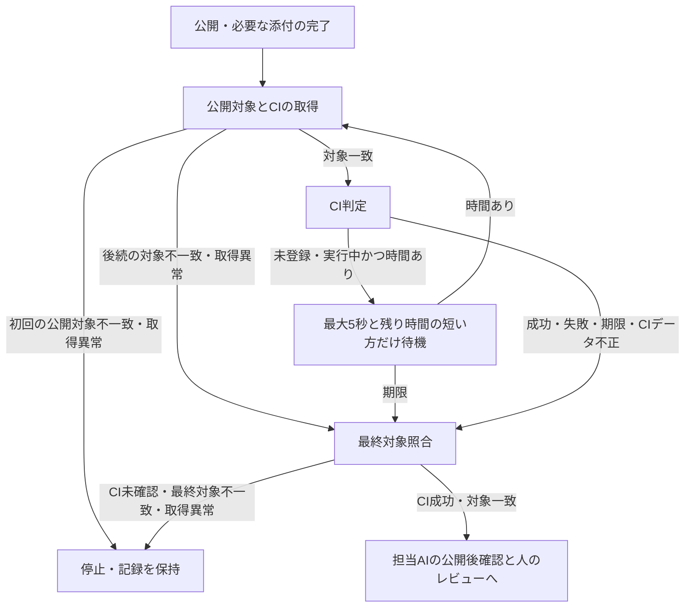

# 制御CLIの試行手順

合意済みIssueから新しい変更を作る担当者と、既存の修正・独立評価の構成を設定して試す担当者向けの手順です。この文書をCLIの操作および実行制約の正本とします。目的に応じて次の入口を選びます。

- 合意済みIssueの開発は[implement](../skills/implement/SKILL.md)から`development.ts`を使います。初回実装からPR作成までの手順、利用条件、上限は[IssueからPR作成](#issueからpr作成)を参照してください。文書のみの合意済みIssueも同じ入口で扱い、[ドキュメントの更新](../.codex/DEVELOPMENT.md#ドキュメントの更新)を適用します。
- 修正や独立評価の構成を設定して試す場合は`correction.ts`を使います。[準備と実行](#準備と実行)で設定と実行上限を確認し、check失敗または独立評価の`needs_changes`から修正、再検証、再評価へ接続します。
- ハーネスの導入や検証は[READMEのセットアップと検証](../README.md#セットアップと検証)、変更とレビューの方針は[DEVELOPMENT.md](../.codex/DEVELOPMENT.md)を参照してください。制御CLIや実モデルの起動は不要です。
- 何を変更するか未確定の相談は[scoping](../skills/scoping/SKILL.md)で要求を整理し、[対話と方針の決定](../.codex/DEVELOPMENT.md#対話と方針の決定)に従って合意済みIssueへつなぎます。

中断後の確認は[結果と再実行](#結果と再実行)、公開担当の操作は[PRの公開](#prの公開)、PRと人のレビュー・承認は[レビューを助ける説明](../.codex/DEVELOPMENT.md#レビューを助ける説明)を参照してください。公開の許可と範囲は[implement](../skills/implement/SKILL.md)と[IssueからPR作成](#issueからpr作成)で確認します。共通check内の制御テストは模擬コマンドを使いますが、ここで説明するCLI試行は実モデルを呼びます。

## IssueからPR作成

```sh
bun /absolute/path/to/trusted/scripts/development.ts 99 --repo /absolute/path/to/target-checkout
```

番号または対象repoのIssue URLを渡します。実行前に対象のREADME、開発方針、適用される指示、下記の設定を確認してください。ハーネスはBun、Git、gh、Codex CLIを使います。対象repoの言語やテストツールは設定に従います。

開始時にcheckout、remote、GitHub repo ID、base branch、gh主体、必要なpush権限を照合します。開始commit・元checkout・必要入力・隔離worktree・setup後照合の定義は、[共有モデルから生成した実装開始の説明](../docs/knowledge/implementation-start.md)を参照してください（`start-objects`、`start-identity`、`isolation`、`setup-recheck`）。run保存先や同名branchが既にある場合は開始せず、要求・対象・設定・主体の変更や上限超過では停止します。照合後は初回実装、必要な撮影、対象のcheck、独立評価へ進みます。

必要な調査報告がある場合は[引き継ぎ引数](#調査報告を指定した実装開始)で指定します。旧セッション状態、保存済み評価、lockはそのまま保全し、移行入力にしません。

通常の新規実行では、初回実装・修正・独立評価にモデル経過時間の上限を設けません。初回実装の経過時間は記録し、後工程には時間上限なし（`modelTimeMs: null`）を渡します。追加修正2回、独立評価2回、各checkとCI待機の各9分は維持します。通常コマンドと公開直後・CI待機後の対象照合も各11分で打ち切ります。要求・対象・権限の照合と手動中断による停止は継続し、通常利用者に時間設定の入力は求めません。

この設定は採用後の新規実行に使います。進行中の実行コードや過去のrun・state・設定・消費予算は変更・変換・削除せず、自動再開しません。有限設定の既存runを同じ記録のまま無制限へ切り替えることは設定変更として拒否します。

保存先は `~/.local/share/dotagents/development/<Git管理ディレクトリの識別値>/<Issue番号>/` です。`--run-dir DIRECTORY` でcheckoutやGit管理領域の外を指定できます。`target.json` に対象設定、repo ID、gh主体を残し、ほかに要求、指示と結果、検証ログ、作業checkout、PR本文とURL、CI結果を残します。既存の保存先は再実行に使いません。中断後は記録、実プロセス、GitHubの状態を照合し、保存先の削除や別名での自動再試行は行いません。

`--no-publish` は独立評価までで止め、commit、push、PR作成を行いません。push権限の確認も不要です。通常実行は検証済み対象を再照合し、commit、acceptedな評価からのPR本文生成、ユーザー認証と権限の再確認、gh主体の資格情報を明示したpush、ユーザー認証によるPR作成へ進みます。pushにはコマンド内だけで定義するHTTPSの公開先を使い、GitのURL書き換え後も対象が一致することを確認します。SSHへの切り替えや別repoへの書き換えは拒否します。`push.followTags`の設定にかかわらず、タグを同時に公開しません。設定した保存先から生成媒体の変更を添付します。

`ciChecks`に指定した全checkの登録とSUCCESSを待ち、取得ごとにPRのhead・base・OPEN状態を照合します。必要なcheckのSKIPPEDやNEUTRALは成功と扱わず、同名checkが複数ある場合は全件の成功を求めます。他の登録済みcheckに失敗や保留がある場合も完了にしません。

最後の公開操作（媒体があれば添付）の後に、URL・head・base・OPEN・Issue参照とcheck群を一度に取得します。初回取得は11分を上限とし、公開対象の一致を確認してから9分のCI待機時間を開始します。同じ初回応答のcheckを直ちに判定し、未登録・実行中なら最大5秒と残り時間の短い方だけ待って再取得します。後続の取得コマンドも残り時間で制限し、期限後は再取得しません。待機間隔により状態変化の検知に数秒かかる場合があるため、即時の確認が必要ならPR上のcheckを確認してください。実際のGitHub負荷の削減量は未測定です。

CI未確認時もPR URLと取得済みの公開結果・ログを保持し、非zeroコードで終了します。詳細は[結果と再実行](#結果と再実行)を参照してください。担当AIは公開本文と根拠を照合し、`rendered_media_check`があれば添付後の表示・再生・配置を確認します。人が要求・権限の変更、レビュー、承認、マージを判断します。

## 調査報告を指定した実装開始

必要な報告の選択と共有状態の確認は[scopingの引き継ぎ手順](../skills/scoping/references/session.md#調査成果の引き継ぎ)に従います。この節では、確認済みの報告を実装へ渡すGit操作とCLIの検証条件を説明します。

報告の内容を確認した時点で、`git hash-object --no-filters -- research/reset-behavior.md`の出力を`REVIEWED_BLOB`として記録します。報告をcommitした後、`git rev-parse HEAD`で開始commitを取得し、`git rev-parse HEAD:research/reset-behavior.md`が確認済みblobと一致することを確かめます。次の`START_COMMIT`と`REVIEWED_BLOB`を、それぞれの完全なIDに置き換えて指定してください。

```sh
bun /absolute/path/to/trusted/scripts/development.ts 99 \
  --repo /absolute/path/to/target-checkout \
  --start-commit START_COMMIT \
  --report research/reset-behavior.md=REVIEWED_BLOB
```

`--report`は必要な報告ごとに繰り返し、`--start-commit`も指定します。開始・停止の条件は[生成説明のstart-identityとsetup-recheck](../docs/knowledge/implementation-start.md)を参照してください。初回実装にはIssue URL、開始commit、報告パスとblobを渡します。報告本文を読み、内容の十分性と合意・共有状態を確認する責任は担当者に残ります。

選んだ報告のパスとblob IDは、同じ実行の検証設定の`reports`へ自動で渡します。初回実装、修正、独立評価は同じ開始commitと参照一覧を受け取り、Issueや報告から出典、適用条件、合意状態を確認します。対象repoの`.dotagents.json`や別の引き継ぎ文書に報告本文を転記する必要はありません。必要な報告がない場合も、Issueが参照する今回関連する資料を担当者が選びます。

修正と独立評価の入口では、参照の形式と開始commitのblobを照合します。実装中の報告改訂は通常の差分として評価対象に含め、開始時の参照は書き換えません。担当AIは開始版と現在の報告を比較し、新しい観測が以前の結論を変えるか、未合意の提案を規則として扱っていないかを説明します。評価対象のファイルhashと参照文書の版は既存の評価記録に残ります。評価中や完了後の根拠ファイル変更は既存のソース同一性検査で検出し、古い成功を流用しません。外部資料の更新や意味の変化はこのhash検査の対象外となるため、担当者が元資料の版や適用条件を確認します。

判断を左右する参照の欠落や古さ、矛盾がある場合は、影響する判断と戻り先を示します。事実不足は調査し、要求・許容範囲・権限の変更は人の合意へ戻します。独立評価では判断を妨げる不足を必須の未解決指摘として扱い、公開後の作業へ送ってacceptedにはしません。参照した文書の役割と理由、各観点の評価、残る確認は構造化評価から[公開用のPR説明](#レビュー対象と参照記録)へ渡します。検証結果の再利用条件とCI分類の再設計は、この参照引き継ぎでは扱いません。

上記の開始条件を満たす未共有の報告でも、既存の許可範囲で`--no-publish`の実装を開始できます。共有・commitの許可と状態の扱いは[引き継ぎ手順](../skills/scoping/references/session.md#調査成果の引き継ぎ)に従います。参照の機械的な照合は人の合意や実装許可を代替しません。

## 共有知識の選択

対象repoに関連するモデルがある場合、scoping担当は通常の要求整理の中で必要なIDと選択理由・適用条件を選び、今回の要求との関係をIssueへ記します。モデルのないrepoは既存のIssue・報告だけで開始できます。dotagentsの初回モデルは[実装開始のJSON正本](../docs/knowledge/implementation-start.json)です。[人向け説明](../docs/knowledge/implementation-start.md)は同じ抽出処理の生成物なので直接編集しません。

内容を確認したモデルのパス・Git blob・IDをIssue本文の独立した一つの`dotagents-knowledge`コードブロックへ記します。Markdownのバッククォートまたはチルダの囲みを使えます。閉じていない囲みや複数の選択は停止します。説明用の外側のコード囲み、引用・リスト、HTML内の例は選択しません。これは既存Issueの参照欄であり、別の台帳や追加のCLI引数は作りません。下の`REVIEWED_BLOB`は`git hash-object --no-filters -- docs/knowledge/implementation-start.json`で内容確認時に取得した完全なIDへ置き換えます。公開範囲・共有状態は既存の報告と同様に確認してください。

````markdown
```dotagents-knowledge
[{"path":"docs/knowledge/implementation-start.json","blob":"REVIEWED_BLOB","ids":["preserve-work","start-objects","authority","start-identity","isolation","setup-recheck","less-rework","index-counterexample"]}]
```
````

一つの配列へ複数モデルを指定できます。選ぶIDはモデル内のnode IDです。関係先は参照として残し、その本文を自動で追加しません。例のIDも毎回すべて必要という意味ではありません。未合意の案を選んでも提案のまま、仮説は未確認のまま渡し、Issueの要求やホストの必須ゲートへ昇格させません。

ホストはIssueから選択を読み、既存の`verifyStartInputs`・`verifyReportBase`で開始commitのファイルとblobを照合します。[抽出処理](knowledge.ts)は形式、重複・未知ID、モデル内の関係先・根拠ID、空の参照や状態を検査します。初回実装・修正・独立評価は開始blobの同じ選択内容を`researchContext`から受け取ります。参照はIssueと既存の評価対象記録に残り、`.dotagents.json`や別の引き継ぎファイルへ転記しません。選択されたファイル・版が欠けた場合は停止します。外部URLの到達性・内容や意味上の適用性は形式検証では確認しません。

モデルの改訂は通常の差分です。実装・評価担当は固定した開始版と現在の差分を比べ、観測→影響するnode ID・根拠→今回のIssue判断を既存のfindings/assessmentsへ記します。不一致なら必要な調査や人の判断と変更案を示し、自動承認せず、変更後のcheckと評価へ戻します。独立評価者は追加根拠や矛盾を調べられます。参照一致は内容・合意・公開許可の保証ではありません。

正本の`nodes`は`id`、三概念を示す`facet`、`kind`、`status`、文章の`statement`・`question`・`scope`、`sources`、`relations`を持ちます。`sources`はURL、対象版、適用範囲、状態を持ち、各nodeから結びます。定義した形式は[parseKnowledge](knowledge.ts)が正本です。規則の実行や予算・権限の設定項目はありません。

正本を変更したら`bun run knowledge:generate`で説明を更新します。`bun run knowledge:check`は正本と生成物の不一致を検出し、通常の`bun run check`にも含まれます。出力には正本パスとGit blobを載せます。生成例のblobは本文の同一性であり、commit済み・共有済み・合意済みを意味しません。意味と日本語の確認は既存の独立評価に含めます。

## 対象repoの設定

対象checkoutのルートに `.dotagents.json` を置き、コミット済みの合意した設定から開始します。設定自体を変更するIssueは、実行前に適用する設定と検証方法を照合してください。実行中の設定置換で検証を省略することはできません。

このファイルはハーネスの対象repoと実行・検証方法の設定です。Codex一般の設定やプロダクト知識の保存先には使いません。要求と合意はIssueから、判断根拠は関連文書や必要な調査報告から参照します。

```json
{
  "repository": "team/component",
  "remote": "upstream",
  "baseBranch": "release",
  "setup": [["python3", "-m", "venv", ".venv"], [".venv/bin/pip", "install", "-r", "requirements-dev.txt"]],
  "check": [".venv/bin/python", "-m", "pytest"],
  "ciChecks": ["tests"],
  "capture": null
}
```

コマンドはshell文字列ではなくargv配列です。実行ファイル名は空にせず、後続の空文字や空白引数はそのまま渡します。対象checkoutで実行し、非zeroコードは失敗です。セットアップが不要な場合は `setup: []` と明示します。`check` の欠落や空配列、撮影方針の省略は拒否します。対象のcheckがテスト未実行やskipなどを成功扱いしないことも、設定担当と独立評価で確認します。CLIが任意の外部runnerのレポート形式や合意の意味を判定するものではありません。

`ciChecks`はCIで実行成功を確認するcheck名の配列です。省略、空の名前、重複を拒否し、対象repoのcheck名をそのまま指定します。公開する`development.ts`の実行では1件以上が必要です。CIを持たないrepoは空配列を明示すれば、`--no-publish`でローカル検証まで実行できます。既存設定にもこの項目を追加してください。

`capture: null` は必要な媒体がない場合に使います。媒体が必要な場合は `command`（argv）、`destination`（生成媒体専用のrepo相対ディレクトリ）、`required` を指定します。必要な媒体を常に撮影する場合、Markdownを画面の入力にするrepo、文書のみのIssueでも媒体が必要な場合は `required: true` です。`false` は下記の文書や保存記録が画面に影響しないrepoでのみ使えます。設定時にIssueの必要証拠と照合し、未設定を成功へ読み替えません。実装担当や評価担当は、設定と要求が矛盾した場合は停止します。

`{harness}` はコマンド引数内で信頼するハーネス実体の絶対パスへ展開します。このハーネス自身の設定は [../.dotagents.json](../.dotagents.json) が正本です。別repoへこの設定を無条件にコピーしないでください。

読み取りによる照合は次で行えます。`--write` はghのpush権限も検証します。IssueやPRの作成・更新はここで表示するghユーザーの認証を使います。scoping担当者が合意と対象を照合して既存ghのIssue操作を行います。

```sh
bun /absolute/path/to/trusted/scripts/target.ts /absolute/path/to/target-checkout https://github.com/team/component/issues/99 --write
```

対応環境は現在のmacOSホストとgithub.comです。GitHub Enterprise、他のホスティング、旧code/cleanup入口、旧state変換は対象外です。全調査への必須監査、質問・回答のruntime所有、公開intentの機械的拘束、自動再開は提供しません。人の合意と変更時の停止、対象の検証、独立評価、検証済み対象の同一性確認を維持します。

## ホストによるブラウザー検証と撮影

実装担当と修正担当はsandbox内でコード、テスト、文書、撮影定義を準備します。ブラウザーやサーバーの起動はホストCLIが担当します。ホストの実行を残しているだけなら`repaired`を返し、要求や許可の判断が必要な場合は`needs_human`で具体的な理由を返します。

必要な媒体は対象設定のcapture commandで撮影します。コマンドにはcheckout外の新しい絶対出力ディレクトリを最後の引数として渡します。PNG、JPEG、WebP、MP4、WebMだけを直下に保存し、動画contextを閉じて確定してください。撮影中はcheckoutに媒体、コード、文書、レポートを書き込みません。ホストは空の出力、不正な形式、symlinkを拒否し、対象が変わっていないことを確認したうえで `destination` へ取り込みます。生成媒体専用領域は内容を置き換えるため、手書きの記録を置かないでください。

付属のPlaywrightアダプターは `bun {harness}/scripts/capture.ts SPEC CONFIG ABSOLUTE_OUTPUT` です。対象repo側のPlaywright依存、指定したspec、設定のprojectsやwebServerを使います。元設定からの相対的な`testDir`、global setup/teardown、`tsconfig`、`webServer.cwd`を解決します。指定したspecが通常の`testDir`外にある場合は、そのspecのディレクトリへ探索範囲を広げます。各撮影projectでは指定したspecだけを選び、依存projectやteardown projectは元の選択条件を保ちます。projectの`use`とブラウザーの選択、ホストの`PLAYWRIGHT_BROWSERS_PATH`を引き継ぎます。specの欠落、指定specの実行0件、skip、失敗はいずれも成功扱いしません。setupだけ成功しても撮影成功にはしません。[trial repo](https://github.com/thkt/dotagents-workflow-trial/blob/d0134086ad9bdddb5ed2693327cb1ffb0859c4a2/README.md)では同repoのspec、config、媒体保存先を使います。この共通repoはプロダクトを含まず、Playwright依存も持ちません。ブラウザーやサーバーは対象設定で起動し、起動失敗をレポートから分類します。

アダプターは新しい外部出力先を要求し、生成設定、JSONレポート、artifactsの保存先もその隣へ指定します。既存snapshotの参照先は元設定の場所から解決し、snapshot更新は無効にします。媒体は拡張子とファイル先頭の形式識別子を照合し、空の出力とsymlinkを拒否します。完全なデコードや表示品質はこの照合では保証しません。spec、global hook、webServer自身の書き込みもcheckout外へ向けてください。任意の対象コードの書き込みを隔離する機能ではないため、ホストは撮影後に対象が変わっていないかを照合します。

`destination`の媒体は撮影で更新されます。過去の記録の固定ハッシュを最新媒体の根拠には使いません。撮影後に対象ソース（commitと未commit差分を含む）、撮影ログ、配置した媒体のサイズとSHA-256、検証結果を照合し、対応PRへ記録します。公開時はホスト固有のパス、非公開repo情報、非公開の実行ログを転載せず、公開可能な要約と根拠を示します。過去の記録は対象時点を保ち、PR内の表示・再生と同headのCIはそれぞれの実施結果を区別します。

correctionを単独で設定する場合も、capture commandに加えて `captureDestination` と `captureRequired` を明示します。`captureRequired: true` でcommandがない設定は実行前に拒否します。capture commandの省略は、媒体不要の合意がある場合だけ使います。通常入口のdevelopmentは対象設定をそのまま渡します。

撮影結果は同じ実行内で入力と媒体が一致する場合に再利用します。`required: true` は文書・保存記録も同一性に含め、初回は必ず撮影します。以下の文書・保存記録の除外は `required: false` の場合だけ適用します。

各検証の前に、HEADからの追跡ファイルの差分と未追跡ファイルを確認します。変更が通常の非実行Markdownファイルだけなら撮影と媒体の置き換えを省略し、既存媒体を保持して共通check・独立評価へ進みます。symlinkや実行属性の追加・解除・削除、コード、撮影定義、媒体など他の変更を含む場合や、変更を判定できない場合は通常どおり撮影します。文書が参照する媒体の不足や不整合は独立評価で確認します。撮影保存先の媒体がGitのignore規則によってソース同一性の対象から外れる場合は停止し、撮影成功や再利用とは扱いません。

初回撮影後は、最後に成功した撮影と媒体取り込み時点のファイル内容、モード、パスを保存し、修正後と比較します。通常のMarkdown文書と、`destination`の親ディレクトリ内（`destination`を除く）の保存記録（`.json`・`.txt`・`.log`・`.stdout`・`.stderr`・`.diff`）だけの更新なら撮影を省略し、既存の媒体と撮影ログを保持します。これらは撮影の入力として使わない文書や記録の配置です。実行可能ファイル、symlink、撮影コマンドの引数が直接指すcheckout内の定義ファイルは、単独のパス引数と`--config=path`のようなオプション値のどちらも、拡張子にかかわらず省略対象にしません。直接指定した定義が未追跡かつGitのignore規則で除外される場合は、`required`の値にかかわらず停止します。定義から間接的に読み込む入力も、除外する文書・保存記録の配置に置かないでください。その配置を画面や撮影の入力に使うrepoは`required: true`にします。コード、設定、撮影定義、媒体、その他のファイルが変わった場合、撮影失敗後、成功した比較基準がない場合は再利用しません。初回のMarkdownのみの変更を省略する条件は上記のとおりです。

撮影を再利用しても、文書や記録を含む全体の変更検知、共通check、独立評価は省略しません。評価者は保持された媒体の撮影対象と現在のコードの対応、および証拠記録の整合を確認します。停止済み実行の上限や状態は変更せず、この仕組みは同じ実行の修正ループ内で使います。

再撮影が必要な場合はcheckout外の新しい出力先で行います。要求とソースが変わっていないことを確認して媒体を取り込み、媒体を含む対象を確定して共通check、独立評価、公開へ進みます。撮影失敗時はログを修正担当へ渡します。起動不能は`capture_unavailable`、撮影の時間切れは`capture_timeout`として停止し、ホスト側での環境確認が必要です。撮影にも各checkと同じ9分の上限とプロセスグループの中断処理を適用します。正常な`needs_human`と不正応答を区別して表示し、記録と既存の消費上限を保持します。

### 同じ実行内の確認と再利用

各工程は、それぞれの入力に対応する既存の記録を使います。再利用は同じ実行内に限り、別実行、PR差し戻し、中断復旧へ結果を引き継ぎません。入力を取得・照合できない場合は成功を再利用せず、原因を確認します。

| 工程 | 入力と記録 | 変更時の処理 |
| --- | --- | --- |
| 撮影 | 設定とIssueの必要証拠を照合し、`captureSource`で対象・媒体を比較 | 対象コード、定義、媒体、モード、symlinkの変更は再撮影。要求変更は停止 |
| 共通check | 設定したコマンド、文書・媒体を含むソースと`check-N`ログ | 修正後は毎回実行。実行中の要求・ソース変更は停止 |
| 独立評価 | 要求、ソース、成功したcheck、モデル設定と`review-N.target.json` | 修正後のcheck成功を受けて再評価。評価中の対象変更は停止 |
| 公開前照合 | 同じ実行の終端結果、設定、要求、成果物 | 同一ならcheck・独立評価の成功を再利用。変更なら`target_changed_after_stop`で拒否し、旧stateは保持 |

`state.json`のcapture・checkイベントには`captureDecision`として実行予定（`execute`）、同一入力の再利用（`reused`）、対象外による不要（`not_required`）と理由・比較対象を残します。`execute`だけでは成功を意味せず、撮影の終了結果、媒体取り込みと後続checkの記録を確認します。撮影未設定による不要は、Issueで媒体不要と合意していることが前提です。利用不能・時間切れは停止理由と撮影ログに残し、不要や成功へ読み替えません。

撮影を再利用しても、修正後の共通checkと独立評価、同じPR headのCI確認は維持します。失敗・中断のログ、旧state、消費時間と回数は削除・変換しません。

## 準備と実行

```text
bun scripts/correction.ts /absolute/path/config.json
```

設定は信頼する公開・実行担当が用意します。対象base branchと照合した隔離作業コピーを用意し、設定、制御コード、証拠ディレクトリを修正対象の外へ配置します。以下は設定形式の例です。Issue番号、絶対パス、実行上限はその試行で合意した値を起動前に設定してください。例の値自体は新たな実行許可を意味しません。

```json
{
  "cwd": "/absolute/path/isolated-worktree",
  "runDir": "/absolute/path/evidence",
  "issue": ["gh", "issue", "view", "DELIVERABLE_ISSUE_NUMBER", "--repo", "OWNER/REPO", "--json", "title,body,updatedAt"],
  "check": ["bun", "run", "check"],
  "repair": ["bun", "/absolute/path/controller/scripts/codex-actor.ts", "repair", "/absolute/path/evidence"],
  "review": ["bun", "/absolute/path/controller/scripts/codex-actor.ts", "review", "/absolute/path/evidence"],
  "repairLimit": 2,
  "reviewLimit": 2,
  "modelTimeMs": 1200000,
  "checkTimeMs": 540000
}
```

`modelTimeMs`は必須です。正の有限数なら修正・独立評価の累計時間の上限（ミリ秒）、`null`ならモデルの時間上限なしを意味します。省略、0、負数、文字列などの不正値は拒否します。上の例はモデル累計20分に制限する単独試行であり、通常のdevelopment入口とは異なります。時間上限なしでも経過時間・結果を記録し、回数上限と中断処理は働きます。`checkTimeMs`は引き続き正の有限数が必須で、`null`にはできません。

`issue`は成果物の要求を取得するコマンドです。CLIは取得結果の全文を修正と独立評価の両方へ渡します。GitHubの書き込みコマンドはこの入口にありません。

必要な調査報告を伴う単独実行では、`baseCommit`に開始commitを指定し、`reports`に`[{"path":"research/reset-behavior.md","blob":"確認済みの完全なGit blob ID"}]`の形式で参照を指定します。`reports`は省略できますが、指定した報告がある場合は`baseCommit`が必要です。通常のdevelopment入口では[引き継ぎ引数](#調査報告を指定した実装開始)から自動設定するため、手作業で二重管理しません。参照は実行設定の同一性検査にも含まれ、実行途中で差し替えることはできません。

### 成果物の要求と実験の管理

成果物のIssueには、目的、変更範囲、完了条件、適用する合意済み方針を記載します。成果物に必要な検証と説明も含めます。文書整理なら、読む順序、正本の配置、リンクの整合性などを要求にし、その実験の計測や公開作業を成果物へ書き込む指示にはしません。

実験を行う場合は、実験管理のIssueから成果物のIssueを参照し、比較条件、実行上限、計測項目、結果の保管と公開を管理します。通常の変更に実験管理Issueを追加する必要はありません。実行担当はそこで合意した上限と権限を設定・実行に反映します。

`config.issue`には成果物のIssueを指定します。完了条件の理解に必要な別Issueの本文は取得対象に含めますが、実験管理の本文を一括で連結しません。要求と実験手順が混在している場合は、実行前にIssueを分けて合意し、見出し抽出で要求を省略する運用は避けます。過去の実測を再利用する場合は元のIssueや証拠を保持し、分離した要求を新しいIssueに記録します。

実行前に`config.issue`の取得結果を確認し、必要な要求と参照内容が揃い、実験手順が成果物の完了条件として混ざっていないことを照合します。この分離は入力準備の責任であり、CLIが内容を自動判定するものではありません。

### 修正・独立評価の担当

初回実装と修正は[repair.ts](repair.ts)の共通指示と応答検査を使います。文書・テスト・撮影・公開禁止の指示を共有し、初回はIssue全体の実装とホスト検証の準備、修正は失敗の根拠に沿う原因診断・修正確認を担当します。初回のsetup後照合と結果保存はdevelopment、修正の起動前予約・回数・中断状態の保持はcorrectionが担当します。初回実装は追加修正2回に数えず、修正後のcheckと独立評価はホストが実行します。

`repair`と`review`は、要求と失敗の根拠を標準入力で受け取り、結果のJSONだけを標準出力へ返します。`repair`は`status: repaired | needs_human`と文字列`findings`を返します。`review`は[review.ts](review.ts)の専用schemaに従います。独自のreviewコマンドにも同じ形式が必要です。

評価担当は、概要の`findings`、ホストが指定した`targetId`、4観点の`assessments`、過去指摘への判断の`updates`、新規指摘の`newItems`、参照文書の`documents`、後続担当の作業を示す`handoff`を返します。総合`status`と完全な`items`はホストが組み立てるため、応答には含めません。各観点には判断理由と未確認範囲を記し、適用しない観点についてもその理由を説明します。

指摘は、`id`、初出対象の`introducedIn`、証明できた欠陥と未確認の懸念を分ける`kind`、指摘の観点を表す`area`（code・requirements・tests・documentation）、必須対応かを表す`required`、`location`、発生条件、影響、根拠、必要な対応を持ちます。文書不足など実在するコード位置がない場合は、pathとlineを`null`にし、架空の位置や再現実行を埋めません。新規の指摘は`newItems`に入れ、空でない識別名を持つ`R<評価回数>-<識別名>`を指定します。`newItems`の各項目に`introducedIn`と`disposition`は含めません。ホストが応答全体の`targetId`を照合した後、検証済みの対象IDと`open`をそれぞれ付与し、完全な指摘記録として保存します。

ホストは以前の全指摘の内容と判断を評価担当へ渡し、元の指摘内容と初出対象を保持します。評価担当は現在の成果物と必要な検証を確認し、過去の各IDに対して`id`・`disposition`・`reason`だけを持つ判断を`updates`へちょうど1件ずつ返します。解決済みの指摘も対象です。初回の`updates`は空配列にします。`disposition`は`open`・`fixed`・`not_applicable`のいずれかにします。`reason`へは未解決、修正済み、根拠付き非該当の判断理由を記します。修正担当の自己申告だけでは解決と扱いません。再発時は`open`へ戻します。

ホストは形式と必須項目、対象ID、更新IDの欠落・重複・未知ID、新規指摘のIDを検査します。新規指摘に固定二項目を含む余分な項目があれば拒否します。過去IDの新規指摘への再登録も拒否し、欠落を解決済みに読み替えません。不正な応答は`invalid_review`で停止します。ホストは過去の本文に現在の判断と新規指摘を合わせ、必須かつ`open`の指摘があれば`needs_changes`、それ以外は`accepted`を算出します。必須対応でない懸念はacceptedにも残せます。指摘の真偽や判断理由の十分性まで形式検査で保証するものではありません。欠落、不正、実行失敗時は停止し、指摘なしや成功には読み替えません。

付属のCodex呼び出しはAstra/highを使います。修正はworkspace-write、評価はread-onlyで新しい実行を開始します。評価者はコード、テスト、文書を読み、ホスト側のcheck結果と分けて評価します。実行前にCodexへログインし、対象モデルが利用できるCLIを用意してください。GitHubの書き込みtokenを成果物やプロンプトへ埋め込まないでください。

独立評価は、コードの正しさ、Issueの要求・範囲との一致、テストの検出力、文書・証拠と実装版の整合を区別して判断します。差分に加え、影響する呼出し元、共有型、状態遷移、エラー処理、関連テストを読みます。Issueに個別の要求がなくてもコードとしての欠陥を指摘します。無関係な全コードや全テストの監査、好みの書き方、対象外の機能追加は求めません。

実装からコピーした期待値、別の理由でも成功する失敗テスト、保証に見合わないテストを見落とさず、文書では現行方針、過去の結果、未採用の提案を区別します。文書だけの変更にも適用し、必要のないコードやテスト追加を要求しません。check成功や指摘なしは、欠陥が存在しないことの保証ではありません。

PR作成・添付・CIの登録と成功の確認はCLI、PR内の表示確認と本文・根拠の照合は担当AI、要求・権限の変更とレビュー・承認・マージ判断は人の担当です。実行条件から決まる定型作業はホストがPR本文へ一度だけ加え、評価担当はhandoffなどの公開用項目へ繰り返しません。handoffにはIssue固有の未確認事項・必要な対応・担当だけを記し、なければ空配列にします。条件や担当が異なる自由文は類似表現を理由に削除しません。判断を妨げる未解決事項は必須のopenな指摘に残し、accepted後の残作業へ移しません。定型作業が公開前に未実施であることだけを実装の不備とは扱いませんが、要求の免除や確認の完了も意味しません。

修正担当は調査や修正に必要な箇所を確認し、共通checkはホストが修正後に実行します。独立評価担当は共通checkを再実行せず、要求、コード、テスト、文書の妥当性を確認します。これはCLI試行での担当分担です。

文書の更新要否と完了条件は[ドキュメントの更新](../.codex/DEVELOPMENT.md#ドキュメントの更新)を参照します。修正担当と独立評価担当で同じ基準を使います。

### レビュー対象と参照記録

評価ごとに既存のrunDirへ次を保存します。

- `review-N.target.json`: 取得したIssue全文とhash、差分の基準commit、追跡ファイルとignoreされていない新規ファイルのパス・モード・内容hash、checkのコマンド・対象・結果・ログhash、reviewコマンドとモデル設定、ホストが算出したtargetId。
- `review-N.diff`と`review-N.additions.json`: 基準commitからのbinary対応差分と、未追跡ファイルの内容・モード。通常ファイルの追加内容はBase64、symlinkはリンク先文字列として保持します。
- `review-N.json`: 過去の本文・現在の判断・新規指摘からホストが再構成した完全なレビュー（`status`・`items`を含む）、対象記録への参照、参照文書の位置・内容hash・モード・役割・参照理由。
- `review-N.prompt`・`.stdout`・`.stderr`: 指示と生の応答。失敗、不正応答、中断でも既存ログと予約を保全します。検証済みの`.json`がない試行を成功とは扱いません。

通常入口は実装前のcommitとAstra/high設定をホストから渡します。correction単独実行では`baseCommit`の省略時に開始時のHEADを基準として固定します。Git commitのない作業コピーは対象にできません。独自モデルコマンドは、ホストが把握した`reviewModel: {model, reasoningEffort}`を設定します。省略時はモデル設定を不明として記録し、モデルの自己申告で補いません。

評価者は今回参照した主要なリポジトリ内文書を列挙し、ホストは対象内の通常ファイルであることと版を結び付けます。symlink先など対象同一性の範囲外にある文書はこの参照記録に含められません。これは全文書の索引でも、モデルが十分に読んだことの証明でもありません。

`state.json`のreviewHistoryに有効な評価を残し、修正担当と次の評価へ渡します。修正後のcheckや撮影が失敗した場合も、その失敗ログと以前の指摘・対象版・記録先を次の修正担当へ渡します。以前の評価は過去の記録として扱い、現在の成果物を照合します。内部の検証概要（`verification-summary.md`）には指摘ID、初出対象、根拠、対応、最新判断、未確認事項と記録の保存場所を保持します。原文、履歴、生ログ、対象版への参照も内部記録に残します。

公開用の`pr.md`は、CLIが最新のaccepted評価から変更と理由、要求との対応、検証の内容と限界、指摘の現在の判断・対応、文書の役割と選択理由、残作業を選んで生成します。評価担当AIは既存のassessments・reason・handoffへこれらの具体的な説明を記し、生ログと内部記録への参照はevidenceなどに分けます。CLIは内部要約全体や生のevidenceを転記せず、選んだ文章内の実行ディレクトリや既知のローカルパスは省略表記に置き換え、周囲の事実と公開URL・ルートの説明を残します。文書は対象commitの公開リンクで示し、適用条件、過去の観測、未合意の提案、未確認事項を区別します。共有が必要な証拠は秘密情報や生ログを除き、対象repoの合意した保存先へ要約します。

CLIは検証済み成果物と公開するcommitの同一性を照合し、Issue参照、対象commit、検証コマンド、必要な添付と担当別の残作業を本文へ加えます。指摘がなければ対応の節を、添付がなければ添付・実表示確認の作業を省きます。本文専用のモデル生成・校正や自由文の重複除去は行いません。担当AIは生成本文とIssue・根拠の意味の一致を確認します。文章の選択やパスの置換だけでは、意味の正しさや機密情報の除去、実モデルの重複出力の解消を保証しません。

PR本文の公開・CI・公開後確認は本文作成時点の未完了事項として記します。公開後のCLI結果は`result.json`で確認し、CI成功を媒体表示確認や人の承認へ読み替えません。`remaining`の`ci`はCLI結果と同じheadのCIを担当AIが確認する作業、`rendered_media_check`は担当AIによる実画面確認、`human_review`は人のレビューと承認・マージ判断です。`--no-publish`の`verified_local`も公開完了ではなく、`publication`・`human_review`と、CIが設定されていれば`ci`を残します。公開する際は必要な添付と実画面確認も引き継ぎます。

この応答契約は`state.json`の`reviewFormat: 3`で識別する新規実行に適用します。`reviewFormat: 1`・`2`や識別のない旧形式の保存状態は変換・再開しません。保存済みの完全なReviewでは引き続き`introducedIn`と`disposition`を必須とし、空の導入対象や不正な状態を拒否します。独自のreviewコマンドも新規実行前に応答形式を合わせてください。repairの応答形式は変更しません。停止理由とログを保持し、回数や時間枠をリセットしません。対象変更、不正応答、評価失敗時に以前のacceptedへ戻す処理はありません。

## 結果と再実行

新しい通常の`development.ts`実行では、最初に`result.json`を読み、`details`や`evidence`から必要な証拠へ進みます。安全な新規保存先を確保できた場合、準備途中の失敗から、実装・検証・公開・CIでの停止、成功、`--no-publish`の完了まで同じ場所へ保存します。新規runでは`stopped.txt`を作りません。過去の`result.json`・`stopped.txt`・下位state・生ログは変換・削除せず、その版の記録として保持します。単独のcorrection・publish・評価実験CLIの結果形式は変更しません。

`status`は`stopped`、ローカル検証完了の`verified_local`、公開と同じ対象のCI確認完了の`ready_for_human_review`です。`phase`は`preparation`・`implementation`・`verification`（撮影・独立評価・修正を含む）・`publication`・`ci`を示します。具体的な処理は`operation`、終了理由は`reason`、既知の理由コードは`reasonCode`、次の対応は`nextAction`、残る作業は`remaining`で確認します。setupは`setup-N`、初回実装は`initial implementation`として区別し、`details`のログ接頭辞に`.stdout`・`.stderr`を付けて読みます。検証は`verification/state.json`とそこから参照するログを確認します。例外文から細かい原因コードは推測しません。

`repository`・`issue`・`startCommit`・`branch`・`checkout`は今回の対象、`evidence`は保存先です。保存済みの要求は`issue.json`、設定・主体は`target.json`にあります。準備失敗などでは参照先がまだ存在しない場合があります。検証の履歴・予算・activeの正本は下位stateのままで、上位結果へ複製しません。終端再照合で返された`target_changed_after_stop`などは、その呼び出しの結果を保持します。保存stateに以前の成功があっても上位の停止を取り消しません。

| `publication` | 意味と確認先 |
| --- | --- |
| `not_attempted` | PR公開処理をまだ呼び出していない。commitやpushも未実施という意味ではないため、`operation`とGit・GitHubの実状態を確認する。 |
| `unconfirmed` | PR公開処理を呼び出したが、URLが返る前に停止した。通信断、作者・本文の照合失敗などではPRが存在する可能性がある。GitHubのPR・作者・本文・branchを確認し、自動再作成・再添付しない。 |
| `published` | 公開処理からURLを取得した。`url`と、保存できた`pr-url.txt`を確認する。後続の添付失敗やCI割込みでも既知のURL・`commit`・`branch`を保持する。CI、人のレビュー、媒体表示確認の完了は別に確認する。 |

`commit`は公開に用いるcommitを取得した時点で記録します。`remaining`に`attachments`があれば、一部添付済みの可能性も含めて実際の本文を照合してください。`human_review`と必要な`rendered_media_check`は成功後にも残ります。`--no-publish`では公開・設定済みCI・人のレビューを残し、公開する際の必要な添付と実表示確認も引き継ぎます。

通常結果は上位で一度だけ保存し、完全なJSONを書いた一時ファイルを`result.json`へrenameします。保存中に割込みを受けた場合は、既知の公開情報・CI観測と元の停止理由を保持し、割込みを反映した停止結果へ更新して失敗を返します。書きかけの`.tmp`は有効な結果として扱いません。引数・権限の失敗、既存runとの衝突、安全な新規保存先の確認前の失敗では結果を書かず、stderr／例外で元の理由と保存不能を伝えます。結果保存自体の失敗も元の理由と保存エラーを両方伝え、成功終了しません。割込みを反映する更新に失敗した場合、直前の完全な記録が残ることがあるため、stderr／例外の保存不能も併せて確認してください。既存記録を新規runの結果へ書き換えないでください。

CLIは保存に成功した`verified_local`または`ready_for_human_review`だけをstdoutのJSONと終了コード0で返します。未達・人の判断待ち・割込み・保存失敗は終了コード1で、stderrに理由と記録先または保存不能を示します。関数`develop`も成功時は保存した結果を返し、失敗時はrejectします。人の承認やマージ完了を意味しません。

公開後のCI結果は`ci`で確認します。CI処理が結果を返す前の割込みでは`ci`・`ciDetails`はなく、CI確認済みとは扱いません。保存済みの取得ログを`evidence`から確認してください。`ciDetails.lastObservation`には最後に対象commitで確認できたcheck名と状態（同名checkも全件）、必要checkの未登録（`missing`）、実行中（`running`）、失敗（`failed`）、未達の必要check（`unmet`）を残します。初回の公開対象が未確認・不一致、または有効なcheck観測がない場合は`null`です。`requiredChecks`には必要checkの一覧を残すため、初回取得ができない場合も未確認の対象を辿れます。`ciDetails.reason`は失敗・未確認の理由、`ciDetails.logs`は使用した取得ログの接頭辞、`nextAction`は次に必要な対応です。

| `ci` | 意味と担当AIの次の対応 |
| --- | --- |
| `passed` | 必要checkが全件SUCCESSで、他の登録済みcheckにも失敗・保留がなく、最後の対象照合も一致。人のレビューと必要な媒体表示確認へ引き継ぐ。 |
| `failed` | 実行失敗、または必要checkがSKIPPED・NEUTRALなどで未達。checkのログから原因を確認して修正する。 |
| `timed_out` | 待機上限に到達。最後の観測から未登録・実行中を確認し、同じPR commitのCIを手動で確認する。コードの失敗とは扱わない。 |
| `unavailable` | API失敗、取得の時間切れ、不正な応答などで確認不能。認証・権限・接続と取得ログを確認する。最後の対象取得だけが失敗した場合も、先に観測した成功だけでCI成功としない。 |
| `target_changed` | head、base、OPEN状態、または公開直後に照合するURL・Issue参照が対象と不一致。公開commitと現在のPRを照合し、変更理由と確認すべき対象を判断する。別commitの成功を今回の成功にしない。 |

公開直後の初回取得も同じ分類で`result.json`へ保存します。公開対象の取得失敗・時間切れ・不正な応答は`unavailable`、対象不一致は`target_changed`として終了し、その応答のcheck判定・CI待機・最終対象照合へ進みません。公開対象が一致してもCIデータが欠落・不正なら`unavailable`とし、成功にはしません。CI判定・待機を終えた後は、11分を上限に対象を再照合します。PR URLは`pr-url.txt`、初回の生応答は`pr.json`と`pr-publication.stdout`、診断は`pr-publication.stderr`に保持し、CI初回ログとして複製しません。後続取得は`ci-registration-N.stdout`および`.stderr`（Nは1から）、最終対象照合は`ci-final-target.stdout`および`.stderr`へ保存します。取得不能時の`pr.json`は有効なJSONとは限らないため、生の応答として確認してください。

`ciDetails.timedOut`はCI待機上限への到達を示し、最後の観測を消しません。期限時点で失敗を取得した場合は`failed`として残します。取得不能や対象変更で終了した場合も、それ以前のcheck観測は履歴として保持し、現在の対象での成功とは扱いません。待機の再開、自動再実行、予算延長は行いません。`remaining`の`ci`と`nextAction`を担当AIへ、`human_review`を人へ引き継ぎ、媒体がある場合の`rendered_media_check`も別に確認します。

以下は下位の検証制御にも共通する保全・中断条件です。単独correctionは`ready_for_human_review`で終了コード0、それ以外は1です。
- `state.json`に消費回数、モデル累計時間、各check・モデルの対象と結果を残します。checkの時間はモデル累計時間に含めません。
- checkやモデルの標準出力とエラー、モデルへの指示を証拠ディレクトリへ保存します。CodexのJSONLは別の実行ディレクトリへ逐次保存します。
- 回数は起動前に予約します。有限の時間上限を設定したコマンドが時間超過した場合はプロセスグループを停止し、親プロセスの終了を待ちます。macOS/Linuxを対象とします。
- 同じ設定・証拠ディレクトリの再実行は回数を初期化しません。終端結果があれば再実行せず、対象が変わっていれば古い成功を返しません。
- モデルの時間上限の有無にかかわらず、SIGINT/SIGTERMでは実行中のコマンドと同一プロセスグループの子をSIGKILLで停止し、コマンド終了と出力保存を待って異常終了します。active予約を完了に読み替えず、次のコマンドへ進みません。
- 中断した予約やlockが残った場合は停止します。既存プロセス、ログ、消費量の照合が必要です。lockやstateを削除して制限を回避しないでください。完全自動再開は対象外です。

初回準備で知識モデルと選択IDを検査します。終端の再照合では参照形式と開始commit内のファイル種別・blob一致、知識blobの存在・型の確認を残し、知識JSONの読み込み・解析・選択内容の抽出を省きます。

SIGKILLやOS停止は捕捉できません。CLIだけが強制終了すると、子プロセスが残る場合があります。この場合もlockまたはactive予約が再実行を拒否しますが、書き込み停止の保証とは別です。プロセスグループから離脱した子も停止保証の対象外です。

中断後は、設定したコマンド、作業ディレクトリ、開始時刻をプロセス一覧と照合し、実行が残っていれば対象を確認して停止します。その後、stateのactiveや消費回数、保存ログ、現在のIssueと作業差分を照合します。保存済み時間は中断した実行の全時間を含むとは限らないため、回数だけで再開可能とは判断しません。このCLIには自動復旧やlock解除の入口はありません。再開の範囲や残り実行上限を判断するまで既存の証拠を保持します。

対象はGitの追跡ファイルとignoreされていない未追跡ファイルのパス、内容、モード、および取得した要求本文です。削除はそのパスが存在しない成果物として比較するため、検証済みの削除やrenameをstage・commitしても同じ検証結果を再利用できます。受入後にファイルを復元したり、内容、モード、必要媒体、要求を変えたりすると古い成功を拒否します。既存の停止状態や消費予算は書き換えません。ignoredな依存関係や生成物まで同一性を保証するものではありません。信頼する単一実行で使い、別作業による同じcheckoutの同時更新を避けてください。

準備時の分離や記録は、同一ユーザーによる悪意ある改変へのセキュリティ境界ではありません。検証定義の弱体化は独立評価と人のレビューでも確認します。

## 検証

現在の共通checkの順序やハーネスの検証範囲は[README](../README.md#セットアップと検証)を、書式や型情報を用いるlintおよびテスト完了の方針は[DEVELOPMENT.md](../.codex/DEVELOPMENT.md#typescriptの書き方)を参照してください。
制御テストは `scripts/tests/` に配置し、対象の責務に合わせて分割しています。

| 対象 | テスト |
| --- | --- |
| 最終レビューの応答検証・対象記録・指摘の再評価 | [review.test.ts](tests/review.test.ts) |
| 修正フローの結果・上限・入力・保存状態 | [correction.test.ts](tests/correction.test.ts) |
| 制御プロセスの中断・timeout・ログ | [correction-process.test.ts](tests/correction-process.test.ts) |
| 撮影設定の解決・実行判定・外部出力 | [capture.test.ts](tests/capture.test.ts)、[capture-browser-errors.test.ts](tests/capture-browser-errors.test.ts) |
| 撮影・媒体の保持と再利用 | [correction-capture.test.ts](tests/correction-capture.test.ts) |
| テスト実行完了の判定 | [test-runner.test.ts](tests/test-runner.test.ts) |

撮影アダプターの実動作はホスト専用の一時fixtureでも確認できます。既存のPlaywright依存と導入済みブラウザーを持つ対象repoを明示します。依存の導入や対象repoへの書き込みは行わず、OSの一時ディレクトリにfixture、媒体、ログを保持します。ブラウザーを起動するためsandbox内では実行しません。

```sh
bun scripts/verify-capture.ts /absolute/path/to/target-repo firefox
```

最後の引数は`chromium`、`firefox`、`webkit`のいずれかです。通常の相対`testDir`およびその範囲外にあるspec、依存project、既定の`webServer.cwd`、選択したブラウザー、checkoutの不変性、ならびに0件・skip・失敗・不正媒体・起動不能を実際のPlaywrightで確認します。この確認は共通checkには含めず、対象のPlaywrightバージョン、選択したブラウザー、ログの保存場所、および実行結果を別の証拠として報告します。

Playwright runnerを起動する契約テストは[trial repoのtrial/control/](https://github.com/thkt/dotagents-workflow-trial/tree/93b38f0bc690373b4b1f68e37a42f721929d6386/trial/control)に置き、同repoの `test:trial-control` が商品側の依存を使って実行します。Bun runnerと両レポート形式の拒否条件は `scripts/tests/test-runner.test.ts` に残します。

開発入口と必要報告のGitによる版照合、公開対象・権限、PR公開、Codex実行は、それぞれ `development.test.ts`、`target.test.ts`、`publish.test.ts`、`codex-actor.test.ts` で確認します。scopingの会話上の判断は[新しいタスクでの手順確認](#scopingの切替と手順確認)で扱います。共有する試験環境とモデル応答データの組み立ては `tests/support/` に置き、テストケースと期待値は各テストファイルに置きます。

SIGKILLのテストでは残存プロセスをテスト側で後片付けしており、CLIの自動停止保証ではありません。

制御テストの成功は実モデルの判断品質の証拠には数えません。実測結果とその対象、未検証範囲は[検証記録](https://github.com/thkt/dotagents-workflow-trial/blob/93b38f0bc690373b4b1f68e37a42f721929d6386/trial/evidence/README.md)を参照してください。

### 実モデルによるレビューの確認

共通checkと別に、ホストで次を実行します。既存のCodex認証を使い、ブラウザーやサーバーの起動、GitHub公開は必要ありません。

```sh
bun scripts/verify-review.ts
```

OSの一時ディレクトリに公開可能な小さなページ分割関数のfixtureを作り、不具合入りと正しい変更をAstra/highで各1回評価します。既存のcorrection・actorを使い、自動修正はせず、対象と指摘を保持します。各試行はreview 1回、修正への引き継ぎ応答1回、モデル時間20分を上限とし、通常フローの設定は変更しません。これはレビュー品質の観測であり、見落としや誤指摘がないことを成功条件にはしません。

`result.json`には制御上の終了理由、対象、実時間、モデル時間、使用量、独立した再現入力と期待値・実結果、裁定待ちの指摘を保存します。ホストは各指摘をコードと再現入力で裁定し、真の指摘、誤指摘、未確認、既知の欠陥の見落としを理由とともに記録します。単にneeds_changesなら検出成功、acceptedなら誤指摘なしとは扱いません。モデルが委譲した場合は子の使用量も照合し、合計を確定できないときは未確認とします。CLIの集計だけで親子合計を保証しません。

実行環境、時間、使用量、裁定、未確認範囲を、秘密情報を除いた証拠として`docs/evidence/`へ残してから完了条件を確認します。制御テスト、実モデルの検出結果、今回の変更の独立評価、最新commitのCIは別の結果です。少数の合成課題から一般的な検出率や速度改善は判断しません。

Issue #66の試行結果は[2026-09-15の実モデル検証記録](../docs/evidence/review-foundation-66.json)にあります。実行時のコードのhash、fixture、指摘の裁定、時間、使用量と未確認範囲を保持した過去の証拠です。後続の変更に対する検証成功を示すものではありません。

## scopingの切替と手順確認

要求整理は[scoping](../skills/scoping/SKILL.md)から会話、Issue・下書き、必要なGit管理文書で進めます。専用の開始設定、SESSIONパス、revision、全基準の評価JSON、gate、archiveは使いません。別の状態管理CLIや互換実行経路は提供しません。[十分性の判断](../skills/scoping/references/sufficiency.md)は担当AIが行い、重要な判断と権限は人へ戻します。入力漏れ・評価revision・保存先bindingやarchive保存時の拒否は機械で保証しません。実装入口のIssue・必要報告の版・公開対象の照合と最終独立評価は継続します。

旧セッション、lock、保存済み評価、research、生ログ、worktreeは削除・変換しません。旧セッションは参照資料として必要な事実だけ読み、旧CLIの実行や評価の自動移行を新しい通常経路にしません。進行中の旧タスクは内容と所有者を確認し、途中で実行コードを差し替えません。共通登録の切替・復帰は[保全方針](../.codex/DEVELOPMENT.md#旧資産の保全と登録変更)に従い、人がマージした採用commitを対象にします。

ホストは採用候補のスキル実体と対象版を固定し、旧入口を差し替えず、新しいタスクで次を確認します。対象repo・Issue・既存の許可範囲を照合し、公開を許可していない試行はローカル下書きまでに留めます。

| 代表例と入力 | 確認する判断・結果 |
| --- | --- |
| 小さな既知の変更: 対象箇所・変更内容が合意済みのREADMEリンク修正。関連コードと既存checkを渡す | 六つの観点で不足を判断し、要求・完了条件・検証方法を既存のIssue・下書きにまとめる。不要な報告や専用状態を要求せず、公開が許可された場合だけ対象・主体・権限と公開本文を照合してIssueへ反映する |
| 判断を左右する不明点: 一覧リセットの依頼で、条件の解除範囲とフォーカス方針が未合意 | 現状のコードは調査し、意図・許容範囲を人へ質問する。依存する方針決定は回答まで止め、回答後も合意の範囲と残る不足を確認して再評価する |
| 根拠変更: 下書きの出典が示すAPIと現在の導入版が異なり、挙動の前提が変わる | 影響する判断を止め、出典・対象版・適用条件を調査する。事実の更新と要求変更を区別し、後者は人へ戻す。既存のIssue・報告へ差分を反映し、以前の評価やblob IDを無確認で置換しない |
| 中断・担当交代: 決定と出典、未解決の権限、次の判断がある下書きと、旧タスクの完了表示を渡す | 下書きの参照から現在の要求・コード・権限を確認し、未解決部分は止める。旧完了表示を流用せず、再開台帳や評価の自動移行を作らない |

必要報告がある場合は、出典・対象版・適用条件・合意状態・未確認事項を読み、[引き継ぎ手順](../skills/scoping/references/session.md#調査成果の引き継ぎ)で確認済みblobと開始commitを照合します。Issueと出典で足りる場合は報告不要の判断を伝えます。既存の実装入口テストは、報告の欠落・未commit・版違い・setupによる改変を拒否する条件を確認します。

観測した判断と出力、対象版、使った参照、停止・再評価の理由、未実施範囲は既存のcheckout外の実行記録へ残し、共有が必要な根拠だけをresearch/へ置きます。この手順の記載は実施済みを意味しません。変更文書は既存の独立評価に含め、Issue・原資料・コード・検証結果と照合します。模擬コマンドの制御テスト、新しいタスクでの手順確認、実モデルによる意味判断、実際のGitHub公開は別の結果として報告します。スキルの文字列一致やCLIの終了値で意味判断の正しさを保証しません。

## 専用校正の廃止と切替

文書の作成・評価は[日本語確認の方針](../.codex/DEVELOPMENT.md#pr本文人向け文書の日本語確認)に従い、執筆、既存の独立評価、公開前後の確認で行います。`writing-review.ts`の`file`・`documents`、Gemini校正、Codexの`review-text`は提供しません。設定未指定時の自動校正も終了します。`agy`の導入・実行・認証はハーネスの前提ではありません。利用者のCLIや認証情報は削除しません。

対象repoの`.dotagents.json`またはstandalone correction入力に`writing`があれば、空の指定や`null`も含めてモデル実行・公開前に拒否します。対象の文書方針を確認し、専用校正の廃止がそのrepoの運用に与える変更を説明した上で、`writing`キーを削除してください。互換実行や任意の校正モードはありません。専用校正が必要な利用先は切替前に方針を決め、未解決なら旧版を保持します。他repoの設定・方針を一括で書き換えません。

採用版からの新規実行だけに新しい契約を使います。実行中の旧版を差し替えず、保存済みの原文・候補・評価・失敗記録・runは削除、変換、再開しません。新しい保存先を使うことも、旧runの停止理由や上限を迂回する許可にはなりません。

切替の受入確認はホストが次の手順で行います。通常のcheckとは別の確認であり、この手順の記載だけでは実施済みになりません。

1. 合意した対象repo・Issue・許可範囲で、文書変更を含む新しいタスクを選びます。変更後のハーネスを隔離先に固定し、その実体パス、HEAD、未commit差分を含むファイルhashを実行前後に記録します。固定した実体の`development.ts`から新しい保存先へ開始し、生成された`verification-config.json`のrepair・reviewが同じ版の`codex-actor.ts`を参照し、`writing`を含まないことを確認します。登録済みの旧入口や進行中のrunは差し替えません。
2. 担当AIは、`verification/review-N.target.json`、同じ番号の`.diff`・`.additions.json`・`.json`、checkログを照合します。変更文書が評価対象に含まれることに加え、実モデルの評価が原資料・Issue・変更文書・check結果の内容と整合するかを読みます。具体的な内容不備があれば修正へ戻し、変更後のcheckと独立評価を確認します。単なるファイル名の掲載やaccepted応答だけを意味の確認とは扱いません。
3. PR本文は、そのタスクのacceptedな評価と検証済みcommitから生成された`pr.md`を使います。Issue番号、対象commit、要求との対応、検証結果、未確認事項、文書リンクを評価記録・対象ソース・checkログと照合します。`--no-publish`はcommitと本文生成の前に停止するため、文書評価までの部分的な証拠です。本文確認のために公開禁止を外したり、仮のcommitや固定応答で完了扱いにしたりしません。公開が許可されたタスクでは公開前後の本文と同じPR headのCIも確認します。対象・権限の変更が必要なら人の判断へ戻します。
4. 既存のcheckout外の証拠保存先に、対象版、実行コマンド、対象Issue、評価・check・本文の記録への参照と担当AIの照合結果、未実施範囲を残します。共有する根拠だけを対象repoの合意した保存先へ置き、再評価へ渡します。実行結果や過去の受入記録を現行の操作説明へ混ぜず、旧runや旧版での成功を新しい版の証拠に流用しません。

制御テストによる受け渡し、実モデルの意味判断、実際のGitHub公開は別の確認です。模擬応答が通っただけで文章の意味が正しいとは扱いません。文体統一・保護対象の機械比較・校正前後の別モデル照合は廃止しており、既存評価が同じ検査を代替すると説明しません。

## PRの公開

公開担当は信頼するハーネスから対象checkoutを指定し、ユーザーの既存gh認証を使います。App設定、署名鍵、installation tokenは不要です。環境変数のtokenが保存済み認証より優先される場合もあるため、実効主体を `gh api user` で確認します。対象hostはgithub.comです。`GH_HOST`が別hostを指定している場合はGitHub操作前に停止します。認証情報をrepo、ログ、PR本文へ保存しません。

```sh
bun /absolute/path/to/trusted/scripts/target.ts /absolute/path/target-checkout --write
bun /absolute/path/to/trusted/scripts/publish.ts --repo /absolute/path/target-checkout --actor USER_LOGIN --head codex/example --title '変更の概要' --body-file /absolute/path/pr.md
```

`target.ts CHECKOUT --write`は対象repo、base branch、remoteとghのpush権限、実効ユーザーを照合し、PRを作らず確認結果を返します。`--actor` は事前に確認したloginを指定します。developmentは開始時のloginを公開時にも渡し、不一致で停止します。PR書き込みの細かなtoken権限や組織ポリシーは読み取り確認だけで保証せず、公開失敗時は停止理由とGitHub上の実状態を確認します。

同じhead・baseのopen PRがあれば作者と確認済み本文の一致を照合してURLを返します。不一致なら本文を保持して停止し、担当者が内容を照合して対応します。新規作成も同じgh認証を使い、作者と本文を確認します。旧Appや別ユーザーのPRを現在のユーザーの公開成功とは扱いません。このCLIは既存PRの本文更新、push、承認、マージを行いません。正常終了時もコマンドの所有するprocess groupの残存子を終了させます。SIGINT・SIGTERMでは実行中のコマンドと子プロセスを停止し、後続の公開操作へ進みません。通信断や強制終了時は、再試行前にPRの実状態を確認します。制御テストの模擬応答は実際のGitHubアクセスの証拠ではありません。

developmentは、publishからURLを受け取り、必要な添付を終えてから次のCI処理へ進みます。単独publishはURLを返すところまでで、CI成功を判定しません。



「公開対象とCIの取得」は初回だけURL・Issue参照も照合します。初回対象が不正ならcheck判定へ進まず、[結果と再実行](#結果と再実行)の分類と証拠を残します。

### PRへの画像・動画の添付

添付直前に対象と開始時のユーザー認証を再照合し、同じユーザーのgh認証で`gh pr edit --attach`を実行します。対象 commit で取得した画像や動画を指定します。本文を指定しなければ、既存の本文を保って添付が追加されます。

```sh
gh pr edit PR_NUMBER --repo OWNER/REPO \
  --attach '/absolute/path/screenshot.png#検索結果の表示' \
  --attach /absolute/path/demo.mp4
```

添付後は`gh pr view PR_NUMBER --repo OWNER/REPO --json body --jq .body`で本文を取得し、アップロード先の URL を確認します。配置を整える場合は、この最新の本文をファイルに保存して編集し、`gh pr edit PR_NUMBER --repo OWNER/REPO --body-file /absolute/path/pr.md`で反映します。既存の説明と添付 URL を維持し、画像は必要に応じて table に並べます。動画の添付 URL は単独の行に置き、PR 内で再生できるようにします。

公開を担当するAIは[レビューを助ける説明](../.codex/DEVELOPMENT.md#レビューを助ける説明)に従い、実際のPR画面で表示・再生と配置・説明の読みやすさを確認します。動画には確認する操作・状態と画面条件が分かる見出し・説明を添え、撮影準備時に選んだ説明手段が実際に伝わるかを確認します。キー表示、字幕、音声がある場合の確認と、説明不足の戻り先も同方針に従います。必要な整形後に再確認して完了とし、確認できない場合は未確認点を報告します。`rendered_media_check`はこの確認全体を指し、CLIのアップロード成功だけでは完了しません。一部のアップロードが失敗すると、成功した添付を反映したうえでコマンドが失敗終了するため、本文を確認し、未添付のファイルだけを再実行します。
