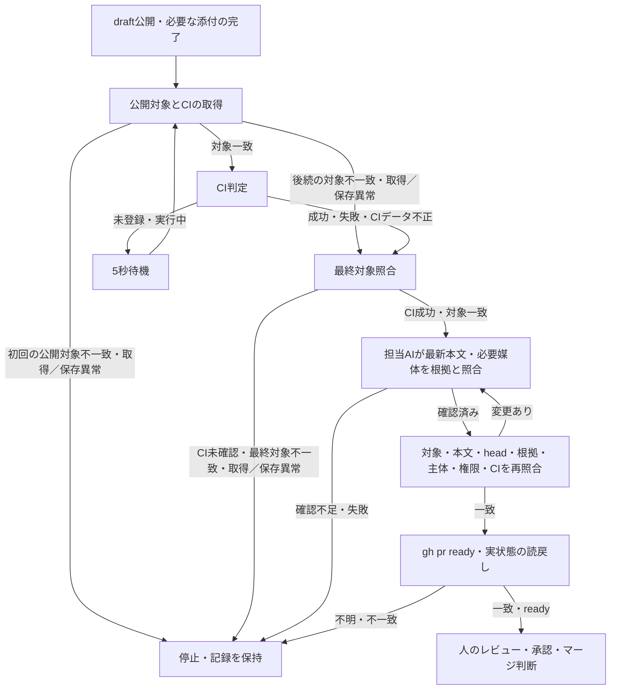

# 制御CLIの試行手順

合意済みIssueから新しい変更を作る担当者と、独立評価を試行する担当者向けの手順です。この文書をCLIの操作および実行制約の正本とします。目的に応じて次の入口を選びます。

- 合意済みIssueの開発は[implement](../skills/implement/SKILL.md)から`development.ts`を使います。初回実装からPR作成までの手順、利用条件、上限は[IssueからPR作成](#issueからpr作成)を参照してください。文書のみの合意済みIssueも同じ入口で扱い、[ドキュメントの更新](../docs/wiki/development-policy.md#ドキュメントの更新)を適用します。
- 独立評価を1回観測する試行には`review-probe.ts`を使います。[実行方式](#実行方式)で通常開発との違いを確認してください。
- ハーネスの導入や検証は[READMEのセットアップと検証](../README.md#セットアップと検証)、変更とレビューの方針は[開発方針](../docs/wiki/development-policy.md)を参照してください。制御CLIや実モデルの起動は不要です。
- 何を変更するか未確定の相談は[scoping](../skills/scoping/SKILL.md)で要求を整理し、[対話と方針の決定](../docs/wiki/development-policy.md#対話と方針の決定)に従って合意済みIssueへつなぎます。

中断後の確認は[結果と再実行](#結果と再実行)、公開担当の操作は[PRの公開](#prの公開)、PRと人のレビュー・承認は[レビューを助ける説明](../docs/wiki/development-policy.md#レビューを助ける説明)を参照してください。公開の許可と範囲は[implement](../skills/implement/SKILL.md)と[IssueからPR作成](#issueからpr作成)で確認します。共通check内の制御テストは模擬コマンドを使いますが、ここで説明するCLI試行は実モデルを呼びます。

## IssueからPR作成

```sh
bun /absolute/path/to/trusted/scripts/implement/development.ts 99 --repo /absolute/path/to/target-checkout
```

番号または対象repoのIssue URLを渡します。実行前に対象のREADME、開発方針、適用される指示、下記の設定を確認してください。ハーネスはBun、Git、gh、Codex CLIを使います。対象repoの言語やテストツールは設定に従います。

開始時にcheckout、remote、GitHub repo ID、base branch、gh主体、必要なpush権限を照合します。開始commit・元checkout・必要入力・隔離worktree・setup後照合の定義は、[実装開始の条件](../docs/wiki/implementation-start.md)を参照してください。run保存先や同名branchが既にある場合は開始せず、要求・対象・設定・主体の変更や、設定された有限の上限超過では停止します。照合後は初回実装、必要な撮影、対象のcheck、独立評価へ進みます。

必要な調査報告がある場合は[引き継ぎ引数](#調査報告を指定した実装開始)で指定します。

通常の新規実行では、初回実装・修正・独立評価にモデル経過時間の上限を設けません。実行回数・経過時間・指摘履歴・結果・実行中の予約は記録します。追加修正・独立評価にも回数上限を設けず、合意範囲内の必須指摘を解消した最新成果物のcheckと独立評価acceptedまで修正ループを続けます。CI待機の総時間上限も設けません。各checkの9分は維持し、通常コマンドとCIの各状態取得・最後の対象照合は各11分で打ち切ります。要求・対象・権限の照合と手動中断による停止は継続し、通常利用者に時間・回数設定や回数だけを理由とした続行承認は求めません。

有限設定の既存runを同じ記録のまま無制限へ切り替えることは設定変更として拒否します。時間・使用量・履歴の保存量が増える可能性があり、修正の収束は保証しません。

保存先は `~/.local/share/dotagents/development/<Git管理ディレクトリの識別値>/<Issue番号>/` です。`--run-dir DIRECTORY` でcheckoutやGit管理領域の外を指定できます。`target.json` に対象設定、repo ID、gh主体を残し、ほかに要求、指示と結果、検証ログ、作業checkout、PR本文とURL、CI結果を残します。既存の保存先は再実行に使いません。中断後は記録、実プロセス、GitHubの状態を照合し、保存先の削除や別名での自動再試行は行いません。

`--no-publish` は独立評価までで止め、commit、push、PR作成、draft/ready操作をしません。push権限の確認も不要です。通常実行は検証済み対象を再照合し、commit、acceptedな評価からのPR本文生成、ユーザー認証と権限の再確認、gh主体の資格情報を明示したpush、ユーザー認証によるdraft PR作成と対象・本文・draft状態の読戻しへ進みます。pushにはコマンド内だけで定義するHTTPSの公開先を使い、GitのURL書き換え後も対象が一致することを確認します。SSHへの切り替えや別repoへの書き換えは拒否します。`push.followTags`の設定にかかわらず、タグを同時に公開しません。通常入口ではpush前に同じhead branchのopen PRがないことを確認し、あれば既存PR修正の入口へ戻します。別baseのPRも同じbranchのpushで更新されるため対象に含めます。設定した保存先から生成媒体の変更を添付します。

`ciChecks`に指定した全checkの登録とSUCCESSを待ち、取得ごとにPRのhead・base・OPEN・draft状態を照合します。必要なcheckのSKIPPEDやNEUTRALは成功と扱わず、同名checkが複数ある場合は全件の成功を求めます。他の登録済みcheckに失敗や保留がある場合も完了にしません。

最後の公開操作（媒体があれば添付）の後に、URL・head・base・OPEN・draft・Issue参照とcheck群を一度に取得します。初回取得と後続の各取得は、それぞれ11分を上限とします。公開対象の一致を確認し、同じ初回応答のcheckを直ちに判定します。未登録・実行中なら5秒待って再取得し、総待機時間では打ち切りません。未登録・実行中のままなら手動中断や異常検出まで待機が続き、取得ログも増え続けます。待機間隔により状態変化の検知に数秒かかる場合があるため、即時の確認が必要ならPR上のcheckを確認してください。実際のGitHub負荷の変化は未測定です。

過去の時間切れ記録は[結果と再実行](#結果と再実行)の分類で読めます。

CI未確認時もPR URLと取得済みの公開結果・ログを保持し、非zeroコードで終了します。詳細は[結果と再実行](#結果と再実行)を参照してください。CI成功後もPRはdraftのままです。担当AIは[公開後確認とreadyへの切替](#公開後確認とreadyへの切替)を完了してから人へ渡します。人が要求・権限の変更、レビュー、承認、マージを判断します。

## 既存PRの修正

人が採用したレビュー指摘・期待する結果・許可範囲と、必要な過去指摘・出典を一つの文章ファイルにまとめ、前回の公開runを指定します。PRコメントの自動収集・自動採用は行いません。対象は、このハーネスで検証・公開したopen PRで、現在のgh主体が作者である同一repoのbranchです。`result.json`、対象・Issue・検証設定・state・公開対象の記録が揃うrunを使います。

開始前に担当ホストは、既存の要求精査で現在のIssueが人の合意済みであり、今回の明示的な修正依頼と許可範囲が整合することを確認します。前回公開後にIssueを更新した場合も、この確認を経て同じPRの新runを開始できます。本文の差分やOPEN状態だけで人の合意を自動判定しません。未合意の要求変更は人の合意へ戻します。

```sh
bun /absolute/path/to/trusted/scripts/implement/development.ts 99 \
  --repo /absolute/path/to/previous-run/checkout \
  --previous-run /absolute/path/to/previous-run \
  --request-file /absolute/path/to/adopted-review.md \
  --run-dir /absolute/path/to/revision-run
```

`--run-dir`は前回runと同じ親ディレクトリ内の新しい保存先を指定します。既存の`result.json`を使って同じcheckoutの未完了・公開結果不明の実行を照合するためです。新しい保存先を確保した後、結果の初期記録を先に置き、要求・設定・修正入力を保存してからsetup直前に対象と並行する実行を照合します。ここで不一致があれば、`phase: implementation`・`operation: check revision before setup`で停止しますが、setupや担当AIは起動していません。停止理由・既知のPR URL・次の対応は新runの`result.json`で確認できます。別の再開台帳は作りません。前回run・state・ログは読み取り参照に限り、修正入力・検証設定・評価・結果は新runへ保存します。

前回記録にあるrepo・Issue番号・PR・公開commit・checkout・主体・対象設定をGit/GitHubの実状態と照合します。checkoutは記録した公開headと一致し、設定原文が前回runと一致し、ローカル設定以外の追跡対象・未追跡の作業差分がないことが必要です。既存本文は開始時に読み取り、固定した修正入力とともに担当者へ渡します。未完了の実行、結果不明、対象不一致、残った作業があれば開始せず、記録と作業を保ったまま原因・次の対応を返します。別checkoutの自動作成、stash、作業差分の移植、rebase、旧stateの変換・再開は行いません。

前回のIssue内容は前回stateのhashと照合し、保存記録の整合性を検査します。前回runに`issueFormat: 1`を要求し、保存した比較用テキストのhashだけを照合します。保存ファイルへの改行追記や本文の改変は拒否し、前回の記録は書き換えません。現在のIssueには前回との内容一致を求めず、同じrepo・Issue番号のOPENな要求で、空でないtitle・bodyがあることを確認します。開始時に取得したtitle・body・state・updatedAtを今回の固定入力とし、新runの`issue.json`と修正の検証設定へ保存します。前回のIssueとstateは書き換えません。この条件は新しい修正runへ適用し、停止した実行の再開や旧記録の移行には使いません。

新しい明示的な修正依頼ごとに初回修正し、追加修正・独立評価の回数上限は設けません。モデル時間制限も設けず、check・capture・CI等は通常developmentの時間枠と処理を共用します。過去のaccepted・check・capture成功や指摘IDは新runへ移しません。固定後のIssue変更は開始準備中も拒否し、setup前・実装前や後続の工程境界で検出したら停止します。修正入力・主体・権限・設定・PRの本文・head・baseなどの変化も引き続き停止対象です。人が要求・許可範囲を変更する場合は合意へ戻し、新しい明示的な依頼で別のrunを開始します。

検証入口の修正対象照合はcorrectionが担当します。設定・保存先、lock、保存stateを確認してから、修正入力・Issue・対象・主体・権限・PR・remote ref・並行runを照合します。同時に異常がある場合、保存先・lock・stateの異常で先に停止し、その時点では外部対象の変化を照合しません。検証後とsetup・モデル実行・commit・push・本文更新・draft/ready切替をまたぐ再照合は継続します。

correctionの`readIssue`はIssueを取得して比較用テキストへ変換し、開始時だけraw出力を保存します。修正対象は照合しません。呼出し元が取得直後の比較用テキストをcorrectionの`revisionUnchanged`へ渡して修正対象を照合し、通った後に開始時の`issue.txt`を保存します。入口（終端stateの再照合を含む）、各cycleの開始、追加修正の直前、capture・checkの後と独立評価の前後でIssueを読み直します。同じ境界では取得済みのIssueを使い、他の修正対象は`checkRevision`で改めて取得・照合します。修正対象の照合をIssueのhash比較より先に行い、修正時の不一致は例外として停止します。進行中の通常correctionではIssueのhashが変わると`requirements_changed`になります。developmentもcorrectionの返却後に修正対象を再照合します。commit前後のverify再呼出しでは終端stateの鮮度を確認し、check・独立評価は再実行しません。

対象不一致や中断までに、空のverificationディレクトリ、または開始時のIssueのraw出力（`issue.stdout`・`issue.stderr`）だけが残る場合があります。取得した自分のlockはfinallyで解放し、既存lockは取得・削除しません。入口で対象不一致を検出した場合はstateやモデル実行記録を新規作成せず、作業と旧runの記録を保持します。

評価の差分は前回から保持したPR全体の基点から作ります。公開headは今回の修正の開始点として別に渡し、独立評価は今回固定した合意済みIssue全体と採用した修正要求の両方でPR全体を確認します。既存本文の変更説明、未確認事項、添付リンクは現在も必要か評価し、必要な内容をacceptedな評価の公開用説明へ含めます。過去の生成本文を再帰的に追加せず、以前の全文は実行証拠に保持します。

引き継いだ調査報告は、初回修正前に同じPR全体の基点のpath・blobと照合します。参照pathの欠落や版違いではsetup・初回修正を開始しません。公開headで資料が改訂されていても参照の基点・blobを置き換えず、初回修正・追加修正・独立評価へ同じ基点と報告参照を渡します。担当者は元の参照と現在の資料の差分を評価します。前回runのIssue・参照・保存記録は変更しません。

公開時は検証済み成果物をcommitし、push前に対象・主体・権限・既存本文・head・refを照合します。同じhead repository・branchを使う対象外のopen PRがあれば、別base向けも含め、draft化・push・本文更新の前に停止します。共有branchの影響と許可範囲を照合し、対象外のPRを自動でdraftへ戻しません。readyなら`gh pr ready --undo`でdraftへ戻し、同じ対象・本文・headとdraft状態を読み戻してからpushします。既にdraftなら切替を重ねません。本文更新前・更新後と添付前にも必要なdraft状態を確認し、不明・不一致なら後続の公開変更を止めます。

draft確認の開始前から今回の`publication`を`unconfirmed`として既知のURLとともに`result.json`へ保存し、本文更新後の本文・ref・PR head・draftの読戻しで`published`とします。更新前に本文等が変わっていれば未確認の手編集を上書きしません。更新後は既存処理で同じheadのCIを確認します。GitHubの複数操作は原子的ではなく、通信断や割込み後に自動再試行せず、失敗時にreadyへ自動復帰しません。draft化やpush成功後の失敗でもPR URLと判明状態・次の対応を残し、旧headを今回の最新成功として案内しません。

`--no-publish`では修正後の独立評価までで止まり、commit・push・本文更新・draft/ready操作をしません。自動コメント投稿、会話のresolve、承認、マージも行いません。媒体がある対象は通常の添付・公開後確認を継続します。制御テストの模擬応答、実モデルの意味判断、実際のPR更新は別の検証です。

## 調査報告を指定した実装開始

必要な報告の選択と共有状態の確認は[scopingの引き継ぎ手順](../skills/scoping/references/session.md#調査成果の引き継ぎ)に従います。この節では、確認済みの報告を実装へ渡すGit操作とCLIの検証条件を説明します。

報告の内容を確認した時点で、`git hash-object --no-filters -- docs/research/reset-behavior.md`の出力を`REVIEWED_BLOB`として記録します。報告をcommitした後、`git rev-parse HEAD`で開始commitを取得し、`git rev-parse HEAD:docs/research/reset-behavior.md`が確認済みblobと一致することを確かめます。次の`START_COMMIT`と`REVIEWED_BLOB`を、それぞれの完全なIDに置き換えて指定してください。

```sh
bun /absolute/path/to/trusted/scripts/implement/development.ts 99 \
  --repo /absolute/path/to/target-checkout \
  --start-commit START_COMMIT \
  --report docs/research/reset-behavior.md=REVIEWED_BLOB
```

`--report`には対象repoの`docs/research/`、`docs/wiki/`、`docs/decisions/`配下のMarkdownを指定できます。現行の文書参照だけを受け付けます。wiki・DRも同じpath・blob・開始commitで照合し、原本の採用状態と適用条件を保ちます。`--report`は必要な報告ごとに繰り返し、`--start-commit`も指定します。開始・停止の条件は[wikiの開始条件](../docs/wiki/implementation-start.md)を参照してください。初回実装にはIssue URL、開始commit、報告パスとblobを渡します。報告本文を読み、内容の十分性と合意・共有状態を確認する責任は担当者に残ります。

選んだ報告のパスとblob IDは、同じ実行の検証設定の`reports`へ自動で渡します。初回実装、修正、独立評価は同じ開始commitと参照一覧を受け取り、Issueや報告から出典、適用条件、合意状態を確認します。対象repoの`.dotagents.json`や別の引き継ぎ文書に報告本文を転記する必要はありません。必要な報告がない場合も、Issueが参照する今回関連する資料を担当者が選びます。

修正と独立評価の入口では、参照の形式と開始commitのblobを照合します。実装中の報告改訂は通常の差分として評価対象に含め、開始時の参照は書き換えません。担当AIは開始版と現在の報告を比較し、新しい観測が以前の結論を変えるか、未合意の提案を規則として扱っていないかを説明します。評価対象のファイルhashと参照文書の版は既存の評価記録に残ります。評価中や完了後の根拠ファイル変更は既存のソース同一性検査で検出し、古い成功を流用しません。外部資料の更新や意味の変化はこのhash検査の対象外となるため、担当者が元資料の版や適用条件を確認します。

判断を左右する参照の欠落や古さ、矛盾がある場合は、影響する判断と戻り先を示します。事実不足は調査し、要求・許容範囲・権限の変更は人の合意へ戻します。独立評価では判断を妨げる不足を必須の未解決指摘として扱い、公開後の作業へ送ってacceptedにはしません。参照した文書の役割と理由、各観点の評価、残る確認は構造化評価から[公開用のPR説明](#レビュー対象と参照記録)へ渡します。検証結果の再利用条件とCI分類の再設計は、この参照引き継ぎでは扱いません。

上記の開始条件を満たす未共有の報告でも、既存の許可範囲で`--no-publish`の実装を開始できます。共有・commitの許可と状態の扱いは[引き継ぎ手順](../skills/scoping/references/session.md#調査成果の引き継ぎ)に従います。参照の機械的な照合は人の合意や実装許可を代替しません。

## 対象repoの設定

対象checkoutのルートに `.dotagents.json` を置き、合意した設定から開始します。設定ファイルは必須ですが、commit・pushは任意です。チームで同じ条件を確認できるよう、リポジトリへの登録による共有を推奨します。設定自体を変更するIssueは、実行前に適用する設定と検証方法を照合してください。実行中の設定置換で検証を省略できません。

未追跡の設定や、`.git/info/exclude`・個人のGit除外設定でローカルに除外した設定も利用できます。利用のために共有`.gitignore`を変更する必要はありません。ローカル設定をstageしないでください。開始commitに設定がない場合、indexへの追加も拒否します。追跡済み設定は開始commitの本文・index・モードと一致する必要があり、ローカルで変更したままでは開始できません。設定の変更を使用する場合は、合意した条件を照合して別途commitするか、設定を追跡しない運用へ別途変更してください。ハーネスが追跡を解除することはありません。

開始時の設定原文・対象・主体はrunの`target.json`へ保存します。初回実装ではローカル設定を作業用worktreeへコピーし、既存PRの修正・ホスト検証後の再評価は同じcheckoutの設定を前回runと照合します。設定原文は検証定義にも固定し、ローカル除外したファイルもソース同一性に含めます。設定の欠落・不正・差替えや対象・主体・権限の不一致では停止します。実行中に設定の追跡状態を変えたり、新しい設定へ切り替えたりしないでください。

ハーネスのcommit対象からルートの`.dotagents.json`を除外し、ローカル設定はcommit・push・PR差分へ追加しません。公開本文はローカル設定への存在しないcommitリンクを省き、runの設定を使用したことを説明します。設定を共有しない場合も、setup・check・capture・同じheadのCI・独立評価・人によるマージの条件は変わりません。公開先のCIはローカル設定を参照できないため、CIに必要な設定は対象repo側で用意してください。永続的な個人設定や全repo共通の設定の正本は追加しません。

このファイルはハーネスの対象repoと実行・検証方法の設定です。Codex一般の設定やプロダクト知識の保存先には使いません。要求と合意はIssueから、判断根拠は関連文書や必要な調査報告から参照します。

```json
{
  "repository": "team/component",
  "remote": "upstream",
  "baseBranch": "release",
  "setup": [["python3", "-m", "venv", ".venv"], [".venv/bin/pip", "install", "-r", "requirements-dev.txt"]],
  "check": [".venv/bin/python", "-m", "pytest"],
  "ciChecks": ["tests"],
  "capture": null
}
```

`setup` はコマンド1件なら `"setup": "bun install --frozen-lockfile --ignore-scripts"`、`check` は `"check": "bun run check"` のような空でないシェルコマンド文字列を指定できます。文字列はmacOSの `/bin/sh -c` へそのまま渡し、対象checkoutで実行します。引用符の解釈、変数展開、パイプやリダイレクトはシェルが処理します。`setup` で複数のコマンドを順番に実行する場合は、上例のようなargv配列の配列を使えます。`check` もargv配列を使えます。argv配列はシェルで解釈せず、実行ファイル名と後続の引数を順序どおり渡します。引数の空文字や空白も保持します。シェル解釈が不要なら既存の配列形式をそのまま使えます。文字列形式には、この形式に対応したハーネスが必要です。

`capture.command` は引き続きargv配列です。`.dotagents.json` では、実行ファイル名が空または空白だけの配列、`setup`・`check` の欠落・空文字列・空白だけの文字列・不正な型、`check` の空配列、撮影方針の省略は開始前に拒否します。セットアップが不要な場合は `setup: []` と明示します。

いずれの形式も対象checkoutで実行し、非zero終了は失敗です。文字列形式も既存のcheck経路で終了コード・タイムアウト・中断を扱い、設定原文の同一性と公開先の照合条件は維持します。対象のcheckがテスト未実行やskipなどを成功扱いしないことも、設定担当と独立評価で確認します。CLIが任意の外部runnerのレポート形式や合意の意味を判定するものではありません。

`ciChecks`はCIで実行成功を確認するcheck名の配列です。省略、空の名前、重複を拒否し、対象repoのcheck名をそのまま指定します。公開する`development.ts`の実行では1件以上が必要です。CIを持たないrepoは空配列を明示すれば、`--no-publish`でローカル検証まで実行できます。既存設定にもこの項目を追加してください。

`capture: null` は必要な媒体がない場合に使います。媒体が必要な場合は `command`（argv）、`destination`（生成媒体専用のrepo相対ディレクトリ）、`required` を指定します。必要な媒体を常に撮影する場合、Markdownを画面の入力にするrepo、文書のみのIssueでも媒体が必要な場合は `required: true` です。`false` は下記の文書や保存記録が画面に影響しないrepoでのみ使えます。設定時にIssueの必要証拠と照合し、未設定を成功へ読み替えません。実装担当や評価担当は、設定と要求が矛盾した場合は停止します。

`{harness}` はコマンド引数内で信頼するハーネス実体の絶対パスへ展開します。このハーネス自身の設定は [../.dotagents.json](../.dotagents.json) が正本です。別repoへこの設定を無条件にコピーしないでください。

読み取りによる照合は次で行えます。`--write` はghのpush権限も検証します。IssueやPRの作成・更新はここで表示するghユーザーの認証を使います。scoping担当者が合意と対象を照合して既存ghのIssueを操作します。

```sh
bun /absolute/path/to/trusted/scripts/scoping/target.ts /absolute/path/to/target-checkout https://github.com/team/component/issues/99 --write
```

対応環境は現在のmacOSホストとgithub.comです。GitHub Enterpriseと他のホスティングは対象外です。全調査への必須監査、質問・回答のruntime所有、公開intentの機械的拘束、自動再開は提供しません。人の合意と変更時の停止、対象の検証、独立評価、検証済み対象の同一性確認を維持します。

## ホストによるブラウザー検証と撮影

実装担当と修正担当はsandbox内でコード、テスト、文書、撮影定義を準備します。設定済みcheck・captureでのブラウザーやサーバーの起動はホストCLIが担当します。設定済みcheck・captureの実行待ちだけなら`repaired`を返します。通常経路では実行しない受入検証が必要なら`needs_host`、要求や許可の判断が必要なら`needs_human`で具体的な理由を返します。初回実装と追加修正の両方へ、実際のcheck・capture契約を渡します。

必要な媒体は対象設定のcapture commandで撮影します。コマンドにはcheckout外の新しい絶対出力ディレクトリを最後の引数として渡します。PNG、JPEG、WebP、MP4、WebMだけを直下に保存し、動画contextを閉じて確定してください。撮影中はcheckoutに媒体、コード、文書、レポートを書き込みません。ホストは空の出力、不正な形式、symlinkを拒否し、対象が変わっていないことを確認したうえで `destination` へ取り込みます。生成媒体専用領域は内容を置き換えるため、手書きの記録を置かないでください。

付属のPlaywrightアダプターは `bun {harness}/scripts/capture/capture.ts SPEC CONFIG ABSOLUTE_OUTPUT` です。対象repo側のPlaywright依存、指定したspec、設定のprojectsやwebServerを使います。元設定からの相対的な`testDir`、global setup/teardown、`tsconfig`、`webServer.cwd`を解決します。指定したspecが通常の`testDir`外にある場合は、そのspecのディレクトリへ探索範囲を広げます。各撮影projectでは指定したspecだけを選び、依存projectやteardown projectは元の選択条件を保ちます。projectの`use`とブラウザーの選択、ホストの`PLAYWRIGHT_BROWSERS_PATH`を引き継ぎます。specの欠落、指定specの実行0件、skip、失敗はいずれも成功扱いしません。setupだけ成功しても撮影成功にはしません。この共通repoはプロダクトを含まず、Playwright依存も持ちません。ブラウザーやサーバーは対象設定で起動し、起動失敗をレポートから分類します。

アダプターは新しい外部出力先を要求し、生成設定、JSONレポート、artifactsの保存先もその隣へ指定します。既存snapshotの参照先は元設定の場所から解決し、snapshot更新は無効にします。媒体は拡張子とファイル先頭の形式識別子を照合し、空の出力とsymlinkを拒否します。完全なデコードや表示品質はこの照合では保証しません。spec、global hook、webServer自身の書き込みもcheckout外へ向けてください。任意の対象コードの書き込みを隔離する機能ではないため、ホストは撮影後に対象が変わっていないかを照合します。

`destination`の媒体は撮影で更新されます。過去の記録の固定ハッシュを最新媒体の根拠には使いません。撮影後に対象ソース（commitと未commit差分を含む）、撮影ログ、配置した媒体のサイズとSHA-256、検証結果を照合し、対応PRへ記録します。公開時はホスト固有のパス、非公開repo情報、非公開の実行ログを転載せず、公開可能な要約と根拠を示します。過去の記録は対象時点を保ち、PR内の表示・再生と同headのCIはそれぞれの実施結果を区別します。

developmentは対象設定のcapture command、保存先、撮影方針を内部の修正ループへ渡します。撮影必須なのにcommandがない設定は実行前に拒否します。撮影の省略は、媒体不要の合意がある場合だけ使います。

撮影結果は同じ実行内で入力と媒体が一致する場合に再利用します。`required: true` は文書・保存記録も同一性に含め、初回は必ず撮影します。以下の文書・保存記録の除外は `required: false` の場合だけ適用します。

各検証の前に、HEADからの追跡ファイルの差分と未追跡ファイルを確認します。開始時に固定した未追跡の対象設定は、初回の文書差分の判定に数えません。ただし、captureコマンドが直接参照する設定は撮影の入力として扱い、`required: true`では文書変更でも撮影します。変更が通常の非実行Markdownファイルだけなら撮影と媒体の置き換えを省略し、既存媒体を保持して共通check・独立評価へ進みます。symlinkや実行属性の追加・解除・削除、コード、撮影定義、媒体など他の変更を含む場合や、変更を判定できない場合は通常どおり撮影します。文書が参照する媒体の不足や不整合は独立評価で確認します。撮影保存先の媒体がGitのignore規則によってソース同一性の対象から外れる場合は停止し、撮影成功や再利用とは扱いません。

初回撮影後は、最後に成功した撮影と媒体取り込み時点のファイル内容、モード、パスを保存し、修正後と比較します。通常のMarkdown文書と、`destination`の親ディレクトリ内（`destination`を除く）の保存記録（`.json`・`.txt`・`.log`・`.stdout`・`.stderr`・`.diff`）だけの更新なら撮影を省略し、既存の媒体と撮影ログを保持します。これらは撮影の入力として使わない文書や記録の配置です。実行可能ファイル、symlink、撮影コマンドの引数が直接指すcheckout内の定義ファイルは、単独のパス引数と`--config=path`のようなオプション値のどちらも、拡張子にかかわらず省略対象にしません。直接指定した定義が未追跡かつGitのignore規則で除外される場合は、`required`の値にかかわらず停止します。ただし、開始時に固定され、ソース同一性に収録されたルートの`.dotagents.json`は直接指定できます。定義から間接的に読み込む入力も、除外する文書・保存記録の配置に置かないでください。その配置を画面や撮影の入力に使うrepoは`required: true`にします。コード、設定、撮影定義、媒体、その他のファイルが変わった場合、撮影失敗後、成功した比較基準がない場合は再利用しません。初回のMarkdownのみの変更を省略する条件は上記のとおりです。

撮影を再利用しても、文書や記録を含む全体の変更検知、共通check、独立評価は省略しません。評価者は保持された媒体の撮影対象と現在のコードの対応、および証拠記録の整合を確認します。停止済み実行の上限や状態は変更せず、この仕組みは同じ実行の修正ループ内で使います。

再撮影が必要な場合はcheckout外の新しい出力先で行います。要求とソースが変わっていないことを確認して媒体を取り込み、媒体を含む対象を確定して共通check、独立評価、公開へ進みます。撮影失敗時はログを修正担当へ渡します。起動不能は`capture_unavailable`、撮影の時間切れは`capture_timeout`として停止し、ホスト側での環境確認が必要です。撮影にも各checkと同じ9分の上限とプロセスグループの中断処理を適用します。正常な`needs_human`と不正応答を区別して表示し、記録を保持します。

### UI変更時の幅掃引

初回実装と追加修正でUIを実装・変更した場合は、[幅掃引の手順](../skills/implement/references/testing.md#ui変更時の幅掃引)に従い、主要状態を対応幅の全整数で計測します。同じ画面・状態・対象版・条件の既存結果を使える場合を除き、実行を省略しません。通常checkに含めたspecは既存のホストcheckで実行し、含まれない実ブラウザー検証は既存の`needs_host`と[再評価](#ホスト検証後の再評価)を使います。`capture: null`でも媒体を要求しないDOM計測は可能です。

対象repoに置くspecの例です。パス・URL・状態・範囲は対象repoの要求から選びます。例の320〜1440px・高さ900pxはIssueの試行条件であり、全repoの既定値ではありません。`prepare`は状態を作り、`ready`は各幅でその状態の描画完了を待ちます。実際の画面に合わせて複数状態を定義し、fixtureの認証・データ準備を使ってください。

```ts
import { test, expect } from '@playwright/test';
import { join } from 'node:path';
import { widthSweep } from '/absolute/path/to/trusted/scripts/ui/width-sweep.ts';

test('主要状態の幅掃引', async ({ page, browser }, testInfo) => {
  test.setTimeout(180_000); // 対象repoの待機と既存のホスト上限に合わせて選ぶ
  const output = process.env.WIDTH_SWEEP_OUTPUT;
  if (!output) throw Error('WIDTH_SWEEP_OUTPUTが必要です');
  await widthSweep(page, {
    testInfo,
    minWidth: 320, maxWidth: 1440, height: 900,
    output: join(output, `${testInfo.project.name || 'default'}.json`),
    source: '対象commitと未commit差分の識別値',
    browser: `${browser.browserType().name()} ${browser.version()}`,
    conditions: '対象URL、認証・データ、フォント、OS、projectのuse設定',
    limitations: '確認した状態の範囲と、今回確認しない操作・環境',
    states: [
      {
        name: '読込後', url: '/screen',
        prepare: async () => { await expect(page.getByTestId('screen-ready')).toBeVisible(); },
        ready: async () => { await expect(page.getByTestId('screen-ready')).toBeVisible(); },
      },
      {
        name: '詳細展開', url: '/screen',
        prepare: async () => { await page.getByRole('button', { name: '詳細' }).click(); },
        ready: async () => { await expect(page.getByTestId('detail-ready')).toBeVisible(); },
      },
    ],
  });
});
```

ホストで、対象repoのcheckoutを作業ディレクトリにして実行します。出力先はcheckout外の未使用の絶対ディレクトリです。親ディレクトリは先に用意します。通常checkから直接呼ぶ場合も、`widthSweep`の`output`には外部の新しい絶対ファイルを渡してください。

```sh
bun /absolute/path/to/trusted/scripts/ui/run.ts \
  tests/width-sweep.spec.ts playwright.config.ts /absolute/path/outside-checkout/new-sweep
```

入口は対象repoの`@playwright/test/cli`を解決します。設定ファイルから辿れる依存が存在することを先に確認し、BunのキャッシュだけにあるPlaywrightは使いません。依存がなければ出力を作る前に拒否します。[撮影アダプター](#ホストによるブラウザー検証と撮影)と同じ設定解決と実行結果の検査を再利用し、元のprojects・依存project・webServer・hooks・ブラウザー設定を引き継ぎます。撮影は要求しません。指定specのみを選び、skip・0件・失敗・計測記録なし・幅の欠落・対象条件やDOM値の欠落・成功とページ超過の矛盾を非zeroで拒否します。`testInfo`から記録したproject名、specの絶対パス、テストの位置とタイトルを実行レポートへ照合し、指定specの各テスト・projectの記録欠落も拒否します。別ファイルの依存projectのsetupは掃引対象に数えません。page fixtureのビューポートを指定するため、固定サイズに変更できない構成は成功にしません。projectごと・テストごとに異なる出力ファイルを指定してください。

計測JSONには対象版・高さ・ブラウザー・条件・一意な状態名と各整数幅の計測値を残します。各sampleの`measurement`はDOMの幅の値だけ、`candidates`は境界・selector・スクロールやクリップする祖先の詳細を一度だけ持ちます。古い二重保存形式や対象識別情報のない記録は、この入口の成功判定には使えません。同じ画面・状態・版・条件の既存結果の明示的な再利用は、引き続き担当AIが証拠を照合して独立評価へ渡します。

新しい出力ディレクトリに計測JSONを、その隣に`.config.mjs`・`.report.json`・`.artifacts`を残します。既存の記録は上書きせず拒否します。依存やブラウザーが不足した場合も非zeroで終了し、起動不能を検査できた場合は78です。一般の実行失敗は1です。途中で中断され、JSONが未完成・未生成の場合は未実行または未完了として生ログに記し、成功へ読み替えません。spec・hook・serverが独自に書くファイルも対象repoで外部へ向けます。任意の対象コードの書き込みを隔離する機能ではありません。

実ブラウザーの結果と候補の実画面確認は、同じ対象版・差分の`findings`から独立評価へ渡します。正常な対照、849〜851pxだけページ全体がはみ出す例、意図した局所横スクロールを使う限定したホスト検証と、模擬pageによる制御テストを区別します。合成HTMLと生結果はcheckout外へ生成し、既存のローカル試行資産は取り込みません。

### 同じ実行内の確認と再利用

各工程は、それぞれの入力に対応する既存の記録を使います。再利用は同じ実行内に限り、別実行、PR差し戻し、中断復旧へ結果を引き継ぎません。入力を取得・照合できない場合は成功を再利用せず、原因を確認します。

| 工程 | 入力と記録 | 変更時の処理 |
| --- | --- | --- |
| 撮影 | 設定とIssueの必要証拠を照合し、`captureSource`で対象・媒体を比較 | 対象コード、定義、媒体、モード、symlinkの変更は再撮影。要求変更は停止 |
| 共通check | 設定したコマンド、文書・媒体を含むソースと`check-N`ログ | 修正後は毎回実行。実行中の要求・ソース変更は停止 |
| 独立評価 | 要求、ソース、成功したcheck、モデル設定と`review-N.target.json` | 修正後のcheck成功を受けて再評価。評価中の対象変更は停止 |
| 公開前照合 | 同じ実行の終端結果、設定、要求、成果物 | 同一ならcheck・独立評価の成功を再利用。変更なら`target_changed_after_stop`で拒否し、旧stateは保持 |

`state.json`のcapture・checkイベントには`captureDecision`として実行予定（`execute`）、同一入力の再利用（`reused`）、対象外による不要（`not_required`）と理由・比較対象を残します。`execute`だけでは成功を意味せず、撮影の終了結果、媒体取り込みと後続checkの記録を確認します。撮影未設定による不要は、Issueで媒体不要と合意していることが前提です。利用不能・時間切れは停止理由と撮影ログに残し、不要や成功へ読み替えません。

撮影を再利用しても、修正後の共通checkと独立評価、同じPR headのCI確認は維持します。失敗・中断のログ、旧state、消費時間と回数は削除・変換しません。

## 実行方式

修正・評価の実行は次の2用途に分けます。

| 用途 | 入口と終了条件 |
| --- | --- |
| 通常開発 | `development.ts`が初回実装後に内部の修正ループを呼びます。check失敗や必須指摘を修正し、最新のcheck成功と独立評価acceptedまで続けます。回数・累計モデル時間の設定はありません |
| 評価試行 | `review-probe.ts`がcheck後に内部の`reviewOnce`を呼びます。レビューは1回で、acceptedとneeds_changesの双方を`review_completed`として保存します。修正担当を呼ばず、指摘・対象・生応答を残します |

両用途はレビュー指示、対象と要求の照合、応答検査、証拠保存、中断処理を共用します。評価試行では1回のレビューに有限の`reviewTimeMs`を適用します。時間切れは`review_timeout`、check失敗は`check_failed`として保存し、観測完了と区別します。check・撮影にも有限の`checkTimeMs`を適用します。`review_completed`は評価を観測できたことを示し、要求充足、公開の許可、人の承認を意味しません。判定の妥当性は保存した成果物と独立した再現で確認します。

`bun scripts/implement/correction.ts CONFIG_FILE`は終了コード1と案内を返し、指定されたコマンドを起動しません。任意の`repairLimit`・`reviewLimit`・`modelTimeMs`を指定する単独修正試行はありません。通常開発は合意済みIssueから`development.ts`で開始し、評価試行は`review-probe.ts`を使ってください。既存PR修正では、前回正常公開したrunの設定を元のhashのまま読み取り照合できます。

要求はIssueの取得結果の全文を修正と独立評価へ渡します。必要な調査報告は通常開発の[引き継ぎ引数](#調査報告を指定した実装開始)で指定し、開始commitと確認済みblobへ結び付けます。実行中に設定や参照を差し替えることはできません。

### 成果物の要求と実験の管理

成果物のIssueには、目的、変更範囲、完了条件、適用する合意済み方針を記載します。成果物に必要な検証と説明も含めます。文書整理なら、読む順序、正本の配置、リンクの整合性などを要求にし、その実験の計測や公開作業を成果物へ書き込む指示にはしません。

実験する場合は、実験管理のIssueから成果物のIssueを参照し、比較条件、選んだ入口で扱う実行時間・試行数の上限、計測項目、結果の保管と公開を管理します。通常の変更に実験管理Issueを追加する必要はありません。実行担当は合意した上限と権限をその入口に反映します。通常開発の修正・評価回数と累計モデル時間は設定しません。

`config.issue`には成果物のIssueを指定します。完了条件の理解に必要な別Issueの本文は取得対象に含めますが、実験管理の本文を一括で連結しません。要求と実験手順が混在している場合は、実行前にIssueを分けて合意し、見出し抽出で要求を省略する運用は避けます。過去の実測を再利用する場合は元のIssueや証拠を保持し、分離した要求を新しいIssueに記録します。

実行前に`config.issue`の取得結果を確認し、必要な要求と参照内容が揃い、実験手順が成果物の完了条件として混ざっていないことを照合します。この分離は入力準備の責任であり、CLIが内容を自動判定するものではありません。

### 修正・独立評価の担当

初回実装と修正は[repair.ts](implement/repair.ts)の共通指示と応答検査を使います。文書・テスト・撮影・公開禁止の指示を共有し、初回はIssue全体の実装とホスト検証の準備、修正は失敗の根拠に沿う原因診断・修正確認を担当します。初回のsetup後照合と結果保存はdevelopment、修正の起動前予約・回数・中断状態の保持はcorrectionが担当します。初回実装は追加修正のカウンタに数えず、修正後のcheckと独立評価はホストが実行します。

初回実装・追加修正・独立評価へ渡す固定の説明文・指示文・見出しは日本語です。報告参照、既存PRの修正要求、ホスト検証からの復帰に添える固定説明も含みます。JSONキー・status・CLI引数・設定値・schema・ファイル名・モデルIDは変更せず、Issue本文、修正要求、過去の評価やログなどの入力は原文のまま渡します。指示の言語から、実モデルの品質や費用の改善を保証するものではありません。

`repair`と`review`は、要求と失敗の根拠を標準入力で受け取り、結果のJSONだけを標準出力へ返します。`repair`は`status: repaired | needs_host | needs_human`と文字列`findings`を返します。`review`は[review.ts](implement/review.ts)の専用schemaに従います。独自のreviewコマンドにも同じ形式が必要です。

レビュー応答の項目・型・許可値と余分な項目の拒否は、`review.ts`のZod定義を正本とします。受信時の構造検証とCodexの`--output-schema`へ渡すJSON Schemaをここから作り、保存用の完全なレビューも応答定義を組み合わせて検証・型推論します。応答項目を変更するときは該当するZod定義を変更し、関連テスト・指示文・利用側への影響を確認します。JSON SchemaやTypeScript型を別途手書きで同期する必要はありません。Zodは[package.json](../package.json)とlockfileで固定した直接依存です。保存状態は`input.ts`の定義から型と検査を導き、保存済みレビューの定義も共用します。検査は元の記録を変換せず、不正時は`Invalid saved state: 項目パス`で拒否した場所を示します。actorの修正応答や、その他のJSON読込みには適用しません。

空白だけの文字列と安全な正整数でない行番号を拒否し、文字列の自動trimや型変換は行いません。行番号がある場合にpathを必須とする関係はZodの実行時検査で確認します。この項目間の検査は生成JSON Schemaには含まれないため、生成に成功しても受信時の検査を省略しません。対象ID・過去指摘の更新ID・文書参照の重複検査と、ID・状態・総合statusの付与は引き続きホストが担当します。保存済みレビューの形式と旧runを変換・再開しない条件は維持します。

`needs_human`では、担当AIが既存の`findings`に問い・人に必要な選択・影響を説明し、回答に依存する作業を止めます。指示ファイルが停止理由なら、実際に読んだファイルへのリンクと該当文を示し、明示条件と解釈を区別します。空文字・空白だけの`findings`は不正応答として、初回は`Invalid implementation reply`、追加修正は`invalid_repair`で停止し、有効な判断依頼として案内しません。生応答・作業差分・既存記録を保持し、内容の推測補完、自動再生成、上限変更、後続公開は行いません。非空検査は判断材料の意味的な十分性を保証しません。

同じ指摘が反復したら、修正担当は既存の評価記録・過去の修正結果と現在の成果物を照合し、原因と修正方針を見直します。合意範囲内の必須修正を続け、対象外の改善や好みの変更まで完了条件にしません。check失敗も既存の修正経路へ戻します。成果物が変われば必要なcheckと独立評価を更新します。停滞専用のAI、追加レビュー工程、別の台帳は設けません。

次の独立評価には、同じ実行で前回の独立評価以降（初回評価では実行開始以降）に正常終了し、`repaired`と返した追加修正すべてへの参照を、修正した順に渡します。評価担当は`review-N.target.json`の`repairsSinceReview`から既存の`repair-M.stdout`を読み、`findings`にある反証・変更内容・変更しない理由と根拠を、現在のIssue・成果物・check結果へ照合します。`latestRepair`は従来どおり最後の追加修正を指します。check失敗後に別の修正が入っても、前回の評価への反証を含む参照は次の評価まで保持します。評価が完了したら、その後の修正から新しい参照一覧を作ります。修正前後の成果物の識別値も渡すため、無変更の説明や、その後のホスト撮影による差分を区別して確認できます。説明本文は複製せず、修正回数・ログの接頭辞・修正前後の識別値・応答hashを対象記録へ結び付けます。追加修正がない初回評価では`repairsSinceReview`は空配列、`latestRepair`は`null`で、修正記録を要求しません。通常の修正履歴に過去runや別runの理由を補いません。[ホスト検証後の再評価](#ホスト検証後の再評価)では、明示した停止runの記録を別の`hostReturn`参照で渡します。

修正理由の受け渡しによってcheckや全指摘の再判断を省略せず、修正担当の自己申告を`fixed`や`accepted`へ自動変換しません。不正応答・`needs_host`・`needs_human`・修正失敗では従来どおり停止します。参照する正常応答の保存ログのどれかが次の評価前に変わった場合や読めない場合も、`invalid_repair`で停止して既存記録を保持します。参照とhashの照合は入力の取り違えを防ぐためのもので、修正理由の正しさや実モデルによる指摘解消率・費用の改善を保証しません。

評価担当は、概要の`findings`、ホストが指定した`targetId`、4観点の`assessments`、変更説明の`walkthrough`、過去指摘への判断の`updates`、新規指摘の`newItems`、参照文書の`documents`、後続担当の作業を示す`handoff`を返します。総合`status`と完全な`items`はホストが組み立てるため、応答には含めません。各観点には判断理由と未確認範囲を記し、適用しない観点についてもその理由を説明します。

指摘は、`id`、初出対象の`introducedIn`、証明できた欠陥と未確認の懸念を分ける`kind`、指摘の観点を表す`area`（code・requirements・tests・documentation）、必須対応かを表す`required`、`location`、発生条件、影響、根拠、必要な対応を持ちます。文書不足など実在するコード位置がない場合は、pathとlineを`null`にし、架空の位置や再現実行を埋めません。新規の指摘は`newItems`に入れ、各項目に`id`・`introducedIn`・`disposition`は含めません。ホストが応答全体の`targetId`を照合した後、`R<評価回数>-<新規指摘の順番>`のID（例: 初回は`R1-1`、`R1-2`）、検証済みの対象ID、`open`をそれぞれ付与し、完全な指摘記録として保存します。順番は各応答の配列順で1から数え、同じ評価回数と順番には同じIDを付けます。一度保存したIDは後続評価で変えません。IDや接頭辞から指摘内容や人の判断が必要かを推測しません。

ホストは以前の全指摘の内容と判断を評価担当へ渡し、元の指摘内容と初出対象を保持します。評価担当は現在の成果物と必要な検証を確認し、過去の各IDに対して`id`・`disposition`・`reason`だけを持つ判断を`updates`へちょうど1件ずつ返します。解決済みの指摘も対象です。初回の`updates`は空配列にします。`disposition`は`open`・`fixed`・`not_applicable`のいずれかにします。`reason`へは未解決、修正済み、根拠付き非該当の判断理由を記します。修正担当の自己申告だけでは解決と扱いません。再発時は`open`へ戻します。

ホストは形式と必須項目、対象ID、更新IDの欠落・重複・未知IDを検査します。新規指摘に`id`・`introducedIn`・`disposition`などの余分な項目があれば拒否します。過去指摘はIDを指定した`updates`で更新し、欠落を解決済みに読み替えません。不正な応答は`invalid_review`で停止します。ホストは過去の本文に現在の判断と新規指摘を合わせ、必須かつ`open`の指摘があれば`needs_changes`、それ以外は`accepted`を算出します。必須対応でない懸念はacceptedにも残せます。指摘の真偽や判断理由の十分性まで形式検査で保証するものではありません。欠落、不正、実行失敗時は停止し、指摘なしや成功には読み替えません。

付属のCodex呼び出しは `gpt-6.1-sol` を使います。通常の初回実装・追加修正（role=`repair`）は `medium`、独立評価と付属actorを使う手動review probe（role=`review`）は `high` です。[codex-actor.ts](implement/codex-actor.ts)でroleから選んだ同じ設定を、起動引数とactor記録へ渡します。独立評価の設定とreview target記録は[review.ts](implement/review.ts)の `reviewModel` を使い、highを維持します。チャットで選んだモデルでは子CLIの設定は変わりません。初回実装と修正はworkspace-write、評価はread-onlyで新しい実行を開始します。評価者はコード、テスト、文書を読み、ホスト側のcheck結果と分けて評価します。実行前にCodexへログインし、対象モデルが利用できるCLIを用意してください。GitHubの書き込みtokenを成果物やプロンプトへ埋め込まないでください。

独立評価は、コードの正しさ、Issueの要求・範囲との一致、テストの検出力、文書・証拠と実装版の整合を区別して判断します。差分に加え、影響する呼出し元、共有型、状態遷移、エラー処理、関連テストを読みます。Issueに個別の要求がなくてもコードとしての欠陥を指摘します。無関係な全コードや全テストの監査、好みの書き方、対象外の機能追加は求めません。

実装からコピーした期待値、別の理由でも成功する失敗テスト、保証に見合わないテストを見落とさず、文書では現行方針、過去の結果、未採用の提案を区別します。文書だけの変更にも適用し、必要のないコードやテスト追加を要求しません。check成功や指摘なしは、欠陥が存在しないことの保証ではありません。

PR作成・添付・CIの登録と成功の確認はCLI、PR内の表示確認と本文・根拠の照合は担当AI、要求・権限の変更とレビュー・承認・マージ判断は人の担当です。実行条件から決まる定型作業はホストがPR本文へ一度だけ加え、評価担当はhandoffなどの公開用項目へ繰り返しません。handoffにはIssue固有の未確認事項・必要な対応・担当だけを記し、なければ空配列にします。条件や担当が異なる自由文は類似表現を理由に削除しません。判断を妨げる未解決事項は必須のopenな指摘に残し、accepted後の残作業へ移しません。定型作業が公開前に未実施であることだけを実装の不備とは扱いませんが、要求の免除や確認の完了も意味しません。

修正担当は調査や修正に必要な箇所を確認し、共通checkはホストが修正後に実行します。独立評価担当は共通checkを再実行せず、要求、コード、テスト、文書の妥当性を確認します。これはCLI試行での担当分担です。

文書の更新要否と完了条件は[ドキュメントの更新](../docs/wiki/development-policy.md#ドキュメントの更新)を参照します。修正担当と独立評価担当で同じ基準を使います。

### レビュー対象と参照記録

評価ごとに既存のrunDirへ次を保存します。

- `review-N.target.json`: 取得したIssue全文とhash、差分の基準commit、追跡ファイル、ignoreされていない新規ファイル、ローカル除外された`.dotagents.json`のパス・モード・内容hash、checkのコマンド・対象・結果・ログhash、reviewコマンドとモデル設定、前回評価以降の追加修正への参照一覧`repairsSinceReview`（各参照は`attempt`・`prefix`・`sourceBefore`・`sourceAfter`・`stdoutHash`、追加修正がなければ空配列）と、その最後の参照`latestRepair`（追加修正がなければ`null`）、これらを含めてホストが算出したtargetId。
- `review-N.diff`と`review-N.additions.json`: 基準commitからのbinary対応差分と、未追跡ファイルの内容・モード。通常ファイルの追加内容はBase64、symlinkはリンク先文字列として保持します。
- `review-N.json`: 過去の本文・現在の判断・新規指摘からホストが再構成した完全なレビュー（`status`・`items`を含む）、対象記録への参照、参照文書の位置・内容hash・モード・役割・参照理由、新しい評価では`walkthrough`の説明と参照先の保存コード・識別値。
- `review-N.prompt`・`.stdout`・`.stderr`: 指示と生の応答。失敗、不正応答、中断でも既存ログと予約を保全します。検証済みの`.json`がない試行を成功とは扱いません。

通常入口は実装前のcommitと、独立評価用の `gpt-6.1-sol` / `high` 設定をホストから渡します。correction単独実行では`baseCommit`の省略時に開始時のHEADを基準として固定します。Git commitのない作業コピーは対象にできません。独自モデルコマンドは、ホストが把握した`reviewModel: {model, reasoningEffort}`を設定します。省略時はモデル設定を不明として記録し、モデルの自己申告で補いません。

評価者は今回参照した主要なリポジトリ内文書を列挙し、ホストは対象内の通常ファイルであることと版を結び付けます。symlink先など対象同一性の範囲外にある文書はこの参照記録に含められません。これは全文書の索引でも、モデルが十分に読んだことの証明でもありません。

`verification/state.json`の`reviewHistory`に有効な評価を残し、修正担当と次の評価へ渡します。`findings`には検証の要約や停止時の診断を保持します。指摘ID、初出対象、根拠、対応、最新判断、未確認事項は`reviewHistory`から確認できます。生ログは、`events`に記録された試行では`events[].prefix`、中断などで`active`が残る試行では`active.prefix`に`.stdout`・`.stderr`を付けたパスを確認します。強制終了や保存障害では、これらのログが存在しない場合もあります。レビューの対象版と原文は同じ接頭辞の上記記録を参照します。修正後のcheckや撮影が失敗した場合も、その失敗ログと以前の指摘・対象版・記録先を次の修正担当へ渡します。以前の評価は過去の記録として扱い、現在の成果物を照合します。

公開用の`pr.md`は、CLIが最新のaccepted評価から生成します。公開説明は次の分担で一度ずつ記し、同じ変更・結論・但し書きを別区分へ繰り返しません。条件、否定、権限、未確認事項、担当が異なる説明は保ちます。

- `assessments.code`: 具体的な変更と理由。
- `assessments.requirements`: 合意した要求と変更の対応。実装の説明は繰り返しません。
- `assessments.tests`: 検証の検出力と限界。CLIが加える対象commit・checkコマンドと成功・accepted状態は繰り返しません。
- `assessments.documentation`: 根拠の適用条件・版・合意・前提の変化。各文書の役割と選択理由は`documents`に記し、対象commitのリンクで示します。
- 指摘の`reason`: 問題と条件、現在の対応または対象外とした判断、その根拠。解決済み・対象外の指摘はこの説明だけを公開するため、今も必要な影響や制約を含めます。openな指摘は発生条件・影響・必要な対応も出力します。評価の各区分へ指摘の対応履歴を転記しません。
- `handoff`: Issue固有の未確認事項・残作業と担当。定型作業はCLIが加えます。

呼出順序、型・データ形状、責務の変化を示すと理解しやすい場合は、`assessments.code`へ短い呼出経路や対比を添えます。既存構造の変更には絞った差分、新しい構造には必要な部分の全体像を使い、文章だけで十分なリンク修正や説明の明確化では省きます。全PRに図や構造欄、固定文数・項目数を要求しません。実際の差分と関連コードを根拠に、概略・擬似コードはその旨を示し、判断に必要な条件、失敗時の動作、順序、担当を省略で変えず、未実装の構造を実装済みとしません。[レビューを助ける説明](../docs/wiki/development-policy.md#レビューを助ける説明)に従い、説明と対象版の整合・重要条件・日本語の明瞭さを既存の独立評価で確認します。短さや定型入力のテストだけでは、説明の十分性、実モデルの遵守、読解時間の改善を証明しません。

CLIは内部要約や生のevidenceを転記せず、公開文中の実行ディレクトリや既知のローカルパスを省略表記へ置き換えます。周囲の事実、公開URL、改行・コードブロック・差分記号は保持します。内部の評価・指摘履歴・生ログは削除せず、共有が必要な証拠だけを秘密情報や生ログを除いて対象repoの合意した保存先へ要約します。[既存PRの修正](#既存prの修正)でも、現在必要な説明・未解決事項・添付リンクを新しい評価へ引き継ぎ、古い成功説明や反復過程を累積させません。

CLIは検証済み成果物と公開commitの同一性を照合し、Issue参照、対象commit、検証コマンド、必要な添付と担当別の残作業を本文へ加えます。定型操作の詳細は[公開後確認とreadyへの切替](#公開後確認とreadyへの切替)へのリンクにまとめます。指摘がなければ対応の節を、添付がなければ添付・実表示確認の作業を省きます。本文専用のモデル生成・校正、自由文の類似判定による削除、文字数での切捨ては行いません。担当AIはdraft公開後の最新本文とIssue・根拠の意味の一致を確認します。生成前のacceptedや機械的な本文一致を完成本文の意味確認とは扱いません。文章の選択やパスの置換だけでは、意味の正しさや機密情報の除去、実モデルの重複出力の解消を保証しません。

PR本文のdraft公開・CI・公開後確認・ready切替は本文作成時点の未完了事項として記します。公開後のCLI結果は`result.json`で確認し、CI成功を本文・媒体確認やready切替、人の承認へ読み替えません。`remaining`の`ci`は同じheadのCI確認、`published_body_check`は担当AIの最新本文照合、`rendered_media_check`は必要な媒体の実画面確認、`mark_ready`は担当AIの再照合・ready切替・読戻し、`human_review`は人のレビューと承認・マージ判断です。`--no-publish`の`verified_local`でもこれらの担当作業は完了せず、`publication`と設定済みの`ci`も残します。公開する際は必要な添付と実画面確認を引き継ぎます。

この応答契約は`state.json`の`reviewFormat: 4`で識別する新規実行に適用します。`reviewFormat: 1`・`2`・`3`や識別のない旧形式の保存状態は変換・再開・削除せず、その版の記録として保全します。保存済みの完全なReviewの項目構成は変更せず、引き続き`id`・`introducedIn`・`disposition`を必須とし、空のID・導入対象や不正な状態を拒否します。独自のreviewコマンドは新規実行前に`newItems[].id`の出力を外してください。`updates[].id`にはホストから渡された過去指摘のIDをそのまま返します。旧応答のIDは取り込まず、不正応答として停止します。repairは[修正・独立評価の担当](#修正独立評価の担当)で示す応答契約を使います。停止理由とログを保持し、回数や時間枠をリセットしません。対象変更、不正応答、評価失敗時に以前のacceptedへ戻す処理はありません。

## ホスト検証後の再評価

検証をホストから担当AIへ引き継ぎ、新しい記録で再評価します。通常check・captureに含まれない受入検証が残る場合、初回実装・追加修正は`needs_host`を返します。`findings`には必要な検証、設定済み経路では不足する理由、対象版、期待する証拠を説明します。空文字・空白だけの説明は不正応答です。CLIは`host_verification_required`で停止し、同じ未解決条件のcheck・レビュー・修正を続けず、公開へも進みません。通常検証待ちの`repaired`や、有効な反証を伴う無変更応答は従来どおり評価できます。

developmentの停止runには`host-stop.json`を保存します。元の差分基準commit、停止時HEAD・branch、成果物の識別値、応答と指摘履歴などの参照・SHA-256を保持します。`host-artifacts.json`には追跡差分、未追跡ファイルの内容・モード・symlink情報と対象ファイル一覧が残ります。元の`issue.json`、`target.json`、`verification-config.json`、実施済みなら`verification/state.json`から要求・設定・主体・報告と指摘へ辿れます。この形式のdevelopment停止runだけが復帰対象で、単独correctionや旧run、公開結果が不明なrunを転用しません。

担当AIは停止理由と参照記録を読み、要求・対象版・実行主体と既存権限を照合して検証します。応答や証拠に書かれたコマンドをそのまま自動実行する機構はありません。生ログと検証結果JSONはcheckoutと旧runの外へ、新しいファイルとして保存します。検証に失敗したら通常の不具合修正へ、実行不能なら既存権限内で環境の解消へ戻します。要求・権限・許容範囲の変更が必要な場合だけ、人に具体的な選択と影響を示します。引き継ぎだけで作業を完了としません。

成果物に必要な検証要約と文書の待機表記を、通常checkの前に更新します。測定対象から変更した内容と証拠の適用条件を説明し、動作に影響する修正なら必要な測定も更新してください。検証結果JSONは次の形式です。`source`は説明更新後の成果物の識別値、`logs`は生ログの絶対パスとSHA-256です。担当AIが測定対象・方法・条件・実行結果、更新内容と証拠の適用理由・未確認事項を`findings`に記します。実行失敗は`failed`、実行不能は`unavailable`とし、成功へ読み替えません。

```json
{
  "status": "passed",
  "source": "説明更新後のsnapshotが返した64桁のSHA-256",
  "findings": "検証の対象版・条件・結果、停止後の変更と証拠の適用理由、未確認事項",
  "logs": [{"path": "/absolute/path/outside-checkout/measurement.stdout", "sha256": "生ログの64桁のSHA-256"}]
}
```

同じハーネス版の`correction.ts`が提供する`snapshot`で識別値を取得します。例のハーネスとcheckoutは実際の絶対パスへ置き換えます。この読取りで検証コマンドは実行しません。

```sh
bun -e 'import { snapshot } from "/absolute/path/to/trusted/scripts/implement/correction.ts"; console.log(await snapshot("/absolute/path/to/stopped-checkout"));'
```

担当AIが次の入口を実行します。`--repo`は停止runのcheckout、`--run-dir`は旧runの隣に作る未使用ディレクトリです。`--host-run`と`--host-evidence`は対で指定し、`--previous-run`・`--request-file`・`--start-commit`・`--report`とは併用しません。Issueと報告・元の差分基準は停止runから引き継ぎます。`--no-publish`で停止したrunは復帰時にも同指定が必要です。

```sh
bun /absolute/path/to/trusted/scripts/implement/development.ts 99 \
  --repo /absolute/path/to/stopped-checkout \
  --host-run /absolute/path/to/previous-run \
  --host-evidence /absolute/path/outside-checkout/host-evidence.json \
  --run-dir /absolute/path/to/new-sibling-run --no-publish
```

復帰時にrepo・要求・元の基準・HEAD・branch・実行主体・権限・設定・必要報告・保存記録と追加証拠を再照合します。未コミット成果物を同じcheckoutに保ち、初回実装をやり直さず、新しいrunでsetup、必要なcapture・check、独立評価へ進みます。説明更新後の識別値と実際の成果物が異なる場合やsetupが成果物を変えた場合は停止します。通常check中の変更拒否も維持します。旧runは再開・上書きせず、元の基準からの全差分を評価します。既存PR修正中の停止なら、採用した修正要求とPRの照合も引き継ぎます。

新しいrunの`host-return.json`とレビュー対象の`hostReturn`は、停止run・追加証拠の参照を保持します。`host-current-artifacts.json`で復帰時の成果物を確認できます。過去の成功や`passed`の申告を現在の受入にせず、評価担当が元の必須指摘、追加証拠の十分性・適用条件、文書更新と現在の要求充足を判断します。証拠の欠落・変更、失敗・実行不能、要求・対象・権限の不一致では受入・公開へ進みません。失敗記録と旧runを保ち、原因を解消して新しい証拠と保存先で再評価します。

識別値と参照の一致は、ログ内容の真実性、測定方法の妥当性、AIの意味判断の品質を保証しません。模擬コマンドによる制御試験と実モデルによる引き継ぎ選択・実ホストの測定を区別し、時間・費用の改善は別に確認します。

## 結果と再実行

Issueの取得・保存・hash・再照合には、[issue.ts](implement/issue.ts)の共通表現を使います。`title`・`body`が文字列のJSONオブジェクトでは、外側の空白・改行だけを除きます。JSONの再直列化は行わず、本文文字列の空白・改行、UTF-8、title・body・state・updatedAtを保持します。それ以外の単独correctionのIssue出力は平文としてそのまま扱い、先頭・末尾の空白や改行も変更検出の対象にします。一般コマンドの出力処理にはこの変換を適用しません。

開始時のraw出力はdevelopmentの`issue.stdout`、correctionのrunDir内の`issue.stdout`に保持します。比較用テキストはそれぞれ`issue.json`・`issue.txt`に保存し、correctionの`state.json`には`issueFormat: 1`と同じテキストの`issueHash`を記録します。レビュー対象にもこのテキストとhashを渡します。correction開始時のstdout・stderrは、取得後の照合に失敗した場合も保存し、既存stateの照合で上書きしません。state保存前に失敗した場合も、`issue.stdout`・`issue.stderr`・`issue.txt`のいずれかが残る保存先は、Issueの再取得前に拒否します。失敗記録を保持し、別のrunDirで開始してください。現行形式に合わない保存stateは再開しません。[既存PRの修正](#既存prの修正)でも、前回runに現行形式を要求します。

新しい通常の`development.ts`実行では、最初に`result.json`を読み、`details`や`evidence`から必要な証拠へ進みます。検証停止時と`--no-publish`完了時の`details`は`verification/state.json`を指します。公開へ進んだ後も、`evidence`が示すrun保存先の`verification/state.json`から[検証の要約・評価履歴・生ログ](#レビュー対象と参照記録)を辿れます。安全な新規保存先を確保できた場合、準備途中の失敗から、実装・検証・公開・CIでの停止、成功、`--no-publish`の完了まで同じ場所へ保存します。新規runでは`verification-summary.md`と`stopped.txt`を作りません。単独のcorrection・publish・評価実験CLIの結果形式は変更しません。

`status`は`stopped`、ローカル検証完了の`verified_local`、draft公開と同じ対象のCI確認完了の`published_draft`です。`phase`は`preparation`・`implementation`・`verification`（撮影・独立評価・修正を含む）・`publication`・`ci`を示します。具体的な処理は`operation`、終了理由は`reason`、既知の理由コードは`reasonCode`、次の対応は`nextAction`、残る作業は`remaining`で確認します。setupは`setup-N`、初回実装は`initial implementation`として区別し、`details`のログ接頭辞に`.stdout`・`.stderr`を付けて読みます。検証は`verification/state.json`とそこから参照するログを確認します。例外文から細かい原因コードは推測しません。

新しいrunでは、終端の`result.json`を保存した後に同じ証拠保存先へ`report.html`を1枚作ります。初回実装・既存PR修正・`--no-publish`・停止をそれぞれ1実行として扱います。新しいrunの中間保存は`terminal: true`を持たないため、再生成入口で終端結果として受理しません。`startedAt`と`finishedAt`はその実行のUTC日時で、HTML生成日時とは別です。保存先確定前の失敗や終端結果を保存できない場合はHTMLを約束しません。画面は保存済みの結果・検証state・モデルイベントを読むだけで、欠けた日時や別ログ間の順序を推定せず、モデル・check・公開を再実行しません。モデル操作の長文は抜粋と明示し、入力・出力と原記録へのリンクを分けます。関連記録の一部が不正でも読めた結果を表示し、注意と原記録への導線を残します。`published_draft`、独立評価のaccepted、CI、公開後の本文確認、ready、人の承認は別の状態です。HTMLと生ログはローカル限定で、PRへ自動添付しません。

コマンド実行の見出しには、保存されたcommandから静的に抽出した「入力ファイル候補」をタグで表示します。展開すると抽出状態（一部のみの場合はその旨）、候補の保存パス、元のcommandと出力を確認でき、イベント原記録へ辿れます。相対パスは実行時の作業ディレクトリへ解決せず、command中の表記から引用符・エスケープを取り除いて表示します。候補は実際の読み込み成功やモデルの理解を示しません。終了コードと開始・未確認状態は別に確認してください。`/tmp/`・`/private/tmp/`配下の絶対パスには`tmp`ラベルを付けます。これはcommand中のパス上の場所を示す印で、用途・不要・削除可・読了を意味しません。

出力パネルの`aggregated_output`とモデル応答の`text`は、保存内容の先頭900文字までをhighlight.jsで色分けします。言語はJSON・Markdown・JavaScriptの構文から生成時に推定します。色分けは構文の正しさや内容の検証結果を示しません。抜粋は再整形せず、切詰めの案内と原記録への導線を残します。MarkdownのHTML・リンク・画像は表示用の文字として扱い、コードも実行しません。補助操作に必要な固定JavaScriptだけをCSPのSHA-256 hashで許可します。モデル文章・コード・ログはHTMLの文字として扱い、スクリプトへ埋め込みません。外部スクリプト・CDN・ネットワーク通信・モデル呼出し・コマンド実行・自動送信・自動公開は追加しません。

「変更のウォークスルー」は検証・公開状態の後、行動ログの前に表示します。新しい独立評価は、追加修正を含む評価対象の実際の差分・関連コードから、説明順のステップを作成します。見出し・意図・選択理由・コード位置・検証の証拠・未確認事項を含め、文書変更も必要に応じて説明します。説明の意味とコード・証拠の対応は、既存の四観点の独立評価で確認します。全ファイルの説明や固定のステップ数は要求しません。

ホストは`verification/review-N.json`へ評価対象ID・ソース識別値と、参照先のUTF-8コード全文・SHA-256を保存します。対象ファイルの識別値・行範囲を評価対象記録へ照合し、不正な参照は`invalid_review`で停止します。HTMLは最後の評価の説明を使い、保存コードの識別値を対象記録へ照合して該当行を表示します。再生成時に現在のcheckoutを読まず、別版のコードを混ぜません。識別値の一致は説明の正しさを保証しません。初回の`implementation-summary.md`は行動ログに初回要約として残し、最終説明とは区別します。

停止・評価未完了の説明には、その評価対象だけに適用することを示します。対象不一致・欠落・不正な記録は注意として表示し、読めた結果と原記録への導線を残します。現行形式の既存記録にウォークスルーがなければ「未記録」とし、変換・補完・上書きしません。ステップは番号付きの折りたたみで表示し、初期状態ではすべて閉じます。報告全体の配色はOSのライト・ダーク設定に追従します。状態の文字と色はどちらの配色でも併記します。質問欄とコピーボタンはBasecoat 1.0.2のデザインに合わせ、スタイルの適用範囲を質問欄に限定します。前後のステップへの移動リンクは表示しません。対象版の識別値と質問文は別の折りたたみにまとめます。JavaScriptが無効でも各見出しから開けます。既存の行動ログ・実行リストはそのまま表示します。質問文にはステップ・対象版・コード位置を含めます。コピーは固定スクリプトで補助し、失敗時は質問文を選択して手動コピーを案内します。JavaScriptが無効でも説明・コード・選択可能な質問文を読めます。質問文のコピーや読了は送信・承認にはなりません。

制御テストは記録と生成HTML、固定スクリプトのコピー成功・失敗を確認します。実ブラウザーでのJavaScriptなしの可読性、キーボード移動、狭い画面、Clipboard APIとCSPの動作は別のホスト検証です。captureがnullでも実画面確認を免除する意味ではなく、媒体の自動添付は追加しません。

操作タイトル横の「L6」などは、モデル側では各`events.jsonl`の物理行位置で、空行や不正な行も数えます。ホスト側では`verification/state.json`の`state.events`内の1始まりの記録順です。どちらもソースコードの行番号ではなく、L番号はリンクではありません。「ホストの実行ログ」はホストが実行・保存した工程記録であり、会話全体ではありません。入力候補の限界、L番号の意味、別ログ間の全体順序を推定しない旨は、行動ログ冒頭の「読み方」に一度だけ示します。

イベント種別の`thread.started`・`turn.started`・`turn.completed`はそれぞれ「対話の開始」「処理の開始」「処理の終了」、item種別`file_change`は「ファイルの変更」と表示します。未知の種別は元の名前を残し、「処理の終了」を検証成功とは扱いません。

バッジは状態の文字列を残したまま色分けします。成功・修正済みは緑、失敗は赤、開始・更新・要対応・結果未確認は黄系、記録・応答完了・公開済みの記録は青系、対象外・未知は中立色です。コマンドの成功はイベントの終了コード0、ホスト工程は時間切れでない終了コード0に基づき、出力文から成功を推定しません。モデルの応答完了はコマンド成功や内容の検証済みとは扱いません。CI取得不能などは、コードの失敗と区別して未確認として表示します。

結果欄の既知の英文の定型文（必須チェックの成功、公開したdraftのCI確認後に担当AIが行う次の対応、残作業名）は、保存値が既知の英文と完全一致した場合だけ日本語に変換して表示します。次の対応の条件と順序（最新の公開本文とIssue・commit・accepted評価・検証結果の照合、必要媒体の実表示確認、対象・本文・証拠・実行主体・権限・同じheadのCIの再確認、`gh pr ready`、切替結果の読戻し）は保ちます。未知の文言は原文のまま表示し、成功状態を推定しません。保存された英語は変更せず、「原記録」の`result.json`から確認できます。

抽出対象は`cat`、数値または`$`による行範囲を`p`で表示する`sed -n`、`head`・`tail`の静的なファイル引数です。引用した空白入りパス、`;`・`&&`・`||`・パイプ・改行で区切った複数コマンド、`sh`・`bash`・`zsh`の`-c`・`-lc`等による引用済みcommandも扱います。対応するオプションは限定しており、検索パターン、`rg --files`などの列挙候補、リダイレクト先を入力ファイル候補に含めません。標準入力の元ファイルも推定しません。`tail +2`・`tail +2c`などの旧形式の位置指定があるコマンドも抽出を見送ります。`tail -- +2`や`cat +2`の`+2`はファイル候補として扱います。変数・コマンド置換、glob、here-document、制御構文などがあるcommandは抽出を見送ります。単語の先頭にある引用・エスケープされていない`=`も、zshのパス展開と区別できないため、シェルの明記がなくても抽出を見送ります。引用・エスケープされた`=sh`などは文字どおりの候補として扱います。CR文字（復帰）を含むcommandも、文字を削除して別のパスとして表示しないよう、抽出を見送ります。一部のみ抽出した場合や抽出できない場合も、入力ファイルがないとは断定しません。元のcommandと原記録を確認してください。候補の生成のためにファイルの読取りやコマンド、モデルを再実行することはありません。

生成したHTMLはローカルの`report.html`をブラウザーで開きます。macOSでは`open /absolute/path/to/run/report.html`を使えます。担当AIは完了・停止の報告で、実際の絶対パスと開き方を案内します。

HTML生成に失敗した場合も元の`result.json`は変更せず、成功として報告しません。担当AIは残る`result.json`と次の再生成コマンドを案内します。保存済みの新しいrunから再生成するには、既存HTMLを上書きしない別名を指定します。古いrunの変換・再評価や停止runの再開には使いません。

```sh
bun scripts/implement/run-report.ts /absolute/path/to/run --output /absolute/path/to/run/report-new.html
```

既知の検証停止では、`nextAction`に理由別の対応と`verification/state.json`への参照を返します。担当AIは既存の許可範囲で事実を調べ、ホスト環境の変更に追加権限が必要ならその許可を求めます。環境の調査自体を一律に人の判断待ちにはしません。

| 検証の`reasonCode` | 対応と再判定に必要な条件 |
| --- | --- |
| `invalid_review`・`invalid_repair` | 担当AIが生応答と応答契約を照合する。レビューでは対象と文書参照も確認し、応答元の修正後に検証・評価を行う。 |
| `review_storage_failed` | レビュー応答の検査後に`review-N.json`の保存が失敗した。担当AIが`findings`の元のエラー、保存先、生応答を調べ、ホストが許可範囲で保存環境を解消する。以前の完全な`reviewHistory`は残るが、今回の受入には使わない。 |
| `repair_failed`・`review_failed` | 担当AIがコマンドの終了結果とstdout・stderrから実行環境を調べ、原因を解消してから再判定する。 |
| `check_unavailable`・`capture_unavailable`・`capture_timeout` | 担当AIが起動失敗や時間切れ、撮影環境をログで調べる。ホストが必要な依存・ブラウザー・表示環境などを解消し、必要な検証・撮影を行う。上限の変更は人が判断する。 |
| `requirements_changed` | 担当AIが保存した要求と現在のIssueを比較し、要求・範囲の変更は人の合意へ戻す。 |
| `source_changed`・`target_changed_after_stop` | 担当AIが対象差分と同時更新の有無を照合し、意図した成果物への検証を確認する。古い成功で変更後の対象を受け入れない。 |
| `host_evidence_changed` | 復帰後のcheck・評価中に参照証拠が変化・欠落した。担当AIが原因を照合し、新しい証拠と保存先を使って元の`--host-run`から再評価する。失敗runも終端記録として保全する。 |
| `host_verification_required` | 担当AIが通常経路に含まれない検証を実行し、[ホスト検証後の再評価](#ホスト検証後の再評価)へ進む。停止run・未コミット成果物と元の差分基準を保つ。 |
| `human_decision_required` | findingsを確認し、要求・範囲・許可など必要な選択を人へ戻す。 |
| `execution_limit` | 旧runで有限の回数・モデル累計時間の上限に到達した記録。新規runでは返しません。指摘と消費量を確認し、旧runの停止理由と上限は書き換えません。 |
| `review_completed` | 評価試行の1回レビューを保存した。acceptedとneeds_changesの判定・根拠を読み、独立した再現と照合する。通常開発の完了や公開可能を意味しない。 |
| `review_timeout` / `check_failed` | 評価試行のレビュー時間切れ、またはcheck失敗。ログと対象を確認し、評価完了や指摘なしに読み替えない。 |

支援後も対象・根拠・権限・検証を再確認します。対応案内は旧runの再開許可ではなく、現行CLIに停止runを再開する入口はありません。旧run、lock、active予約、上限を変更せず、新しい保存先を停止条件の迂回に使いません。公開結果が不明ならGitHubの実状態を確認し、自動再試行しません。

レビューの保存に失敗した場合は終端結果を保存して後続修正・公開を止めます。終端stateも保存できない場合は元の停止理由と保存先・保存エラーを例外へ残し、直前の完全なstateとレビューのactive予約を保持して再実行を拒否します。生応答・以前の完全な評価・履歴は削除しません。保存環境全体が使えない場合まで新しい証拠の永続保存は保証できないため、stderr／例外と保存できた記録を併せて調べます。

`repository`・`issue`・`startCommit`・`branch`・`checkout`は今回の対象、`evidence`は保存先です。保存済みの要求は`issue.json`、設定・主体は`target.json`にあります。準備失敗などでは参照先がまだ存在しない場合があります。検証の履歴・予算・activeの正本は下位stateのままで、上位結果へ複製しません。終端再照合で返された`target_changed_after_stop`などは、その呼び出しの結果を保持します。保存stateに以前の成功があっても上位の停止を取り消しません。

| `publication` | 意味と確認先 |
| --- | --- |
| `not_attempted` | PR公開処理をまだ呼び出していない。commitやpushも未実施という意味ではないため、`operation`とGit・GitHubの実状態を確認する。 |
| `unconfirmed` | PR公開処理を呼び出した、または既存PRのdraft確認・更新を開始したが、完了を確認していない。通信断、対象・本文・draftの照合失敗でも変更済みの可能性がある。既知の`url`と記録を保持し、実状態を照合するまで自動再試行・再作成・再添付・ready復帰をしない。 |
| `published` | 公開処理からURLを取得した。`url`と、保存できた`pr-url.txt`を確認する。後続の添付失敗やCI割込みでも既知のURL・`commit`・`branch`を保持する。CI、担当AIの本文・媒体確認、ready切替、人のレビューの完了は別に確認する。 |

`commit`は公開に用いるcommitを取得した時点で記録します。`remaining`に`attachments`があれば、一部添付済みの可能性も含めて実際の本文を照合してください。`published_body_check`・`mark_ready`・`human_review`と必要な`rendered_media_check`は成功後にも残ります。`--no-publish`では公開・設定済みCI・人のレビューを残し、公開する際の必要な添付と実表示確認も引き継ぎます。

通常結果は上位で終端時に保存し、既存PRの修正では開始予約とdraft確認・公開変更前の未確定状態も保存します。いずれも完全なJSONを書いた一時ファイルを`result.json`へrenameします。保存中に割込みを受けた場合は、既知の公開情報・CI観測と元の停止理由を保持し、割込みを反映した停止結果へ更新して失敗を返します。書きかけの`.tmp`は有効な結果として扱いません。引数・権限の失敗、既存runとの衝突、安全な新規保存先の確認前の失敗では結果を書かず、stderr／例外で元の理由と保存不能を伝えます。結果保存自体の失敗も元の理由と保存エラーを両方伝え、成功終了しません。割込みを反映する更新に失敗した場合、直前の完全な記録が残ることがあるため、stderr／例外の保存不能も併せて確認してください。既存記録を新規runの結果へ書き換えないでください。

CLIは保存に成功した`verified_local`または`published_draft`だけをstdoutのJSONと終了コード0で返します。未達・人の判断待ち・割込み・保存失敗は終了コード1で、stderrに理由と記録先または保存不能を示します。関数`develop`も成功時は保存した結果を返し、失敗時はrejectします。人の承認やマージ完了を意味しません。

公開後のCI結果は`ci`で確認します。CI処理が結果を返す前の割込みでは`ci`・`ciDetails`はなく、CI確認済みとは扱いません。保存済みの取得ログを`evidence`から確認してください。`ciDetails.lastObservation`には最後に対象commitで確認できたcheck名と状態（同名checkも全件）、必要checkの未登録（`missing`）、実行中（`running`）、失敗（`failed`）、未達の必要check（`unmet`）を残します。初回の公開対象が未確認・不一致、または有効なcheck観測がない場合は`null`です。`requiredChecks`には必要checkの一覧を残すため、初回取得ができない場合も未確認の対象を辿れます。`ciDetails.reason`は失敗・未確認の理由、`ciDetails.logs`は使用した取得ログの接頭辞、`nextAction`は次に必要な対応です。

| `ci` | 意味と担当AIの次の対応 |
| --- | --- |
| `passed` | 必要checkが全件SUCCESSで、他の登録済みcheckにも失敗・保留がなく、最後の対象照合も一致。担当AIの最新本文・必要媒体確認、ready直前の再照合、切替と読戻しへ引き継ぎ、その後に人のレビューへ渡す。 |
| `failed` | 実行失敗、または必要checkがSKIPPED・NEUTRALなどで未達。checkのログから原因を確認して修正する。 |
| `timed_out` | 旧runでCI総待機上限に到達した記録。新規runでは返しません。最後の観測から未登録・実行中を確認し、同じPR commitのCIを手動で確認する。コードの失敗とは扱わない。 |
| `unavailable` | API失敗や取得の時間切れで確認不能。担当AIが許可範囲で認証・権限・接続と取得ログを調べ、必要な環境変更はホストへつなぐ。追加権限が必要なら許可を求める。 |
| `invalid_response` | JSON、PRの必須項目、CIデータが不正。担当AIが生応答と要求した項目・応答契約を照合し、解消後に同じ公開対象を再判定する。 |
| `storage_failed` | `pr.json`や取得ログを保存できない。元のエラーと失敗した保存先・処理を確認し、ホストが許可範囲で保存環境を解消する。保存できた生応答と最後の完全なCI観測は保持し、認証失敗やコードの不具合とは説明しない。 |
| `target_changed` | head、base、OPEN・draft状態、または公開直後に照合するURL・Issue参照が対象と不一致。公開commitと現在のPRを照合し、変更理由と確認すべき対象を判断する。別commitの成功を今回の成功にしない。 |

最後の対象取得やその保存に失敗した場合も、先に観測した成功だけでCI成功としません。公開直後の初回取得も上表の分類で`result.json`へ保存します。初回の公開対象の取得・応答・保存に異常があるか対象が不一致なら、その応答のcheck判定・CI待機・最終対象照合へ進みません。公開対象が一致してもCIデータが欠落・不正なら上表の応答不正として扱います。CI判定・待機を終えた後は、11分を上限に対象を再照合します。PR URLは`pr-url.txt`、初回の生応答は`pr.json`と`pr-publication.stdout`、診断は`pr-publication.stderr`に保持し、CI初回ログとして複製しません。後続取得は`ci-registration-N.stdout`および`.stderr`（Nは1から）、最終対象照合は`ci-final-target.stdout`および`.stderr`へ保存します。stdout・stderrは片方の保存に失敗しても両方の保存を試みます。保存例外には取得済みの両出力と終了情報を含め、CIでは停止理由にも残します。初回取得ではログ保存に失敗しても`pr.json`への保存を試みます。保存に失敗した記録は欠落・不完全な場合があります。`pr.json`が既にある場合は上書きせず停止します。取得不能時の`pr.json`は有効なJSONとは限らないため、生の応答として確認してください。

待機中の保存失敗後も最終対象を照合します。最終照合も失敗した場合は`storage_failed`を保ち、先行する保存原因・保存先と最終照合の失敗理由・対応を両方残します。

`ciDetails.timedOut`は旧runのCI総待機上限への到達を読むために保持し、新規runでは`false`です。各取得の時間切れは`unavailable`として区別します。旧runでは期限時点で失敗を取得した場合も`failed`と`timedOut: true`が残るため、最後の観測と併せて確認してください。取得不能や対象変更で終了した場合も、それ以前のcheck観測は履歴として保持し、現在の対象での成功とは扱いません。待機の再開、自動再実行、予算延長は行いません。`remaining`の`ci`と`nextAction`を担当AIへ、`human_review`を人へ引き継ぎ、媒体がある場合の`rendered_media_check`も別に確認します。

以下は下位の検証制御にも共通する保全・中断条件です。単独correctionは`ready_for_human_review`で終了コード0、それ以外は1です。
- `state.json`に消費回数、モデル累計時間、各check・モデルの対象と結果を残します。checkの時間はモデル累計時間に含めません。
- checkやモデルの標準出力とエラー、モデルへの指示を証拠ディレクトリへ保存します。CodexのJSONLは別の実行ディレクトリへ逐次保存します。
- 回数は起動前に予約します。有限の時間上限を設定したコマンドが時間超過した場合はプロセスグループを停止し、親プロセスの終了を待ちます。macOS/Linuxを対象とします。
- 同じ設定・証拠ディレクトリの再実行は回数を初期化しません。終端結果があれば再実行せず、対象が変わっていれば古い成功を返しません。
- モデルの時間上限の有無にかかわらず、SIGINT/SIGTERMでは実行中のコマンドと同一プロセスグループの子をSIGKILLで停止し、コマンド終了と出力保存を待って異常終了します。active予約を完了に読み替えず、次のコマンドへ進みません。
- 中断した予約やlockが残った場合は停止します。既存プロセス、ログ、消費量の照合が必要です。lockやstateを削除して制限を回避しないでください。完全自動再開は対象外です。

SIGKILLやOS停止は捕捉できません。CLIだけが強制終了すると、子プロセスが残る場合があります。この場合もlockまたはactive予約が再実行を拒否しますが、書き込み停止の保証とは別です。プロセスグループから離脱した子も停止保証の対象外です。

中断後は、設定したコマンド、作業ディレクトリ、開始時刻をプロセス一覧と照合し、実行が残っていれば対象を確認して停止します。その後、stateのactiveや消費回数、保存ログ、現在のIssueと作業差分を照合します。保存済み時間は中断した実行の全時間を含むとは限らないため、回数だけで再開可能とは判断しません。このCLIには自動復旧やlock解除の入口はありません。停止原因と新しい実行の範囲・許可を判断するまで既存の証拠を保持します。

対象はGitの追跡ファイル、ignoreされていない未追跡ファイル、ローカル除外されたルートの`.dotagents.json`のパス・内容・モード、および取得した要求本文です。削除はそのパスが存在しない成果物として比較するため、検証済みの削除やrenameをstage・commitしても同じ検証結果を再利用できます。受入後にファイルを復元したり、内容、モード、必要媒体、要求を変えたりすると古い成功を拒否します。既存の停止状態や消費予算は書き換えません。ignoredな依存関係や生成物まで同一性を保証するものではありません。信頼する単一実行で使い、別作業による同じcheckoutの同時更新を避けてください。

準備時の分離や記録は、同一ユーザーによる悪意ある改変へのセキュリティ境界ではありません。検証定義の弱体化は独立評価と人のレビューでも確認します。

## 検証

現在の共通checkの順序やハーネスの検証範囲は[README](../README.md#セットアップと検証)を、書式や型情報を用いるlintおよびテスト完了の方針は[開発方針](../docs/wiki/development-policy.md#typescriptの書き方)を参照してください。
未使用コード・循環依存の検査の設定は[未使用コード検査とコードベース調査](#未使用コード検査とコードベース調査)を、重複・複雑度・循環依存の調査コマンドは[READMEのコードベース調査](../README.md#未使用コード検査とコードベース調査)を参照してください。循環検出は共通checkの`check:unused`にも含めます。重複・複雑度の追加調査は共通checkの失敗条件に含めません。
制御テストは `scripts/tests/` に配置し、対象の責務に合わせて分割しています。

`bun run test:control`は成功時に件数を要約し、失敗時は診断を表示します。Bunが成功してもJUnit集計を拒否した場合は`JUnit report retained:`に実際の一時ファイルのパスを表示します。skipしたテストの特定にはそのXMLを開いてください。調査後は利用者が削除します。Bun自体の失敗やレポート未生成・読取り失敗では一時レポートを削除し、自動再実行はしません。

共有入口の変更では、次の既存検証と実際の利用条件を対応させ、不足する条件だけを補います。正常入力の成功だけでなく、失敗理由と後続操作の抑止・記録の保持を確認します。

| 共有入口で守る条件 | 既存検証と残る確認 |
| --- | --- |
| スキルの役割・参照解決・合意の引き継ぎ | スキルと原資料の意味は既存の独立評価で照合し、選択・登録は[新しいタスクでの手順確認](#scopingの切替と手順確認)で観測します。文字列一致のテストでは代替しません |
| 対象設定・CLI引数と対象照合 | [target.test.ts](tests/shared/target.test.ts)はIssue形式、argvの保持、CI指定・未知キーや不正値の拒否、実CLIからの対象解決と`--write`の効果を確認します。[development.test.ts](tests/implement/development.test.ts)は対象不一致、開始入力やsetup後の変更、別技術構成、`--no-publish`の公開抑止を確認します。GitHub応答は模擬のため実際の認証・権限は別途照合します |
| 通常開発・既存PR修正・1回レビュー試行と公開 | [development.test.ts](tests/implement/development.test.ts)、[revision.test.ts](tests/implement/revision.test.ts)、[correction.test.ts](tests/implement/correction.test.ts)、[correction-process.test.ts](tests/implement/correction-process.test.ts)、[review-probe.test.ts](tests/implement/review-probe.test.ts)、[publish.test.ts](tests/implement/publish.test.ts)が停止・保全・評価試行のレビュー1回・draft・公開対象を確認します。実モデルの判断品質や実際の公開の成功は別の証拠です |
| 結果の状態・理由・証拠への導線 | developmentの成功・停止・ローカル完了の記録と、[run-report.test.ts](tests/implement/run-report.test.ts)の状態の区別・証拠リンク・不正記録・既存出力の保持を使います。HTMLの生成確認はブラウザーでの実表示確認ではありません |

文書・設定・CLIの変更前後で、今回影響する呼出し方の成功と想定する失敗を同じ条件で確認し、対象版・入力・結果・未実施範囲を既存のfindingsと独立評価へ残します。未使用検査の成功は、この確認の代わりにはなりません。

撮影アダプターの実動作はホスト専用の一時fixtureでも確認できます。既存のPlaywright依存と導入済みブラウザーを持つ対象repoを明示します。依存の導入や対象repoへの書き込みは行わず、OSの一時ディレクトリにfixture、媒体、ログを保持します。ブラウザーを起動するためsandbox内では実行しません。

```sh
bun scripts/capture/verify.ts /absolute/path/to/target-repo firefox
```

最後の引数は`chromium`、`firefox`、`webkit`のいずれかです。通常の相対`testDir`およびその範囲外にあるspec、依存project、既定の`webServer.cwd`、選択したブラウザー、checkoutの不変性、ならびに0件・skip・失敗・不正媒体・起動不能を実際のPlaywrightで確認します。この確認は共通checkには含めず、対象のPlaywrightバージョン、選択したブラウザー、ログの保存場所、および実行結果を別の証拠として報告します。

Playwright runnerを起動する契約テストは[trial repoのtrial/control/](https://github.com/thkt/dotagents-workflow-trial/tree/93b38f0bc690373b4b1f68e37a42f721929d6386/trial/control)に置き、同repoの `test:trial-control` が商品側の依存を使って実行します。Bun runnerと両レポート形式の拒否条件は `scripts/tests/checks/test-runner.test.ts` に残します。

開発入口と必要報告のGitによる版照合、公開対象・権限、PR公開、Codex実行は、それぞれ `development.test.ts`、`target.test.ts`、`publish.test.ts`、`codex-actor.test.ts` で確認します。scopingの会話上の判断は[新しいタスクでの手順確認](#scopingの切替と手順確認)で扱います。共有する試験環境とモデル応答データの組み立ては `tests/support/` に置き、テストケースと期待値は各テストファイルに置きます。

SIGKILLのテストでは残存プロセスをテスト側で後片付けしており、CLIの自動停止保証ではありません。

制御テストの成功は実モデルの判断品質の証拠には数えません。実測結果とその対象、未検証範囲は[検証記録](https://github.com/thkt/dotagents-workflow-trial/blob/93b38f0bc690373b4b1f68e37a42f721929d6386/trial/evidence/README.md)を参照してください。

### 未使用コード検査とコードベース調査

`bun run check:unused`は、未使用のファイル・export・型・依存（dev・optional を含む）と、実行時 import の循環が指摘されると失敗します。[実行入口](lint/fallow.ts)は、fallow の終了時の失敗を引き継ぎます。終了コードが 0 でも、JSON の`workspace_diagnostics`に`degrades_analysis: true`があれば不合格にします。構文解析の中断や読み取り不能などで不完全になった解析を、指摘なしの成功として扱わないためです。結果の JSON には、指摘の位置と診断が残ります。設定の不正や起動の失敗も、成功に変換しません。CI の`checks`も同じ`bun run check`を使います。

循環の検出は、同じ fallow 実行の`--circular-deps`で行います。保証するのは、fallow が解析できる実行時 import の循環に限ります。型のみの参照は循環として拒否しません。循環していない逆向きの依存や、責務境界のすべては検査しません。これらは調査とレビューで判断します。実行時の権限・鮮度・停止・データ保全は、既存の制御テストと独立評価で確認します。循環検査のために追加する適用除外は設けません。

[.fallowrc.json](../.fallowrc.json)の`entry`には、外部から起動する CLI を、自動発見への追加の入口として指定します。バージョンを固定した fallow 3.31.0 では、`scripts/tests/**/*.test.ts`を Bun プラグインが、Oxlint が読み込む[ローカルプラグイン](lint/local/index.ts)を Oxlint プラグインが自動で検出します。`includeEntryExports`で入口の export も検査します。カスタム`framework`の`usedExports`と`enablers`では、Oxlint が有効なときの`default` export の利用を宣言します。この export の利用は、通常の lint の実行テストでも確認します。未使用のファイル・export・型と通常の依存には既定の`error`を使い、既定が`warn`の dev・optional 依存は明示的に`error`にします。他の export と、ファイル・依存の未使用検査も維持します。fallow のバージョンを更新するときは、既定の重大度と入口の自動検出を再確認してください。使用判定を調べるには、入口を`bunx --no-install fallow list`で、export の参照を`bunx --no-install fallow dead-code --trace scripts/shared/values.ts:isRecord`で確認してください。

整形は`bun run format`、書式の確認は`bun run format:check`を使います。Oxfmt には`scripts`を渡し、[.oxfmtrc.json](../.oxfmtrc.json)の ignore 指定で、従来どおり`scripts/**/*.ts`だけを対象にします。package script に TS の glob を渡すと、fallow が整形対象を入口として追加し、未参照のファイルを見逃すためです。CLI・テストや format 設定を変えたときは、入口と検出条件も確認してください。

静的解析の参照と推定 coverage は、実行時の利用やテストの網羅を証明しません。CRAP の推定値や類似コードだけで、自動削除や強制分割はしません。呼び出し元、実際の利用条件、既存のテストと突き合わせて判断します。追加調査で指摘がなくても、除外対象を含む全コードの健全性は保証されません。fallow の認知的複雑度と Biome の判定が常に一致するとは扱いません。

ツールの詳細は[公式設定](https://fallow.tools/docs/configuration/overview/)と[重複検査](https://docs.fallow.tools/analysis/duplication)を参照してください。この repo で使うオプションは、導入済みの 3.31.0 の`--help`でも確認してください。

runtime の正常系・異常系は制御テストで確認します。撮影は、共通 check とは別に[撮影の実検証](#検証)で確認します。

### 実モデルによるレビューの確認

レビュー品質の観測が必要な場合に、共通checkと別にホストで次を実行します。改善案の比較には[改善効果の比較方針](../docs/wiki/development-policy.md#改善効果の比較)を適用し、要求充足・実質差分・費用の順に判断します。保存記録で判定方法だけを比較できる条件と再実行が必要な条件も同方針に従い、比較のために常に新しい試行を求めません。既存のCodex認証を使い、ブラウザーやサーバーの起動、GitHub公開は必要ありません。

```sh
bun scripts/implement/review-probe.ts
```

レビュー応答のSchemaを変更した場合も、この入口から実際のCodexによる受理と応答を確認します。`review-codex-*/schema.json`が`--output-schema`へ渡した生成物です。同じディレクトリの`final.json`と、検証済みの`verification/review-1.json`を照合し、CLIのSchema受理とホストによる応答検証を分けて確認してください。生成差分では必須項目・型・enum・余分な項目の拒否・値の制約を確認します。`$schema`やnullableの`anyOf`などの表現差だけで互換性を判断せず、模擬Codexの制御テストとSchema生成の成功だけでは実CLI確認の代わりにしません。

OSの一時ディレクトリに公開可能な小さなページ分割関数のfixtureを作り、不具合入りと正しい変更をSol/highで各1回評価します。`correction.ts`の`reviewOnce`とactorを使い、自動修正はせず、対象と指摘を保持します。各試行はレビュー1回で終了し、レビューの実行時間を20分に制限します。修正応答を終了条件には使いません。これはレビュー品質の観測であり、見落としや誤指摘がないことを成功条件にはしません。

checkoutとレビュー記録は正誤と無関係なランダム名の`case-*`配下に置き、両ケースの実行順もランダムに決めます。開始時に表示する保存先の`host/cases.json`が、実行順のケースIDと正誤の対応表です。最初のレビュー前に保存するため、中断時も対象を照合できます。実行環境とハーネスの版・差分は`host/environment.json`に保持します。停止したrunの上限や記録を変更して続行しません。

cwd、prompt、target record、差分・追加ファイル、checkログ、actor・Codexの実行引数には正誤ラベルやホスト用資料への参照を渡しません。通常の要求、コード、テスト、レビュー基準、対象版の記録は維持します。`test`や`review`という一般名や、欠陥を読み取れるコード・テストは隠しません。これは偶発的な手掛かりを減らす措置であり、意図的な周辺ファイル探索を防ぐセキュリティ境界ではありません。[制御テスト](tests/implement/review-probe.test.ts)は実際のCLIとactorを通し、Codexだけを模擬して生成入力と参照資料を捕捉します。実モデルの判断の証拠とは区別します。

各レビュー後に`host/ケースID/oracle.ts`で独立した再現手順を実行し、同じディレクトリの`result.json`に制御上の終了理由、対象、実時間、モデル時間、使用量、独立した再現入力と期待値・実結果、裁定待ちの指摘を保存します。対応表・既知の欠陥・再現・裁定結果を既定のレビュー入力に含めません。ホストは対応表と結果を照合し、各指摘をコードと再現入力で裁定して、真の指摘、誤指摘、未確認、既知の欠陥の見落としを理由とともに記録します。単にneeds_changesなら検出成功、acceptedなら誤指摘なしとは扱いません。モデルが委譲した場合は子の使用量も照合し、合計を確定できないときは未確認とします。CLIの集計だけで親子合計を保証しません。

実行環境、時間、使用量、裁定、未確認範囲を、秘密情報を除いた証拠として`docs/research/`へ残してから完了条件を確認します。制御テスト、実モデルの検出結果、今回の変更の独立評価、最新commitのCIは別の結果です。少数の合成課題から一般的な検出率や速度改善は判断しません。

モデルやレビュー指示を変更し、前回レビュー後の追加テストの検出力・重複に関する判断を確認する必要がある場合は、次の課題を選びます。同じ入力・環境の保存記録で判断できる場合は再実行しません。引数なしの2ケースとは別に、弱い追加テスト、妥当な追加テスト、変更なしの3条件を各1回実行します。通常の開発・CIには接続せず、改善採否を単独で決める指標にはしません。

```sh
bun scripts/implement/review-probe.ts --scenario test-review
```

製品コードは全条件で正しく、前回精査した6ファイルと対象commitをレビュー入力に渡します。追加の2ファイルがある条件では、既存テストとの重複と検出力の差を調べます。変更なしの条件では別commitのtreeが同一です。全条件を準備し、通常テストの成功と、別コピーへ注入した不具合を妥当な追加テストだけが検出することを確認してから、最初のモデルを起動します。準備失敗では起動せず、取得済みの根拠と停止理由を残します。準備失敗時は保存先直下の`stopped.txt`と`host/ケースID/`を参照します。`preflight.json`には完了した段階までの結果を順次保存します。各段階（`normal`、`original`、`mutated`、`reproduction`）の出力は`preflight-段階名.stdout`・`.stderr`にも保存し、中断したコマンドで取得済みの出力も残します。最初の段階が完了する前に中断した場合、`preflight.json`はありません。モデル実行後の対象版と参照先は、同じ場所の`result.json`から辿れます。

この課題は親レビュー起動3回、各actorの経過時間180秒、合計540秒を上限とします。checkや準備の時間は別で、子モデルを含む総モデル時間・総セッション数の保証ではありません。委譲分の使用量は別途照合し、取得できなければ不明とします。既存correction・actorの応答形式、有限上限、中断、記録保持を利用し、自動修正や成功するまでの再試行は行いません。

指摘の裁定に加え、追加検証を実施したという申告を実際のコマンド出力へ照合してください。証拠不足は不明として残します。通常のtarget record・checkログは正規入力ですが、ホストの正誤対応・オラクル・他試行への参照が見つかった場合は、正解情報等が混入した試行として通常の成績から分けます。参照範囲を確認できない場合も不明とします。静的な入力検査だけで、読取りの隔離や試行の健全性を保証しません。

課題の組込み確認とモデルの成績を区別し、少数の合成課題から一般的な改善率は算出しません。私的な元会話や生ログを公開資料へ含めず、合成fixtureと匿名化した検証概要だけを共有します。

## scopingの切替と手順確認

要求整理は[scoping](../skills/scoping/SKILL.md)から会話、Issue・下書き、必要なGit管理文書で進めます。[十分性の判断](../skills/scoping/references/sufficiency.md)は担当AIが行い、重要な判断と権限は人へ戻します。実装入口のIssue・必要報告の版・公開対象の照合と最終独立評価は継続します。

共通登録の切替・復帰は[保全方針](../docs/wiki/development-policy.md#旧資産の保全と登録変更)に従い、人がマージした採用commitを対象にします。進行中のタスクは内容と所有者を確認し、途中で実行コードを差し替えません。

ホストは採用候補のスキル実体と対象版を固定し、新しいタスクで次を確認します。対象repo・Issue・既存の許可範囲を照合し、公開を許可していない試行はローカル下書きまでに留めます。

| 代表例と入力 | 確認する判断・結果 |
| --- | --- |
| 小さな既知の変更: 対象箇所・変更内容が合意済みのREADMEリンク修正。関連コードと既存checkを渡す | 六つの観点で不足を判断し、要求・完了条件・検証方法を既存のIssue・下書きにまとめる。既存資料で十分なら追加実験を始めない。不要な報告や専用状態を要求せず、公開が許可された場合だけ対象・主体・権限と公開本文を照合してIssueへ反映する |
| 観測で決める方針: 導入版ライブラリの処理中断後に完了通知が届くか資料では不明で、通知を無視する処理の要否が変わる。対象版、既存コード、外部接続不要で実行を許可した隔離環境を渡す | 中断と通知の順序、通知の有無を区別する最小の再現を本番コードと分離して実行する。観測前に各結果と仮説の支持・除外を対応させ、実結果と環境・入力・適用限界から方針を判断する。単回の通知なしを全タイミングの保証にせず、根拠が足りれば止める。結論と必要な証拠を下書きへ残し、試作が成功しても本実装や採用の完了とせず、既存の合意・実装入口へ引き継ぐ |
| 判断を左右する不明点: 一覧リセットの依頼で、改善したい利用場面、条件の解除範囲とフォーカス方針が未合意。候補動作を再現したローカル試作はある | 現状のコードと試作の観測範囲を調べ、目的・好み・許容範囲の選択と影響を人へ返す。試作の成功で合意を代替せず、依存する方針決定は回答まで止める。回答後も合意の範囲と残る不足を確認して再評価する |
| 観測に必要な権限が未確定: ジョブの中断後の保存状態を調べたいが、再現には未許可の外部サービスへの書込みが必要。既存コードとログ、成功するインメモリ試作を渡す | 無許可の書込みをせず、コード・ログの調査を続ける。インメモリの成功では実際の中断・永続化を保証できないと示し、隔離した検証環境の利用許可を得るか、判断を保留するかとその影響を人へ返す。権限に依存する実験は回答まで止める |
| 根拠変更: 下書きの出典が示すAPIと現在の導入版が異なり、挙動の前提が変わる | 影響する判断を止め、出典・対象版・適用条件を調査する。事実の更新と要求変更を区別し、後者は人へ戻す。既存のIssue・報告へ差分を反映し、以前の評価やblob IDを無確認で置換しない |
| 中断・担当交代: 決定と出典、未解決の権限、次の判断がある下書きと、旧タスクの完了表示を渡す | 下書きの参照から現在の要求・コード・権限を確認し、未解決部分は止める。旧完了表示を流用せず、再開台帳や評価の自動移行を作らない |

必要報告がある場合は、出典・対象版・適用条件・合意状態・未確認事項を読み、[引き継ぎ手順](../skills/scoping/references/session.md#調査成果の引き継ぎ)で確認済みblobと開始commitを照合します。Issueと出典で足りる場合は報告不要の判断を伝えます。既存の実装入口テストは、報告の欠落・未commit・版違い・setupによる改変を拒否する条件を確認します。

観測した判断と出力、対象版、使った参照、停止・再評価の理由、未実施範囲は既存のcheckout外の実行記録へ残し、共有が必要な根拠だけをdocs/research/へ置きます。この手順の記載は実施済みを意味しません。変更文書は既存の独立評価に含め、Issue・原資料・コード・検証結果と照合します。模擬コマンドの制御テスト、新しいタスクでの手順確認、実モデルによる意味判断、実際のGitHub公開は別の結果として報告します。スキルの文字列一致やCLIの終了値で意味判断の正しさを保証しません。

## 人向け文書の静的lint

変更したREADME・設計書・操作説明・研究や検証の記録など、人向けMarkdownだけを明示して実行します。PR本文は標準入力から渡します。対象を自動収集しないため、Issue本文・下書き、`AGENTS.md`、`SKILL.md`、プロンプト、テストfixture、生成物は通常の対象に含めません。

```sh
bun run lint:docs -- README.md scripts/README.md
set -o pipefail
gh pr view 123 --json body --jq .body | bun run lint:docs -- --stdin --stdin-filename pr.md
```

`pipefail`により、PR本文の取得失敗をlintの成功として扱いません。

制御文字・ゼロ幅スペース・分解された濁点はエラー、冗長表現は修正を選べる警告です。自動修正の`--fix`は通常実行に含めません。全既存文書の一括修正や、共通`bun run check`・CIへの追加は行わず、変更した文書で必要なときに実行します。警告やエラーを直す際も原資料と意味を確認します。

4規則はtextlintが設定ファイルから読み込むため、静的な未使用依存検査では`.fallowrc.json`にその4件だけを除外しています。

## PRの公開

公開担当は信頼するハーネスから対象checkoutを指定し、ユーザーの既存gh認証を使います。App設定、署名鍵、installation tokenは不要です。環境変数のtokenが保存済み認証より優先される場合もあるため、実効主体を `gh api user` で確認します。対象hostはgithub.comです。`GH_HOST`が別hostを指定している場合はGitHub操作前に停止します。認証情報をrepo、ログ、PR本文へ保存しません。

```sh
bun /absolute/path/to/trusted/scripts/scoping/target.ts /absolute/path/target-checkout --write
bun /absolute/path/to/trusted/scripts/implement/publish.ts --repo /absolute/path/target-checkout --actor USER_LOGIN --head codex/example --commit VERIFIED_COMMIT_SHA --title '変更の概要' --body-file /absolute/path/pr.md
```

`target.ts CHECKOUT --write`は対象repo、base branch、remoteとghのpush権限、実効ユーザーを照合し、PRを作らず確認結果を返します。`--actor` は事前に確認したloginを指定します。developmentは開始時のloginを公開時にも渡し、不一致で停止します。PR書き込みの細かなtoken権限や組織ポリシーは読み取り確認だけで保証せず、公開失敗時は停止理由とGitHub上の実状態を確認します。

developmentは、そのrunで検証したcommitの完全なSHAを送信元に使い、`SHA:refs/heads/BRANCH`をpushします。最後の対象照合後にローカルブランチが更新されても、その更新commitを送信元へ読み替えません。同じSHAをPR公開処理、公開後の対象照合、CI確認まで引き継ぎます。送信内容の固定と公開成功の判定は別で、PRのheadが不一致の場合や取得できない場合は成功にしません。

単独publishは`--commit`が必須です。旧コマンドを使っている場合は、事前の検証・pushで使った完全なSHAを追加してください。`HEAD`・ブランチ名・省略SHAは受け付けません。期待commitを現在のHEADから補うことも、指定SHAが検証済みかを単独publishで検証することもありません。`--revision-file`を使う既存PR修正でも、修正後の検証・pushに使ったSHAを指定します。developmentからの呼出しではrunが保持したSHAを自動で渡します。

この固定が保証するのはpushの送信元です。外部からのremote更新、PR作成・本文更新・draft切替と読戻しの間の競合をすべて防ぐものではなく、公開処理全体の原子性は保証しません。公開後に不一致・取得不能で停止しても、送信やPR変更を取り消したことにはなりません。自動再試行せず、保存されたcommitとGitHub上の実状態を照合します。合意した範囲とローカル試行の条件は[Issue #323](https://github.com/thkt/dotagents/issues/323)を参照してください。

同じhead・baseのopen PRがあれば作者・公開先・head commit・生成本文の一致とdraft状態を照合してURLを返します。readyのPRをこの経路でそのまま再利用しません。不一致なら本文を保持して停止し、担当者が内容を照合して対応します。新規作成は同じgh認証で[`gh pr create --draft`](https://cli.github.com/manual/gh_pr_create)を使い、実際の対象・作者・本文・draft状態を読み戻します。旧Appや別ユーザーのPRを現在のユーザーの公開成功とは扱いません。developmentは公開に必要な値を型付き入力で渡します。既存PRの修正情報も保持済みの値を渡し、検証設定ファイルを読み直さず、同じ公開処理で最新の対象・draft照合、本文更新と読戻しを行います。単独publishの`--revision-file`は引き続き設定ファイル全体を検査し、checkoutと公開branchの一致を確認します。利用者は[既存PRの修正](#既存prの修正)から開始し、個別の公開スクリプトや検証設定を組み立てません。単独publishはdraft確認済みの対象を扱い、push、ready切替、承認、マージを行いません。正常終了時もコマンドの所有するprocess groupの残存子を終了させます。SIGINT・SIGTERMでは実行中のコマンドと子プロセスを停止し、後続の公開操作へ進みません。通信断や強制終了時は、再試行前にPRの実状態を確認します。制御テストの模擬応答は実際のGitHubアクセスの証拠ではありません。

developmentは、publishからURLを受け取り、必要な添付を終えてから次のCI処理へ進みます。単独publishはURLを返すところまでで、CI成功を判定しません。次図はdraft公開・必要な添付の完了後を示します。それより前の検証入口ではcorrectionが修正対象を照合します（[既存PRの修正](#既存prの修正)）。


```mermaid
flowchart TD
  A[draft公開・必要な添付の完了] --> P22[公開対象とCIの取得]
  P22 -->|初回の公開対象不一致・取得／保存異常| S[停止・記録を保持]
  P22 -->|対象一致| P24[CI判定]
  P22 -->|後続の対象不一致・取得／保存異常| P25[最終対象照合]
  P24 -->|未登録・実行中| W[5秒待機]
  W --> P22
  P24 -->|成功・失敗・CIデータ不正| P25
  P25 -->|CI未確認・最終対象不一致・取得／保存異常| S
  P25 -->|CI成功・対象一致| U01[担当AIが最新本文・必要媒体を根拠と照合]
  U01 -->|確認不足・失敗| S
  U01 -->|確認済み| R[対象・本文・head・根拠・主体・権限・CIを再照合]
  R -->|変更あり| U01
  R -->|一致| D[gh pr ready・実状態の読戻し]
  D -->|不明・不一致| S
  D -->|一致・ready| H[人のレビュー・承認・マージ判断]
```

「公開対象とCIの取得」は初回だけURL・Issue参照も照合します。初回対象が不正ならcheck判定へ進まず、[結果と再実行](#結果と再実行)の分類と証拠を残します。

### 公開後確認とreadyへの切替

ホストはdraft公開・機械照合・同じheadのCI確認までを行い、CI成功だけでreadyへ移しません。担当AIは新規PR・既存PRの修正とも次を行います。CLIの`published_draft`や独立評価の`ready_for_human_review`は、この作業や人の承認の完了を意味しません。

日本語のPR本文には、次の本文照合・編集の中で[natural-japaneseの適用手順](../skills/references/natural-japanese.md)を使います。完成した最新本文にlintを実行し、推敲が必要ならdraftで編集します。CLIが参照するaccepted評価や保存済みの証拠を書き換えず、本文の修正後は原資料との意味の照合と読戻しを行います。専用モデルや新しい公開工程は追加しません。

1. 実際の最新本文と対象（URL、repo、作者、OPEN・draft状態、head branch・commit、base、Issue参照）を読み、Issue・accepted評価・検証結果と照合します。事実、数量、条件、範囲、否定、権限、未確認事項、リンクと必要な説明を確認し、生成時の省略・内部パス置換・整形で意味が変わっていないか読みます。必要な媒体は[実表示確認](#prへの画像動画の添付)も完了します。draftの本文は閲覧可能で、後の修正は開示を取り消しません。
2. 本文を直接編集する場合も、対象・主体・権限と現在の本文・head・根拠を照合してからdraftを確認します。readyなら`gh pr ready PR_NUMBER --repo OWNER/REPO --undo`で戻し、切替後の対象・本文・head・draft状態を読み戻します。書込み直前にも変更案と最新本文・head・根拠を照合し、他担当の変更があれば上書きせず取り込み方を確認します。`gh pr edit PR_NUMBER --repo OWNER/REPO --body-file /absolute/path/pr.md`の後は、最新本文を読み戻して内容とリンク・必要媒体を再確認します。変更前の成功は流用しません。
3. ready直前に、確認した版と最新の対象・本文・head・Issue・accepted評価・検証結果・媒体、`gh api user`の実効主体、対象repoの権限、同じheadの設定済みCIを再照合します。`gh pr view PR_NUMBER --repo OWNER/REPO --json url,state,isDraft,body,author,headRefName,headRefOid,baseRefName,headRepository,headRepositoryOwner,isCrossRepository,closingIssuesReferences,statusCheckRollup`等で実状態を取得します。設定されたcheckの登録・全件SUCCESSに加え、他の登録済みcheckにも失敗・保留がないことを確認します。別headの成功や本文変更前の確認は流用せず、変更があれば関係する確認へ戻します。
4. すべて揃ったら既存の[`gh pr ready`](https://cli.github.com/manual/gh_pr_ready)で切り替えます。切替後も対象・本文・head・CIと`isDraft: false`を読み戻してから、PR URL、確認した版と結果、未確認事項を人へ渡します。ready切替はCODEOWNERSへのレビュー依頼等を生じ得ますが、人の承認やマージ判断を代行しません。担当AIの確認結果は既存のrun・PRへの引き継ぎに残し、新しい台帳は作りません。

説明だけの不備は本文修正・再確認へ、成果物の不備は必要な修正・check・独立評価へ、事実不足は調査へ戻します。要求・権限の変更は人の判断を待ちます。確認失敗・不足ではreadyへ移さず、確立したdraftを維持します。他者による予期しない状態変更があれば、draft維持や完了を推測せず対象・変更内容・権限を照合してから対応します。draft/ready切替を含む公開結果が不明なら記録と判明したURLを保持し、実状態を確認するまで再試行しません。失敗時に以前のreadyへ自動復帰しません。GitHubの複数操作を一括確定する仕組みではなく、操作間の他者変更を完全に防ぐ保証はありません。

### PRへの画像・動画の添付

撮影では対象commitと確認する操作・状態を対応づけ、入力途中の変化を示す場合はキーイベントで1文字ずつ入力します。説明が必要ならキー表示・字幕・音声を選び、音声にはmacOS標準音声のKyokoを使ってFFmpegで映像と同期し、合成音声と明記します。探索的な画面確認にagent-browserを使うことは任意で、通常の検証・撮影の必須依存ではありません。

添付直前に対象・本文・head・draft状態と開始時のユーザー認証・権限を再照合し、同じユーザーのgh認証で`gh pr edit --attach`を実行します。対象 commit で取得した画像や動画を指定します。本文を指定しなければ、既存の本文を保って添付が追加されます。

```sh
gh pr edit PR_NUMBER --repo OWNER/REPO \
  --attach '/absolute/path/screenshot.png#検索結果の表示' \
  --attach /absolute/path/demo.mp4
```

添付後は`gh pr view PR_NUMBER --repo OWNER/REPO --json body --jq .body`で本文を取得し、アップロード先の URL を確認します。配置を整える場合も[直接編集の条件](#公開後確認とreadyへの切替)に従い、この最新の本文をファイルに保存して編集し、`gh pr edit PR_NUMBER --repo OWNER/REPO --body-file /absolute/path/pr.md`で反映します。既存の説明と添付URLを維持し、画像・動画は確認内容ごとの表に整理します。対応が確認できる場合はデスクトップ・モバイルを比較列にし、それ以外は媒体名と添付の表にします。動画は表のセル内に添付URLを置き、実際のPRでプレーヤーが表示されることを確認します。

担当AIは必要な媒体がすべて添付されたことを読み戻して確認した後、生成された「CLI: 対象commitの媒体を添付する（…）」の項目を削除します。部分成功や対応不明の添付がある場合は削除せず、既存添付や他の残作業を保ちます。この本文整理はCLIの添付後に担当AIが行い、媒体の実表示確認や人のレビューを完了扱いにはしません。

公開を担当するAIは[レビューを助ける説明](../docs/wiki/development-policy.md#レビューを助ける説明)に従い、実際のPR画面で表示・再生と配置・説明の読みやすさを確認します。動画には確認する操作・状態と画面条件が分かる見出し・説明を添え、撮影準備時に選んだ説明手段が実際に伝わるかを確認します。キー表示、字幕、音声がある場合の確認と、説明不足の戻り先も同方針に従います。必要な整形後に再確認して完了とし、確認できない場合は未確認点を報告します。`rendered_media_check`はこの確認全体を指し、CLIのアップロード成功だけでは完了しません。一部のアップロードが失敗すると、成功した添付を反映したうえでコマンドが失敗終了するため、本文を確認し、未添付のファイルだけを再実行します。

## 指示変更時の同条件eval

`scoping`・`implement`や、それらに適用する`AGENTS.md`を改善するとき、[Issue #191](https://github.com/thkt/dotagents/issues/191)の合意に従って、変更前後の行動・成果・負担を比べます。[Issue #335](https://github.com/thkt/dotagents/issues/335)により、下記の共通参照文書も明示して比較できます。入口は `bun scripts/eval/eval.ts plan|run CONFIG` と `report RUN_DIRECTORY [JUDGMENTS_JSON]` です。通常のdevelopment、定期監査、全PRのCIには接続しません。既存の証拠で判断できる変更には実モデル呼出しを追加しません。

[ケース](eval/corpus/cases.json)は、[#183の公開コメント](https://github.com/thkt/dotagents/issues/183#issuecomment-5793406460)にある依頼文5件を再利用しています。実際の失敗の再現ではなく、公開済みの適用条件から作った正例2件・負例2件・採点外の境界1件です。ケースの依頼文の出典・期待ラベル・採点基準はホストだけが読みます。実装ケースの`context`には対象Issue本文の固定コピーだけを含め、選択時には文脈だけを`evaluation-issue.json`として渡し、その場所だけを依頼文に追記します。過去の中断runや他条件の回答は渡しません。この1ファイルは版管理する評価入力で、雛形や実行結果ではありません。実行結果は`outputDirectory`で指定したリポジトリ外へ保存します。統合後の評価では、新しい配置と内容を含むcommitを`corpusCommit`に指定します。ケースを追加・変更する場合は、実際の見落としの根拠と適用範囲をIssueへ残し、新旧集合を同条件の改善率にしません。

### 実行条件を固定する

実行ホストにはBun、Git、Dockerが必要です。Dockerのinternal bridgeで `gateway_mode_ipv4=isolated` を使えることが条件です。[Dockerの仕様](https://docs.docker.com/engine/network/port-publishing/#gateway-modes)に従い、評価側にホストへのgatewayや外部へのdefault routeを置きません。未対応なら開始前の検査で止め、ネットワークを緩めて続行しません。通常ハーネスのmacOS登録を切り替える操作ではありません。

ホスト担当者は、認証情報・私的資料・追加スキル・起動hookを含まないLinuxのツール用imageを用意して内容を確認し、ローカルに存在するdigestを指定します。`/usr/local/bin/bun`、`codex`、`git`、`sh`、`sleep`、CA証明書が必要です。imageの既定環境変数とvolume宣言も検査します。実行中のpull・依存導入や、利用者のホーム・Docker socket・Git履歴のマウントは行いません。既存のimageやDocker daemon自体を敵対的な実装から守る仕組みではなく、ホストと確認済みimageを信頼境界とします。

設定例のcommit、image digest、実際のツール版、対象Issue/PR、保存先を置き換えます。対象・有限上限・送信先と公開範囲が改善作業の合意内であることを開始前に照合します。設定の存在だけを合意とは扱いません。範囲や上限を広げる場合は依頼者へ戻します。

```json
{
  "repository": "thkt/dotagents",
  "issue": "https://github.com/thkt/dotagents/issues/191",
  "before": "変更前の完全なcommit ID",
  "after": "変更後の完全なcommit ID",
  "corpusCommit": "ケースを保存した完全なcommit ID",
  "workspaceCommit": "両条件で共通に使う課題の完全なcommit ID",
  "workspaceFiles": ["package.json"],
  "instructionFiles": [
    "AGENTS.md",
    "skills/scoping/SKILL.md",
    "skills/implement/SKILL.md",
    "skills/references/documents.md",
    "docs/wiki/development-policy.md",
    "README.md",
    "scripts/README.md"
  ],
  "cases": ["requirements", "implementation", "question", "review", "ambiguous"],
  "image": "確認済みimage名@sha256:完全なdigest",
  "imageReview": "確認した作成元・版と、資格情報や追加の登録がないことの確認記録",
  "model": "利用するモデルID",
  "reasoning": "high",
  "cliVersion": "codex --versionの実出力",
  "bunVersion": "1.4.2",
  "gitVersion": "git --versionの実出力",
  "caseTimeMs": 300000,
  "totalTimeMs": 3000000,
  "maxModelRequestsPerCase": 30,
  "maxOutputTokens": 8000,
  "maxTrials": 10,
  "outputDirectory": "/absolute/path/outside-checkout/new-eval",
  "disclosure": {
    "inputs": "reviewed-public-committed-files-only",
    "raw": "local-only",
    "summary": "manual-issue-or-pr"
  }
}
```

ファイルリストは例であり、このままで各課題の参照が揃うことは保証しません。対象課題に必要な公開コード・検証・固定する参考資料を `workspaceFiles` に、判断へ適用する指示を `instructionFiles` に列挙します。指示側の許可範囲は次のとおりです。許可される場所でも、公開可能な指示であることを担当者が確認します。

- 各階層の `AGENTS.md` と `skills/scoping/`・`skills/implement/` 配下。
- `skills/references/` 配下の `.md` 文書。
- `README.md`、`scripts/README.md`、`docs/wiki/development-policy.md` の3文書。`docs/` 全体や任意のwikiは許可しません。

ルートの `AGENTS.md` と両スキルの `SKILL.md` は必須です。そのほかも、今回適用する `AGENTS.md`、スキル内の参照、共通指示を明示します。課題の実装コードやホスト用の期待値を指示側へ移さないでください。許可範囲外の文書を比較する必要があれば、入力制限の変更を別途レビューし、`workspaceFiles` への移動で代用しません。

UTF-8の通常Git blobだけを使い、symlink、作業差分、未追跡資料、評価の期待値は入力にしません。`scripts/eval/`、ルートの `evals/`・`.git/`・`.agents/`、認証・ローカル設定の拒否は両リストへ適用します。パス検査は内容の秘密情報や採点情報を判別しないため、公開範囲の内容確認も必要です。両リストの重複、未知のケース、有限上限や公開範囲の欠落を拒否します。課題側は共通commit、指示側だけはbefore/afterから取得します。共通参照だけの変更でも、その内容・SHA-256・`changedInstructions` に差が現れます。対象commitに他のコード差分があっても、その差分を課題側へ混ぜません。指定した指示に差がなければモデルを起動しません。

```sh
bun scripts/eval/eval.ts plan /absolute/path/eval-config.json
bun scripts/eval/eval.ts run /absolute/path/eval-config.json
bun scripts/eval/eval.ts report /absolute/path/outside-checkout/new-eval
```

`plan` はモデルを呼ばず、入力内容、各ファイルと固定した実行コードのSHA-256、変えた指示、ケース・判定基準を表示します。各版の `missingReferences` は、選択済みの指示にある相対インラインMarkdownリンクのうち、その版の入力にない参照先を `source`・`target` で示します。参照先の取得や全repoの走査はせず、任意の参考リンクも含むため自動停止条件にはしません。空白・括弧を含むリンク先、参照形式のリンク、コード表記のパス、外部URLやアンカーの有効性は検査しません。リストが空でも必要な参照が揃う保証にはなりません。

担当者は `run` の前に `plan` の両版を読み、次を確認します。

1. 入力の本文が公開可能で、秘密情報・ホスト用の期待値・過去runを含まないこと。
2. 指示本文から今回必要な参照を辿り、`missingReferences` と検査対象外の表記も確認すること。不足を必要性に応じてリストへ追加し、再度 `plan` を確認すること。リンク先が存在しても、適用条件や内容が十分とは限りません。
3. 変更する共通指示が `instructionFiles` にあり、両版の本文・hashと `changedInstructions` が意図した比較を表すこと。固定する課題側は両版で同じ本文・hashであること。

`run` は同じ計画を保存し、ケース・時間・モデル要求数・公開範囲を表示してから、beforeの全ケース、afterの全ケースを各1回実行します。ケースの順序と集合は両条件で同じです。モデルには現在のケースの依頼文と入力ファイルだけが見えます。スキルは新しいコンテナーのホームから、その条件の実体へ登録します。既存の登録や進行中タスクは変更しません。

### 隔離・上限・停止

ホストの `OPENAI_API_KEY` はモデル中継コンテナーだけへ渡します。評価側にはAPI key・gh認証・ホスト環境を渡しません。中継は隔離網側だけで待ち受け、固定の `https://api.openai.com/v1/responses` へPOSTする機能だけを持ちます。URL・認証・任意headerの転送、redirect、ホストされた検索等のremote toolを許さず、モデル・推論設定・出力上限を固定します。通常のChatGPTログインの認証ファイルを流用する経路はありません。API利用条件が今回の合意に含まれなければ `run` を開始しません。

評価側は非root、read-onlyのroot、権限昇格禁止、capabilityなし、独立したPID/network namespaceで動きます。書込みは容量上限のある `/work` と `/tmp` に限り、入力と実行コードのマウントはread-onlyです。モデル起動前にimage・network・実コンテナーの設定、rootと入力への書込み拒否、default routeの不在、モデル専用中継、実際のCLI/Bun/Git版を確認します。分離した子プロセスを起動するprobeが終了し、PID namespaceが停止したことも確認します。確認失敗は `unevaluated` と理由を残し、その試行のモデルを起動しません。

子CLIが中継を使っても、ケース内で共有する `maxModelRequestsPerCase` を超える要求は拒否します。並列要求も同じ上限です。CLIのHTTP・stream再試行を0にし、中継も同一要求の再送とprovider失敗後の続行を拒否します。[Codexの接続設定](https://developers.openai.com/codex/config-reference)を使いますが、固定版CLIと選んだモデルがこの設定で動くかは実試行で確認します。モデル・ツールの終了0は要求充足の判定ではありません。

`totalTimeMs` は計画の読取り・保存後から全ケースに共有する予算、`caseTimeMs` はケースの隔離準備とモデル実行の上限です。終了確認のため、モデル時間の外に各試行最大65秒（使用量取得5秒、コンテナー削除30秒、network削除30秒）の有限猶予があります。新規モデル起動は期限後に行いません。コンテナー内部にも同じ絶対期限を渡し、ホストが停止しても期限でPID 1を終了させます。モデル出力は16MiBを超えると停止します。成果物は1ファイル1MiB・合計8MiB・2000ファイルまで取得し、symlinkは取得不能として示します。`.git`・`node_modules`は含めません。取得失敗・時間切れの成果物不足を成功としません。

SIGINT/SIGTERM・失敗・期限で所有するコンテナーとnetworkを削除し、結果を保存します。終了確認に失敗したら後続試行は未評価で止めます。SIGKILL・Docker daemon停止等でホストの最終記録が欠けた場合は、`containers.json` の自分の資源だけをホストで照合し、停止・証拠を確認してください。停止runを再開・上書きせず、成功まで自動再試行しません。新しい保存先でも旧runの停止理由や合意上限を迂回しません。

### 判定と関係者への報告

`evaluation.json` は計画・各試行・実時間・取得できた中継要求数・実効ツール版・停止と終了確認の記録です。`plan.json` で入力とファイル版へ戻れます。各試行の `actor.stdout`（JSONLと取得できた成果物）、`actor.stderr`、`probe.stdout`、`safety.json` を保持します。これらは私的なローカル証拠です。モデル出力に含まれるコード・パス・命令をホストで実行せず、同じ試行の根拠として読みます。

ホストの独立した判定では、スキル本文を取得した箇所と用途に沿う行動を別々に参照します。言及・部分検索・資料としての読取りだけで選択としません。非選択は完全な行動記録で判断し、欠落があれば `unknown`。成果は各ケースの基準と成果物・検証を照合して `fulfilled` / `unfulfilled` / `indeterminate` とします。境界例は選択の正誤の分母から除きますが、成果と費用には残します。API・GitHub・依存導入が使えない実装ケースでは、ローカルの本文を渡しただけで#187の要求充足を保証せず、不足を判定不能として残します。

裁定を保存するJSONの例です。参照は同じ試行のファイル名、SHA-256、1始まりの行範囲です。各ケースについて基準を適用した理由を記し、使わない参照配列は空にします。`both` は両スキルそれぞれの取得・適用を参照します。成果判断には `evidence`、非選択には `completeTrace` が必要です。参照の一致検査は意味判断の正しさを保証しません。

```json
{
  "evaluationSha256": "evaluation.jsonのSHA-256",
  "conclusion": "indeterminate",
  "reason": "観測した差と、判断できない理由",
  "nextDecision": "依頼者が次に判断すること。採用・マージは人が行う",
  "conditionDifferences": [],
  "trials": [{
    "trial": "before-requirements",
    "selection": "scoping",
    "bodyReads": [{"file": "actor.stdout", "sha256": "同じ試行のSHA-256", "lines": [1, 2]}],
    "applications": [{"file": "actor.stdout", "sha256": "同じ試行のSHA-256", "lines": [3, 4]}],
    "completeTrace": [],
    "outcome": "indeterminate",
    "evidence": [],
    "reason": "本文取得と要求整理を確認。成果判断に必要な記録は不足"
  }]
}
```

`report` は裁定なしでも `comparison.md` を生成し、全件を選択不明・成果判定不能にします。裁定JSONを渡すと、同じrun内にその版を `judgments-*.json` として保存し、その内容のhashを付けた別の `comparison-*.md` を生成します。既存ファイルを上書きしません。原記録が変わった場合は裁定も同じ版から更新し、旧裁定・旧表を保全します。異なる条件や実行失敗を含む比較は `indeterminate` とし、選択と成果をまとめた改善率を生成しません。

関係するIssue/PRには、確認した版・指示差分・条件差、ケースごとの行動・成果・安全条件、分母・試行数・再試行0・実時間・取得使用量、結論と次の判断を短い表と説明で残します。`improved` / `worsened` / `indeterminate` は今回の観測に限る結論です。少数例の差を安定した効果へ一般化しません。子モデル・欠落イベント・請求額をゼロとせず未確認とし、準備と採点の費用は実行費用と分けます。

公開担当は、生成表からローカルの生ログへのリンクを外し、合意した公開先に置いた非機密の根拠へのリンクに置き換えます。私的ログ・個人パス・認証情報は公開しません。依頼者には改善・悪化・判定不能と理由、次の判断を伝えます。CLIは投稿・採用・マージを行いません。通常のimplement runがあれば[#177のreport.html](https://github.com/thkt/dotagents/issues/177)へローカルで辿れますが、選択evalを `result.json` に変換せず、[#149のケースHTML](https://github.com/thkt/dotagents/issues/149)も流用しません。

同条件比較と少数例の限界には[#171](https://github.com/thkt/dotagents/issues/171)と[開発方針](../docs/wiki/development-policy.md#改善効果の比較)を適用します。#183の当時の選択成功、#171の候補採用保留、#177/#149の表示結果は、この入口の実モデル成功や安全確認の証拠にはしません。共通checkは模擬Docker・模擬providerで制御を確認します。実Dockerの隔離確認と実モデルの意味判断、GitHub公開は別の結果です。

## 選択したimplement runの使用量集計

[Issue #234](https://github.com/thkt/dotagents/issues/234)の集計は、保存済みrunを明示したローカルJSONから起動します。モデル・check・公開を再実行せず、元のrunやHTMLを書き換えません。次の入力例は模擬値です。実際の課題・開始commit・条件・独立した判定根拠に置き換えてください。`directory`は入力ファイルからの相対パス、または私的な保存先の絶対パスです。

```json
{
  "format": 1,
  "conditions": {
    "id": "baseline",
    "model": "gpt-6.1-sol",
    "reasoningEffort": "high",
    "environment": "固定したCLI・ハーネス・指示・ツール・入力の版と実行条件",
    "evaluationCriteria": "要求・境界・失敗条件を成果物から確認する基準",
    "evidence": "比較条件を固定した評価記録への参照"
  },
  "runs": [
    {
      "id": "attempt-1",
      "directory": "runs/attempt-1",
      "task": "task-1",
      "targetCommit": "aaaaaaaaaaaaaaaaaaaaaaaaaaaaaaaaaaaaaaaa",
      "retryOf": null,
      "evaluation": {
        "outcome": "unknown",
        "evaluator": "評価担当",
        "evidence": "独立した要求充足の確認が未実施"
      }
    },
    {
      "id": "attempt-2",
      "directory": "runs/attempt-2",
      "task": "task-1",
      "targetCommit": "aaaaaaaaaaaaaaaaaaaaaaaaaaaaaaaaaaaaaaaa",
      "retryOf": "attempt-1",
      "evaluation": {
        "outcome": "satisfied",
        "evaluator": "実装から独立した評価担当",
        "evidence": "この試行の成果物と要求を照合した評価記録への参照"
      }
    }
  ]
}
```

```sh
bun scripts/implement/usage.ts selection.json
```

標準出力は集計JSONです。保存する場合はrun原本の外へ、未使用の出力先を指定します。入力・出力は私的な評価資料として扱います。入力にはホストのパスを指定でき、評価根拠や保存済みの理由にも私的な情報が含まれ得ます。公開するときは必要な集計値と限界だけを抽出し、生ログ・認証情報・ホストの絶対パスを載せないでください。

対象は`terminal: true`とUTCの`startedAt`・`finishedAt`を持つ上位`result.json`、存在する検証stateは`reviewFormat: 4`・`issueFormat: 1`の現行形式に限ります。日時のない旧結果、旧検証形式は拒否し、部分読取り・変換・補完をしません。HTMLの再生成も同じ上位結果の検証を使い、旧検証形式を拒否します。旧run原本や既存HTMLの削除・書換え・再開は行いません。主記録の不正・形式不一致、重複実行などは理由と終了1で拒否します。

新しく起動する付属actorは、起動前にイベントと同じディレクトリへ`actor.json`（`recordFormat: 2`）を保存します。実行UUID、ホスト工程のprefix、role、指定モデル・推論設定・sandbox・ユーザー設定を読み込まない指定に加え、次の観測を`runtime`へ記録します。初回実装のroleもrepairです。

- `cli`：PATHから一度解決した起動入口（`entry`）、その入口の`realpath`、同じ入口・cwd・環境で`--version`を実行した`version`。execの起動先をrealpathへ置き換えません。realpathは入口の参照先であり、shimが転送するCLI本体の同一性を証明しません。
- `harness`：対象repoと区別したハーネス自身の`commit`、Gitの`status --porcelain=v1 --untracked-files=no`による追跡差分の有無（`trackedDirty`）、限定範囲の`codeHash`と範囲の定義（`scope`）。Git観測では継承した`GIT_*`環境変数を除き、ハーネスの管理領域とindexを使います。hash対象は`scripts/implement`・`scripts/shared`直下の`.ts`ファイルと`package.json`・`bun.lock`です。相対パス順に、パス・権限ビット（`mode & 0777`）・内容のSHA-256を並べたJSONのSHA-256を保存します。範囲内の未追跡TypeScriptも含め、追加・削除は一覧の変化として反映します。必須のpackage/lockfile、対象ディレクトリの欠落や読取り失敗、範囲内のsymlinkなど通常ファイル以外はhash取得不能とします。完全な依存追跡ではありません。

各観測は`value`と`reason`の組で、取得不能は`value: null`と理由を保存します。CLI版取得と各Gitコマンドの時間枠はそれぞれ2秒で、標準出力が64KiBを超えた場合も取得不能とします。観測は専用のprocess groupで起動し、観測終了時に通常の子孫もまとめて停止します。監視プロセスは50msごとにactorの生存を確認し、ホストによるactor停止後も観測groupを回収します。停止の検知にはスケジューリングによる遅延があります。任意のdaemon化までは保証しません。観測だけの失敗ではexecを止めません。Codex入口が見つからない場合、実際の起動が失敗した場合、記録を保存できない場合は停止します。既存の設定・権限・検証不一致の停止条件も維持します。観測時間はactorコマンド時間に含まれます。ホストの絶対パスは私的runに限って保存し、公開説明へ転記しないでください。wrapper内部の引数別転送、観測後の更新、全ツール・暗黙コンテキスト・サーバー側モデルの完全再現は保証しません。値が不明な観測は、版を揃えた比較では未確認として扱います。

集計器は形式2のstrict schemaを検査し、上位`implementation.json`と検証stateのprefixに対応付けます。ディレクトリ名から工程を決めません。形式内の取得不能だけでは工程対応を失いません。形式1など非対応形式・JSONとして読めるschema不正・欠落したmetadataや、付属actor以外のコマンドで対応が欠ける場合は`unassigned`と理由を示します。過去runの変換・再開・上書きや旧形式の互換読取りは行いません。過去の集計は、その記録に対応するハーネス版と観測範囲で扱ってください。使用量の加算・採点・上位state/resultの形式は変更しません。JSON構文不正や、権限不足などで原記録を読み取れない場合は、選択全体の集計を理由付きで拒否し、終了1にします。

`actors`は原イベントの相対パス、thread ID、turn順序、行番号とSHA-256を持ち、`references`は読んだ原記録の相対パスとSHA-256を持ちます。入力ファイルのSHA-256も出力します。選択した全runを読み終えた後、読んだ各原記録のSHA-256を再照合し、内容変更を検出したら拒否します。同じrunの別名指定、同じthread・実行UUIDの重複も拒否します。turnの対応は開始・終了イベントの順序で確認し、同値のusageを持つ別turnを捨てません。usageの欠損、不正なJSONやtoken値、重複した終了、未完了turnは理由を残します。不正や重複で対応が曖昧になった行以降は数えず、それまでに確認できたturnだけを観測値に残します。観測できない使用量は`null`で、ゼロとは区別します。

`recorded`はrunの終了・CI・最後のレビューの記録です。`evaluation.outcome`は評価担当が根拠とともに与える`satisfied`・`unsatisfied`・`unknown`で、自動採点ではありません。`verified_local`、`published_draft`、CI成功、レビューaccepted、人の承認・マージを要求充足へ変換しません。課題とモデル・設定・評価条件を揃えた選択は評価担当の責任です。モデルと推論設定はactor記録と照合しますが、自由文の条件や評価根拠の妥当性を機械検証したとは扱いません。

現在の通常runは実装・修正がmedium、独立評価がhighのため、単一の`conditions.reasoningEffort`とは全actorが一致しません。既存の集計器はこの差を`problems`へ記録します。役割別の比較条件は指定できないため、この集計だけで通常run全体を同一の推論設定で比較したと扱わないでください。

`counts`は全試行・再試行・一意な課題数、実行失敗・実行状態不明、要求充足の判定不能・不充足・充足を分けます。工程コマンドの非ゼロ終了・起動失敗・時間切れと、CIの`failed`を実行失敗に数えます。CI待機の`timed_out`、取得不能の`unavailable`、応答不正の`invalid_response`、保存失敗の`storage_failed`、対象変更の`target_changed`は、CIの合否を確認できない実行状態不明として数えます。CI工程に到達した後、割込みなどで`ci`が未保存のrunも実行状態不明に数えます。CIへ進んでいないローカルrunの`ci`省略だけでは、実行状態不明に数えません。工程の失敗とCIの未確認が同じrunに記録されていれば、両方の件数に含めます。停止状態だけで失敗と断定しません。`satisfactionRate`は充足試行数／全試行数です。`perSatisfiedTask`の分子には失敗・停止・再試行を含む全選択runを残し、分母には同条件で独立に充足を確認した一意な課題IDを置きます。同じ課題の再試行は入力の先行試行へ`retryOf`で対応付け、開始commitも揃えます。別の課題を同じ課題IDへ、同じ記録上の課題を複数IDへ割り当てる入力は拒否します。

`observed`は記録済みの親turnの入力・キャッシュ入力・出力です。キャッシュ入力は入力の内数であり、3区分を足した値を総tokenにしません。`stages[].commandMs`は工程のコマンド時間の合計、`elapsedMs`は上位の開始から終了までの時間をrunごとに合計した値です。工程間の待機を含む全体時間と工程時間を区別し、並行runの合計を単一の壁時計時間とは扱いません。run外の試行準備・採点・人の作業は測定範囲外です。

[CodexのJSONL仕様](https://learn.chatgpt.com/docs/non-interactive-mode)はthread・turnイベントとusageの例を示しますが、子モデル分が親のusageに含まれる保証は確認できません。この集計器は子モデル分やシステム文・ツール定義・履歴・ツール結果別の請求tokenを推定で補いません。`problems`に不足理由を出し、子モデルを含む`total`と`perSatisfiedTask.value`は`null`に保ちます。部分集計から完全な総費用や比較比率を確定しません。

使用量は入力・キャッシュ入力・出力のトークン数で表示します。キャッシュ入力は入力の内数です。料金換算・単価入力・金額表示は提供しません。

導入前後の比較は[比較評価の方針](../docs/wiki/development-policy.md#改善効果の比較)に従い、同じ課題・開始commit・モデル・設定・評価条件で要求充足と失敗条件を先に確認します。選択した試行と欠損範囲を明示し、集計器の実装や少数の集計例そのものを改善効果の証明にしません。
